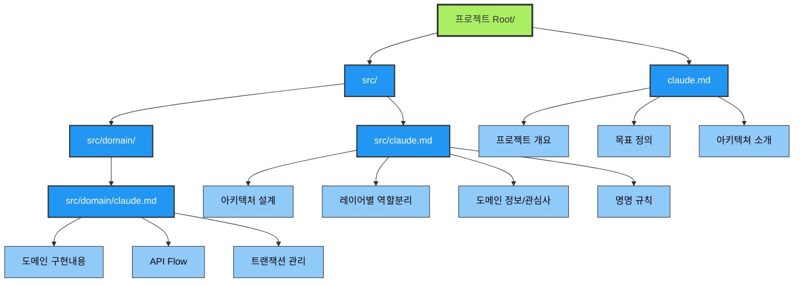
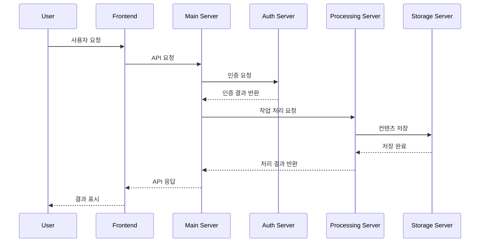
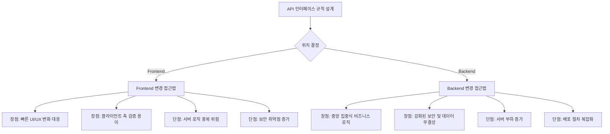

# Claude AI와 함께하는 개발 워크플로우

시니어 개발자의 실전 경험 공유

## 1. AI는 새로운 페어 프로그래밍 파트너

### 기존 개발 프로세스 vs AI 워크플로우

#### Before

```
문제 발생 → 구글 검색 → 스택오버플로우 → 문서 읽기 → 시행착오 → 해결
⏱️ 평균 2-4시간
```

#### After

```
문제 정의 → AI 브레인스토밍 → 구조화된 계획 → 단계별 구현 → 검증
⏱️ 평균 30분-1시간
```

### 핵심 변화

- **도구에서 파트너로**: AI를 검색 도구가 아닌 사고 파트너로 활용
- **반응적에서 능동적으로**: 문제 해결에서 문제 예방으로
- **개별 작업에서 워크플로우로**: 단발성 질문에서 연속적 협업으로

---

## 2. 워크플로우 시나리오

### A. 설계 단위 작업: API 설계

#### 상황

- 새로운 전자상거래 결제 시스템 API 설계 필요

#### 실제 프롬프트 순서

1. 초기 브레인스토밍
    ```
    "전자상거래 결제 시스템 API를 설계해야 해. 어떤 방법들이 있는지 제안해줘, 내 프로젝트 환경에서 많이 사용하는 라이브러리 추천해줘"
    ```

2. 실무 레벨 검증
   ```
   "상용 레벨 서비스에서는 어떤 전략을 사용하는지 가르쳐줘. 특히 결제 보안과 예외 처리 관점에서"
   ```

3. 구체화
   ```
   "결제 프로세스의 사용자 흐름을 시나리오로 작성해줘. 성공 케이스와 실패 케이스 모두 포함해서"
   ```

3. 시각화
   ```
   "직관적으로 이해할 수 있도록 mermaid를 활용해서 결제 플로우 그래프 그려줘"
   ```

---

### B. 기능 추가: 체계적 구현 프로세스

#### 컨텍스트 제공형 프롬프트

```
"{/docs/api-spec.md}에 작성한 문서의 내용을 확인하고 {feat/payment-integration} 계획 문서의 작업 순서대로 실행해줘."

"각 작업 단계가 완료된 후 체크리스트를 통해 올바른 코드수정이 이루어졌는지 확인 후에 다음 작업 단계로 넘어가줘."

"각 단계의 작업 완료와 체크리스트 확인 후 다음 작업이 진행하기 전에 애매한 부분에 대해서 다시 질문해줘"
```

#### 방어적 프롬프팅 전략
      
```
"(성능/가독성) 개선 방향에서 리팩토링 작업 계획 문서 작성해줘."

"현재 API flow와 리팩토링 후 개선된 API flow를 함수단위로(file path를 포함해서) Sequence diagram 작성하고 비교하는 문서 작성해줘."

⚠️ 중요: "코드를 작성하지 말고 문서작성만 해줘"
```

#### 코드 구현 완료 후 마무리는 필수

```
"리팩토링이 완료된 후 리팩토링 과정에서 작성한 함수와 helper 코드를 제거해줘."

"개선된 코드로 인해 사용하지 않게된 파일과 함수를 정리하는 작업을 개발 계획 문서에 추가해줘"
```

---

### C. 실패 사례 분석: "나 뭐한거지??"

#### 상황

1. 설명: 너무 피곤한날, 갑자기 터진 긴급 상황에 마음만 급한날.
2. 실제: 그날 따라 거짓말 투성이, 쓸때없는 레이어 추가, 이미 구현된 util 함수 안쓰고 또 구현.
3. 순간적 결정: 내가 짜는게 빠르겠다. (오랜만에 손 코딩 시작)
4. 완료 후: 긴급 상황에 초인적인 집중력에도 결국 평소보다 저조한 생산성. (이렇게 일주일하면 번아웃)

#### 실패 원인 분석

- **1. 중간 점검 소홀**

```
❌ 잘못된 방식: AI에게 큰 작업 덩어리 요청 → 결과 확인 없이 다음 단계
✅ 올바른 방식: 단계별 진행 → 중간 체크포인트 → 방향 수정
```

- **2. 컨텍스트 관리 실패**

```
❌ 문제: 작업 중간에 AI와의 대화 맥락 손실
✅ 해결: 각 세션마다 현재 상황 요약 전달
```

- **3. 방어적 프롬프팅 부재**

```
❌ "구현해줘" → AI가 잘못된 방향으로 코드 작성
✅ "계획 문서부터 작성하고, 내가 확인 후 구현 진행"
```

#### 결론

- **AI 관리가 핵심 스킬**: AI를 잘 쓰는 것 = AI를 잘 관리하는 것
- **에너지 관리의 중요성**: 피곤할 때일수록 더 구조화된 접근 필요, 더욱더 나를 챙겨야 한다.
  - ⚠️ AI는 잘못이 없다.
  - ✅ 나의 스트레스와 수면, 피로, 집중력 관리의 실패
  - 🔔 https://youtu.be/1G0MyQZ8rHM?si=aMGtNhKSgA_PR8-N&t=581

---

## 3. 위험 요소 관리

### A. Commit 전략

- 작은 단위 커밋으로 특정 AI 작업만 되돌리기 가능
- 작업 단위를 명확히 구분하여 각 단계의 변경사항을 추적 가능
- 문제 발생 시 특정 기능 변경만 롤백하여 다른 작업에 영향 최소화
- 코드 리뷰가 용이하고 변경 이력을 통해 AI 의사결정 과정 파악 가능

```bash
# 작업 단위별 커밋
git commit -m "feat: API 스펙 문서"
git commit -m "feat: 결제 엔드포인트 기본 구조"  
git commit -m "refactor: 리팩토링 - 에러 핸들링 개선"
```

### B. 더욱더 중요해지는 아키텍쳐, 그리고 문서(Cluade.md, CursorAI MDC)

- CLAUDE.md 파일 체계로 컨텍스트 관리

  - link : [공식문서 URL Link](https://docs.anthropic.com/ko/docs/claude-code/memory#claude%EA%B0%80-%EB%A9%94%EB%AA%A8%EB%A6%AC%EB%A5%BC-%EC%B0%BE%EB%8A%94-%EB%B0%A9%EB%B2%95)
  - **CLAUDE.md에 작성된 파일은 최대 5단계 깊이까지 추가 파일을 재귀적으로 가져올 수 있습니다.** /memory 명령을 실행하여 로드된 메모리 파일을 확인할 수 있습니다.
  - Claude Code를 실행하고 _foo/CLAUDE.md_와 foo/bar/CLAUDE.md 모두에 메모리가 있는 대규모 저장소에서 작업할 때 특히 편리합니다.

- Cursor MDC

  - link : https://docs.cursor.com/context/rules#rule-structure

#### B-1. CLAUDE.md 파일 종류

- user.CLAUDE.md(개인 설정)
  - 한국어 답변
  - 개인 코딩 스타일
  - 도구 결과를 받은 후에는 그 품질을 신중하게 검토하고, 최적의 다음 단계를 결정한 뒤 진행하세요. 새로운 정보를 바탕으로 계획하고 반복하며, 가장 적절한 조치를 취하세요.

- project.CLAUDE.md(프로젝트 설정)
  - 프로젝트 전체 정보
  - 폴더 구조 압축

- local.CLAUDE.md(개발 환경)
  - yarn, Docker, git action, kuber
  - db access
  - 보안 환경

#### B-2. 계층적 문서 구조

- root/CLAUDE.md
  - 프로젝트 개요, 목표, 아키텍쳐 소개, 도메인 정보
- root/src/CLAUDE.md
  - 아키텍처 (레이어별 역할분리, 도메인 구현내용, 명명 규칙)
- root/src/domain/CLAUDE.md
  - 도메인 관심사, API flow, 트랜잭션 관리

#### B-3. Claude.md 파일 사용 가이드



### C. **MSA 환경에서의 위력**

#### C-1. 사전작업

- **서버별 역할 정의**

  - 메인 / 인증 / 작업관리 / 스토어 서버 등등
  - Project/Root/CLAUDE.md : 각 서버의 프로젝트 개요, 목표, 아키텍쳐 소개, 도메인 정보

- **전체 API 흐름 관리**



- **서비스 단위 고민**

  - 새로운 기능 도입: 과금 전용 API 기능은 어떻게?
    - 과금 전용 Backend Server 구축? 기존 메인서버에 추가?
  - 서버간의 연결문제: API interface 간의 문제는 어떻게?
    - Frontend server에서 수정 해야할까?
    - Backend Server에서 수정하는게 좋을까?
  - DB Server Redis Cache
    - 각각 서버마다 만들어서 쓸까?
    - 캐시 서버를 같이 쓸까? 같이 쓴다면 각 서버가 어떤 규칙으로 Key Value에 접근할까?
  - 배포 단위에서의 고민: MSA에서 Docker 설정 등등


---

## GPT가 발표 문서 작성중에 전달한 통찰

> "AI는 당신을 대체하지 않는다. 하지만 AI를 잘 쓰는 개발자가 그렇지 않은 개발자를 대체할 것이다."
