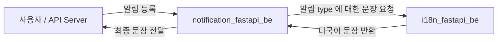

# i18n 인수인계 (i18n_fastapi_hybrid)

## 개요

비대해지고있는 admin_fastapi_mono Server의 역할을 줄이고 i18n 다국어라는 도메인으로 분리해 독립적인 서버를 구축 했다. Hybrid 라는 이름은 MSA URL 규칙을 미리 고민하고 도메인에 특화된 API와 Page를 모두 포함하는 것을 의미한다.

>API URL: /api/v1/i18n/, Page URL: page/i18n/

## 성과

Admin API Server의 역할을 줄이고 다국어 관리 도메인을 위한 서버를 구축 했다. 합리적인 프로젝트 Layer 구조를 적용하여 프로젝트 관리가 쉬워졌다.  그 동안 시행착오를 통해 합리적인 layer 구조를 찾았다고 생각한다. 봄님도 코드 흐름을 금방 이해하고 코드를 수정하는데 무리가 없었다.

다국어 문장을 호출하는 API를 만들어 Notificatoin_fastapi_be Server에서 호출하여 사용하고 있다. Notificatoin_fastapi_be 에서는 notification type index 관리만 하고 있다. type index를 통해 사용자에게 전달되는 최종 문장은 i18n_fastapi_be로 호출 후 문장을 받아 사용하고 있다.

## 문제

### 다시 MSSQL

i18n 도메인 또한 기존 TVCF에서 새로 도입되는 API Server로 Notification 도메인과 같이 독립적으로 DB Table을 사용하려고 처음에 방향을 잡았다. 하지만 Notification 도메인과는 다르게 다국어 table(i18n_string)만 독립적이고 다국어 table외에 원본이되는 상수 Data들이 MSSQL에 있어 코드와 Data 흐름이 복잡해 질 수밖에 없었다. 관리자가 i18n을 편하게 사용하기 위해서는 기존 원본/상수 Data들 자동으로 다국어 table로 가져오는 기능(Sync)을 구현해야 하기 때문에 동시에 PSQL 과 MSSQL 두 개의 DB를 제어하는 부분이 코드가 복잡해져 개발 속도가 지연 되었다. 기본 기능 탑재 후 배포 했지만 기존 MSSQL에서 사용하고 있던 다국어 테이블에 저장된 데이터를 다 가져오지 못해 tvcf_main_api 서버에서 Dataset 관련 오류가 발생했고 급하게 다국어 table을 기존 MSSQL로 접근해서 다른 서버의 오류들을 막을 수 있었다. 결국 PSQL 은 코드만 남기고 MSSQL로 돌아가게 되었다.

## 실수/교훈

### 협업

MSSQL의 i18n_string테이블을 다른 API Server에서 많이 사용하고 있다고 생각하지 못했다. 섣부른 배포 결정이 기존 i18n_string을 사용하는 api server들에게 오류를 발생시켰고 당장의 오류들을 수습하기 위해 PSQL에서 MSSQL로 돌아가는 원인이 되었다. 또한 기존 API들이 도메인 URL 호출을 통해서 data를 얻는 게 아닌 DB에서 직접 가져오는 경우가 대부분이어서 다국어 사용법이 변경됐을 때 반영해야 할 코드 양을 예측하지 못했다.

## 방향

### 그래도 PSQL 

결국엔 MSSQL을 떠날 준비를 해야 한다. 최종 목표인 Linux 환경에서 돌아가는 MSA 구축을 위해서는 PSQL 사용을 늘려야 하고 MSSQL에 의존성을 높이는 결정은 Linux로 최종 정착 목표에 걸림돌이 추가되는 결과를 가져오기 때문이다. 코드를 작성한 후에 다시 되돌아간 사례가 바로 위 섹션에 작성되어 있다.