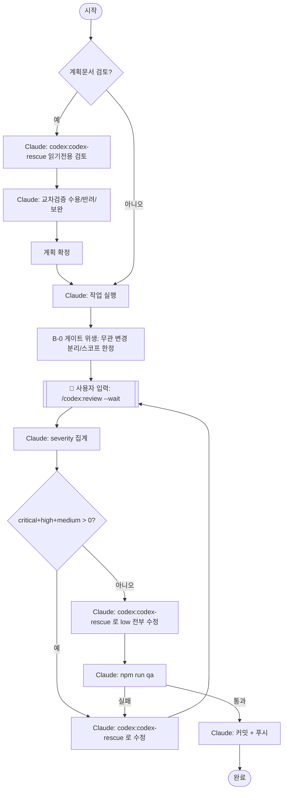

# review-to-zero (human-in-the-loop)

codex 플러그인을 오케스트레이션하는 **검토 → 반복 수정 → 검증 → 배포** 표준 워크플로.

## ⚠️ 가장 중요한 제약 — 역할 분담

codex 플러그인의 리뷰/상태 명령은 `disable-model-invocation: true`라 **Claude가 자동 호출할 수 없다.** 반드시 아래 경계를 지킨다.

| 수단 | 자동호출 | 실행 주체 | 용도 |
| --- | --- | --- | --- |
| `/codex:review` | ❌ | **사용자가 입력** | 변경분 네이티브 리뷰(스키마 구속, severity 태깅) |
| `/codex:adversarial-review` | ❌ | **사용자가 입력** | 설계 도전형 리뷰(+focus) |
| `/codex:status` `/codex:result` `/codex:cancel` | ❌ | **사용자가 입력** | 잡 상태·결과·취소 (`--json` 지원, background 잡 전용) |
| **Agent `codex:codex-rescue`** | ✅ | **Claude가 Agent 도구로 호출** | 수정·실행 위임 (슬래시 명령 아님) |
| `npm run qa`, `git` | ✅ | **Claude가 Bash 실행** | 검증·커밋·푸시 |

→ **리뷰는 Claude가 못 돈다.** Claude는 각 라운드 끝에 "다음에 입력할 명령"을 **한 줄로 정확히 안내**하고, 사용자가 실행한 리뷰 출력이 대화에 들어오면 그걸 파싱해 다음 행동을 결정한다.

### rescue 호출 방법 (Claude 전용 — 실측 검증됨)

이 런타임엔 `SlashCommand` 도구가 없어 Claude는 `/codex:*` 슬래시 명령을 칠 수 없다. rescue는 **Agent 도구의 `codex:codex-rescue`** 로만 호출한다.

```
Agent(subagent_type="codex:codex-rescue",
      prompt="--fresh fix: <이슈 목록>",   # 라우팅 플래그는 프롬프트 텍스트 맨 앞에
      run_in_background=false)              # foreground=false / background=true
```

플래그 라우팅(슬래시 명령과 다름):
- **foreground/background** → Agent의 `run_in_background`(false/true). `--wait`/`--background`는 슬래시 래퍼 전용이라 **에이전트 프롬프트에 넣지 않는다.**
- `--fresh`/`--resume`/`--model`/`--effort` → **프롬프트 텍스트 맨 앞**에 둔다(에이전트가 파싱).
- **읽기전용** → 프롬프트에 "read-only, 수정 금지" 명시 → 에이전트가 `--write` 생략(실측 확인: 파일 변경 0).
- 주의: **foreground rescue는 `/codex:status`·`/codex:result`에 기록되지 않는다**(그건 background/review-gate 잡 전용). 결과는 에이전트 반환값으로 직접 받는다.

## 전체 흐름



## 전제조건

- codex 미설치/미인증이면 **중단**하고 사용자에게 `/codex:setup` 실행 요청.
- 작업 브랜치 확인: `main`/`master`이면 먼저 작업 브랜치로 분기.
- **운영 메모(기대치)**: Phase B 게이트는 라운드마다 사용자가 `/codex:review`를 직접 실행해야 하므로 최대 ~5회 수동 입력이 든다(설계상 불가피). `npm run qa`는 `test:ci`(jest)를 포함하니, 게이트 시작 전 **baseline이 green인지** 확인한다(무관한 기존 실패가 가짜 차단을 만들지 않게).
- (선택) `/codex:setup --enable-review-gate`로 내장 stop-review-gate(직전 턴 단일 검사)를 켤 수 있다. 본 스킬의 다중 라운드 게이트와 **중복되지 않고 보완**된다.

---

## Phase A — 계획문서 검토 → 교차검증 → 실행

> 계획문서가 있을 때만. 코드 변경만 다루면 Phase B로 직행.

1. **계획문서 식별**: 사용자가 경로를 주거나, `docs/`·`plan*`·`*.plan.md` 등에서 후보를 찾아 확정한다.
2. **codex 읽기전용 검토** *(Claude가 `codex:codex-rescue` 에이전트로 호출)*:
   ```
   Agent(subagent_type="codex:codex-rescue",
         prompt="--fresh read-only 검토(수정 금지): <plan 경로>를 비판적으로 검토.
                 누락·리스크·대안을 critical/high/medium/low로 분류해 제시.",
         run_in_background=false)
   ```
   - 계획이 이미 working-tree 코드에 반영돼 있다면, 대신 **사용자**가 `/codex:adversarial-review --wait <focus>`를 실행하게 안내해도 된다.
3. **교차검증(cross-verify)**: codex 피드백을 Claude가 항목별 분류 — **수용**(반영) / **반려**(사실·맥락 오류, 프로젝트 관례 위반 → 사유 명시) / **보완**(맥락 맞게 수정 반영).
4. **계획 확정**: 변경 이유/범위/리스크 한눈 요약.
5. **실행**: 최소 변경 원칙으로 구현.

---

## Phase B — 리뷰 게이트 루프 → low 수정 → 검증 → 배포

### B-0. 게이트 위생 (필수 선행)

`/codex:review` 기본 스코프는 **작업트리 전체**(scope=auto)라, 무관한 dirty 파일까지 리뷰·수정에 끌려온다. 게이트 진입 전 범위를 한정한다.

- 이번 작업과 무관한 변경은 `git stash` 또는 별도 커밋으로 **분리**한다.
- 또는 사용자가 `/codex:review --scope branch --base <ref>`로 **브랜치 diff만** 리뷰하게 한다.
- 대상 작업만 남은 깨끗한 상태에서 B-1 진입.

### B-1. severity 게이트 루프 (critical/high/medium → 0)

```
prevUnresolved = ∅, round = 1
반복:
  [👤 사용자] /codex:review --wait
             # severity 출처: --wait는 prose 출력 → 라벨로 파싱.
             # 신뢰성 높은 구조화가 필요하면(큰 diff): --background 후 /codex:result <id> --json
  [Claude]  리뷰 출력에서 이슈를 severity(critical/high/medium/low)로 추출.
            이슈 식별키 = "파일 + 정규화된 요지(규칙/카테고리)"  # 라인번호 제외: 수정 시 시프트됨
  [Claude]  if (critical + high + medium) == 0: 루프 종료 → B-2
  [Claude]  Agent(codex:codex-rescue, prompt="<flag> fix: <해당 이슈들>", run_in_background=false)
              · 1라운드 flag=--fresh   · 2라운드 이상 flag=--resume (codex 스레드 유지)
  [Claude]  사용자에게 한 줄 안내: "다시 `/codex:review --wait` 실행해 주세요."
  round += 1
```

**종료·가드(무한루프 방지, 침묵 금지):**
- 정상 종료: critical = high = medium = 0.
- **정체 감지**: 이번 라운드 미해결 식별키 집합이 직전(`prevUnresolved`)과 **동일**하면 진전 없음 → 중단. (식별키에 라인번호를 넣지 않으므로 수정 후에도 비교가 성립)
- **상한**: `round > 5`면 중단.
- 중단 시 남은 이슈를 severity별로 **사용자에게 보고**하고 자동 강행하지 않는다.

### B-2. 잔여 low 전부 수정

- 게이트 통과 후 마지막 리뷰의 **low 이슈를 전부** 한 번에 위임:
  ```
  Agent(codex:codex-rescue, prompt="--resume fix all low issues: <low 목록>", run_in_background=false)
  ```
- 수정 보류가 타당한 low(예: 의도된 설계)는 **이유 명시 후 사용자에게 남긴다**(조용한 누락 금지).
- low 수정으로 새 이슈가 우려되면 사용자에게 `/codex:review --wait` 1회 재실행을 요청해 확인.

### B-3. 검증 게이트 *(Claude가 Bash 실행)*

> 원 요청의 `pytest`는 이 저장소(JS/TS/Electron)에 없음 → 프로젝트 표준 게이트 사용.

```bash
npm run qa   # = lint → type-check(renderer+main) → test:ci(jest)
```

- 실패 → 원인 분석 → `Agent(codex:codex-rescue, prompt="--resume fix: <qa 실패>", run_in_background=false)`로 수정 → **재검증**. 통과 전 다음 단계 금지.

### B-4. 커밋 + 푸시 *(Claude가 Bash 실행)*

- **스테이징 범위 한정**: 무관한 dirty 파일이 남아 있을 수 있으므로 작업 대상 경로만 stage — `git add -- <대상 경로>` 후 `git status`로 범위 재확인(전체 `git add -A` 금지).
- Conventional Commits(`type(scope): 요약`, 본문 한국어).
- 브랜치 재확인 — `main`/`master` 직접 커밋·푸시 금지(작업 브랜치에서).
- **푸시 전 1회 확인**: 원격 반영은 외부 영향이므로, 사용자가 본 워크플로에서 "커밋·푸시까지"를 명시하지 않았다면 푸시 직전 한 번 확인한다. 이미 위임받았으면 바로 푸시.

---

## 완료 보고(Persist)

1. **Completed**: 변경 파일/범위
2. **Review gate**: 라운드 수, 시작·종료 severity 집계, 처리한 low 목록, 보류 low(+사유)
3. **Verify**: `npm run qa` 결과
4. **Ship**: 커밋 해시 / 푸시 브랜치
5. **Open issues**: 잔여 리스크

## 가드레일

- codex 미인증 → 중단, `/codex:setup` 안내.
- 리뷰/상태 명령은 **사용자만** 실행 가능 — Claude가 대신 실행하려 시도하지 말 것(컴패니언 스크립트 직접 호출로 우회하지 않는다: 버전·경로 고정·사전체크 우회로 취약).
- rescue는 **Agent `codex:codex-rescue`** 로만 호출. 라우팅 플래그(`--fresh`/`--resume`)는 프롬프트에, foreground/background는 `run_in_background`로.
- 게이트 진입 전 작업트리 위생(B-0)·커밋 시 스테이징 범위 한정(B-4)을 지켜 무관 변경 오염 방지.
- 수정 라운드 상한 5회·정체 시 중단·사용자 보고.
- `main`/`master` 직접 커밋·푸시 금지. 시크릿을 프롬프트·커밋·로그에 노출 금지.
- codex 명령 실패(non-zero) 시 재시도 전에 사용자에게 방향 확인.
