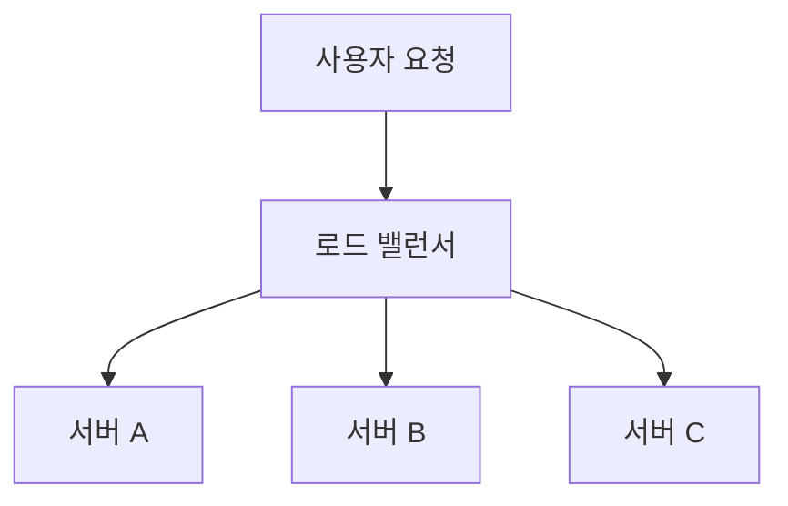
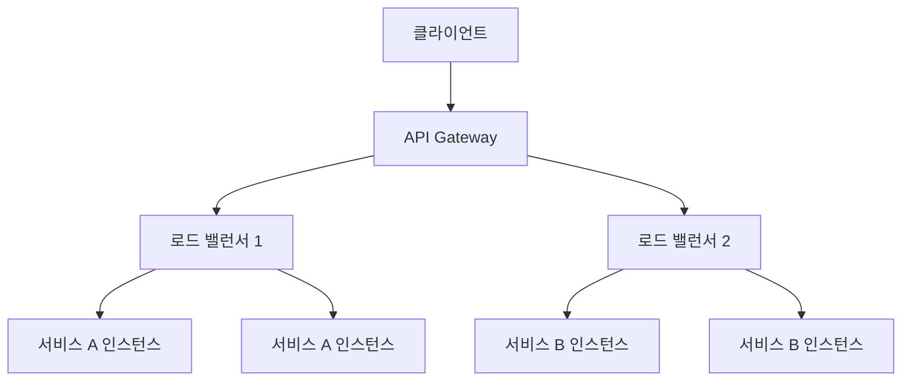

# 로드 밸런싱 (Load Balancing)

MSA(마이크로서비스 아키텍처)를 지향하는 백엔드 서버 구축에서 로드 밸런싱은 중요합니다. 로드 밸런싱은 여러 서버나 서비스의 트래픽을 분배하여 서버 부하를 고르게 할 수 있습니다.

## 로드 밸런싱 기본 개념

## 주요 로드 밸런싱 방식

1. **라운드 로빈 (Round Robin)**
   - 요청을 순차적으로 각 서버에 전달
   - 가장 단순하고 널리 사용되는 방식

2. **IP 해시 (IP Hash)**
   - 클라이언트 IP를 기반으로 특정 서버에 요청 할당
   - 세션 유지가 필요한 경우 유용

3. **최소 연결 수 (Least Connection)**
   - 현재 연결이 가장 적은 서버로 요청 전달
   - 서버 부하 상태를 고려한 방식

## 로드 밸런서 종류

### 1. 하드웨어 로드 밸런서
- 전용 장비를 사용
- 높은 성능과 안정성
- 고비용

### 2. 소프트웨어 로드 밸런서
- NGINX, HAProxy 등
- 클라우드 환경 적합
- 유연한 구성 가능

## MSA 환경에서의 로드 밸런싱

