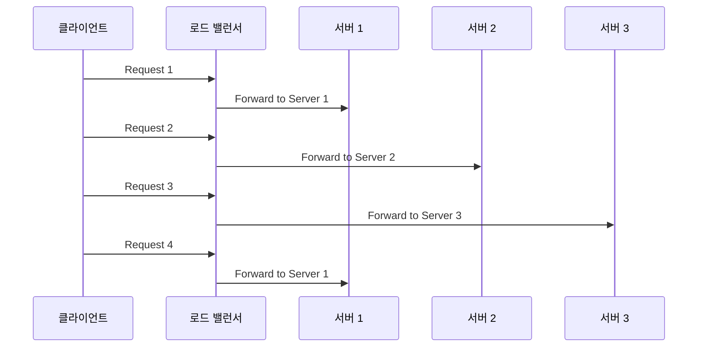
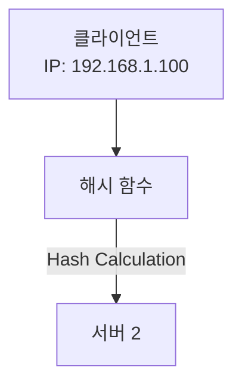
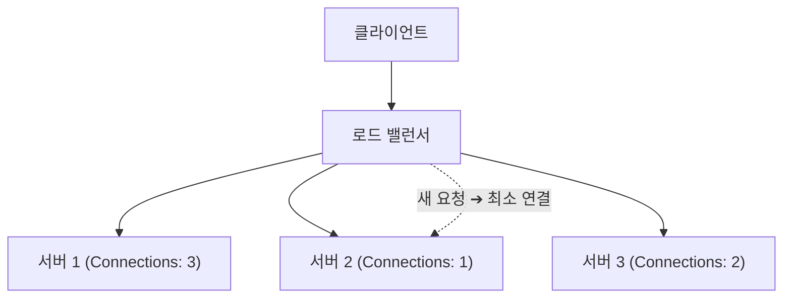

# 로드 밸런싱 알고리즘 자세한 설명

## 1. 라운드 로빈 (Round Robin)

### 개념
- **순차 분배:** 요청이 들어올 때마다 미리 정해진 서버 리스트에서 순서대로 한 서버씩 할당합니다.
- **단순함:** 구현이 간단하고, 모든 서버에 동일한 부하를 분산시키려고 할 때 효과적입니다.

### 동작 방식
1. 첫 번째 요청은 첫 번째 서버로 전달.
2. 두 번째 요청은 두 번째 서버로 전달.
3. 리스트의 마지막 서버에 요청이 전달되면 다시 처음 서버로 순환하여 요청을 할당.

### 장점
- **구현 용이:** 알고리즘이 단순해 설정 및 관리가 쉽습니다.
- **균등 분배:** 서버의 성능이 비슷할 때 요청이 균등하게 분산됩니다.

### 단점
- **서버 상태 미반영:** 각 서버의 현재 부하나 응답 속도와 관계없이 단순 순차 분배하므로, 부하가 많은 서버에도 요청이 갈 수 있습니다.
- **비정상 서버 처리 어려움:** 장애가 발생한 서버를 리스트에서 제외하는 등의 추가 처리가 필요합니다.

### Mermaid 다이어그램 (라운드 로빈 예시)

---

## 2. IP 해시 (IP Hash)

### 개념
- **고정 서버 할당:** 클라이언트의 IP 주소를 해시 함수에 넣어 계산된 값을 기준으로 특정 서버에 요청을 할당합니다.
- **세션 유지:** 클라이언트의 IP가 동일하면 항상 같은 서버로 요청이 전달되어, 세션 상태를 유지하기에 유리합니다.

### 동작 방식
1. 클라이언트의 IP 주소를 해시 함수에 입력.
2. 해시 값에 따라 서버 리스트 내의 특정 서버가 결정.
3. 이후 동일한 IP로 들어오는 요청은 같은 서버로 전달됩니다.

### 장점
- **세션 지속성:** 세션 스티키(Sticky Session)가 필요한 환경에서 유용합니다.
- **예측 가능성:** 동일 클라이언트는 항상 같은 서버로 연결되므로, 캐시 활용 등에서 이점이 있습니다.

### 단점
- **불균등 분배:** 클라이언트 IP 분포가 고르지 않을 경우 일부 서버에 부하가 집중될 수 있습니다.
- **동적 확장 어려움:** 서버 추가/제거 시 해시 값 재계산으로 인한 분배 문제(리밸런싱)가 발생할 수 있습니다.

### Mermaid 다이어그램 (IP 해시 예시)

---

## 3. 최소 연결 수 (Least Connection)

### 개념
- **현재 부하 고려:** 각 서버에 할당된 활성 연결(현재 처리 중인 요청) 수를 비교하여, **가장 적은 연결 수**를 가진 서버에 새로운 요청을 전달합니다.
- **동적 분배:** 요청 처리 시간이 서버마다 다르거나 부하가 일정하지 않은 경우, 보다 효과적으로 트래픽을 분산시킬 수 있습니다.

### 동작 방식
1. 로드 밸런서가 각 서버의 현재 연결 수를 모니터링합니다.
2. 새로운 요청이 들어오면, 연결 수가 가장 적은 서버를 선택합니다.
3. 요청이 해당 서버로 전달되어 처리됩니다.

### 장점
- **효율적인 부하 분산:** 각 서버의 실제 부하를 고려하므로, 과부하 서버에 요청이 몰리지 않습니다.
- **동적 환경에 적합:** 요청 처리 시간이 다양하거나 서버 성능 차이가 있을 때 유리합니다.

### 단점
- **모니터링 필요:** 각 서버의 연결 상태를 지속적으로 확인하는 오버헤드가 있습니다.
- **복잡성 증가:** 단순 라운드 로빈보다 설정 및 구현이 복잡할 수 있습니다.

### Mermaid 다이어그램 (최소 연결 수 예시)

---

## 결론

각 로드 밸런싱 방식은 상황에 따라 적합한 환경이 다릅니다.

- **라운드 로빈:** 단순하고 모든 서버가 동일 성능일 때 이상적입니다.
- **IP 해시:** 세션 지속성이 필요한 환경이나 캐싱 전략을 사용할 때 유리합니다.
- **최소 연결 수:** 서버마다 처리 시간이나 부하가 다를 때, 보다 균형 잡힌 분배가 가능합니다.

상용 서비스에서는 위 알고리즘들을 상황에 맞게 단독으로 사용하거나, 필요에 따라 여러 기법을 혼합하여 사용합니다. 예를 들어, **NGINX**나 **HAProxy** 같은 소프트웨어 로드 밸런서는 이러한 알고리즘들을 지원하며, **Kubernetes** 환경에서는 Ingress Controller를 통해 자동으로 분산 처리를 수행합니다.