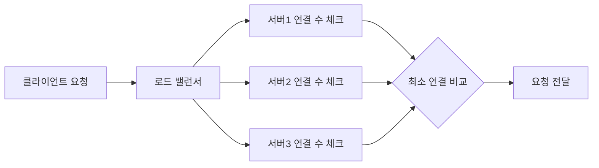

# Least Connection 로드 밸런싱 알고리즘

## 개요
각 백엔드 서버의 활성 연결 수를 기준으로 트래픽을 분산시키는 방식으로, 가장 적은 연결을 가진 서버로 요청을 전달합니다.

## 주요 특징
- 동적 부하 분산: 실시간 연결 수를 기반으로 분산 결정
- 서버 상태 모니터링: 연결 수 외에 CPU, 메모리 사용량 등 추가 지표 활용 가능
- 자동 조정: 연결 종료 시 카운터 자동 감소

## 구현 메커니즘

### 1. 연결 수 추적 시스템

### 2. 구현 단계
1. 요청 수신 시 백엔드 서버 리스트 순회
2. 각 서버별로 다음 지표 확인:
   - 현재 활성 연결 수
   - (선택) CPU 사용량
   - (선택) 메모리 사용량
   - (선택) 평균 응답 시간
3. 최소 연결 서버 선택:
   - 동일 연결 수 시 라운드 로빈/랜덤 방식 적용
4. 연결 수 카운터 관리:
   - 신규 연결: +1 증가
   - 연결 종료: -1 감소

## 장단점 비교
| 장점 | 단점 |
|------|------|
| 실시간 부하 반영 | 연결 수만 고려할 경우 실제 부하와 차이 발생 가능 |
| 자동 장애 조치 | 지속적 모니터링 필요 |
| 유휴 자원 활용 최적화 | 동적 가중치 계산 복잡성 |

## 사용 사례
- 장시간 연결 유지가 필요한 서비스(예: 실시간 스트리밍)
- 서버 사양이 상이한 이기종 환경
- 연결 지속 시간이 불규칙한 애플리케이션 