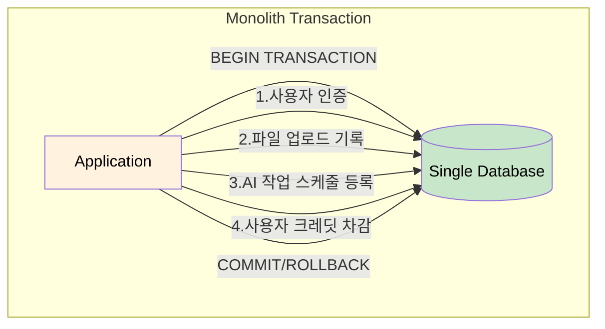
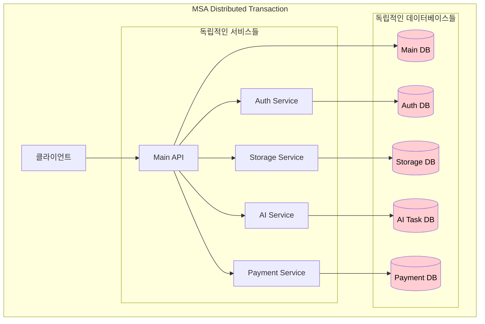
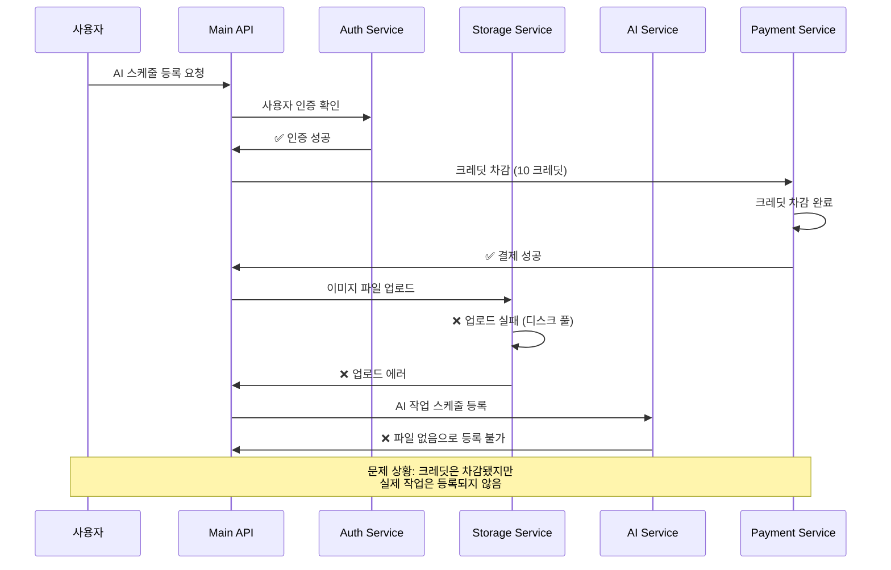
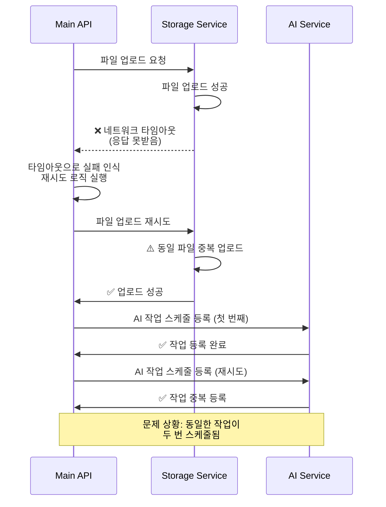
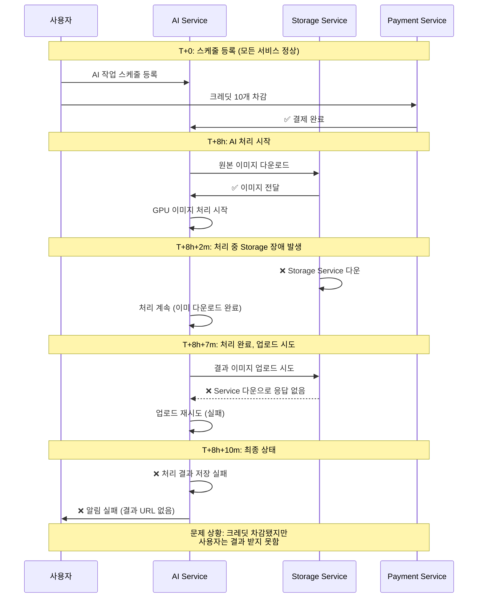
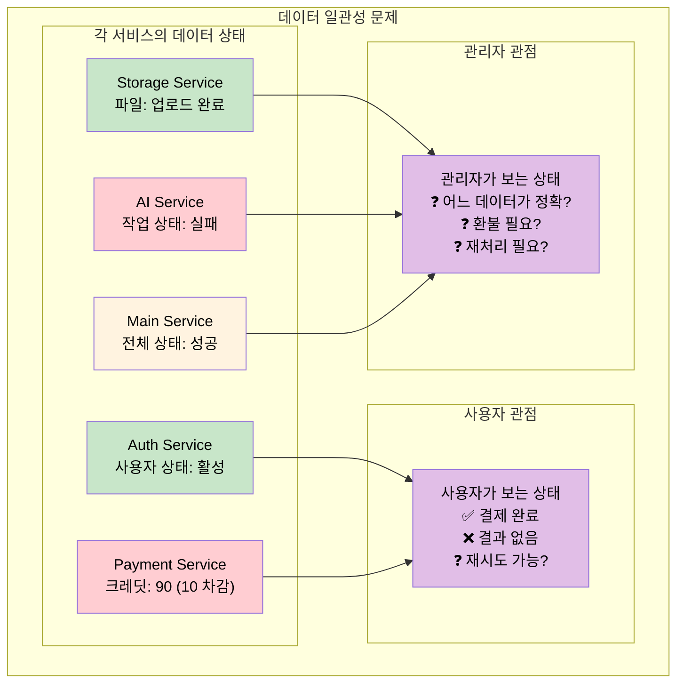

# 내가 앞으로 해결해야할 미션 (MSA 환경에서 ACID 보장 Transaction 문제)

## 개요

MSA 환경에서는 여러 독립적인 서비스에 걸쳐 데이터가 분산되어 있기 때문에, 전통적인 ACID 트랜잭션을 보장하기 어렵습니다. AI 이미지 처리 스케줄링 작업에서 발생할 수 있는 분산 트랜잭션 문제들을 분석합니다.

## Monolith vs MSA Transaction 차이

### Monolith 환경의 단순함

**특징:**

- 단일 데이터베이스에서 ACID 보장
- 실패 시 전체 롤백 가능
- 일관성 보장이 간단함

### MSA 환경의 복잡성

**문제점:**
- 각 서비스가 독립적인 데이터베이스 소유
- 서비스 간 네트워크 호출로 인한 실패 가능성
- 부분 실패 시 일관성 보장 어려움

## AI 스케줄링에서 발생하는 Transaction 문제 시나리오

### 시나리오 1: 파일 업로드 실패와 데이터 불일치

**문제점:**
- Payment Service에서 크레딧은 이미 차감됨
- Storage Service 실패로 파일 업로드 안됨
- AI Service에 작업 등록 불가
- **결과**: 사용자는 크레딧 손실, 작업은 실행 안됨

### 시나리오 2: 네트워크 타임아웃과 중복 처리

**문제점:**
- 네트워크 타임아웃으로 성공/실패 판단 어려움
- 재시도 로직으로 인한 중복 처리
- **결과**: 동일 작업 중복 실행, 자원 낭비

### 시나리오 3: AI 처리 중 Storage 서비스 장애

**문제점:**
- AI 처리는 완료됐지만 결과 저장 실패
- 크레딧은 이미 차감된 상태
- 사용자에게 결과 전달 불가
- **결과**: 작업 완료됐지만 사용자는 결과 받지 못함

### 시나리오 4: 데이터 일관성 문제

**일관성 문제:**
- **Auth Service**: 사용자는 정상 상태
- **Payment Service**: 크레딧은 차감됨
- **Storage Service**: 파일은 정상 업로드
- **AI Service**: 작업 처리 실패로 기록
- **Main Service**: 전체적으로는 성공으로 기록

**결과**: 각 서비스마다 다른 상태를 갖고 있어 전체 시스템의 일관성 부족

## MSA Transaction 문제의 근본 원인

### 1. CAP 정리의 한계
- **Consistency(일관성)**: 모든 노드가 동일한 데이터를 보장
- **Availability(가용성)**: 시스템이 항상 응답 가능
- **Partition Tolerance(분할 내성)**: 네트워크 분할 상황에서도 동작

MSA에서는 세 가지를 동시에 만족할 수 없어, 보통 가용성과 분할 내성을 선택하고 일관성을 포기하게 됩니다.

### 2. 네트워크의 신뢰성 문제
- 서비스 간 네트워크 호출 실패 가능성
- 타임아웃, 지연, 패킷 손실
- 부분 실패 상황에서의 판단 어려움

### 3. 독립적인 데이터베이스
- 각 서비스가 자체 데이터베이스 소유
- 전체 시스템 차원의 트랜잭션 보장 불가
- 데이터 동기화 복잡성

이러한 문제들로 인해 MSA 환경에서는 전통적인 ACID 트랜잭션 대신 **최종 일관성(Eventual Consistency)**을 목표로 하는 다양한 패턴들이 필요합니다.
