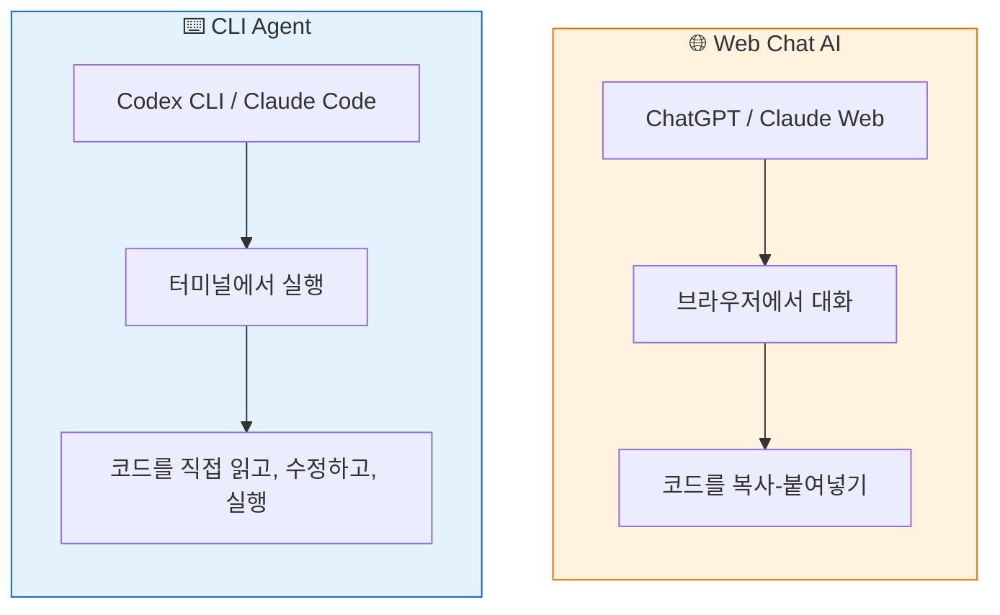
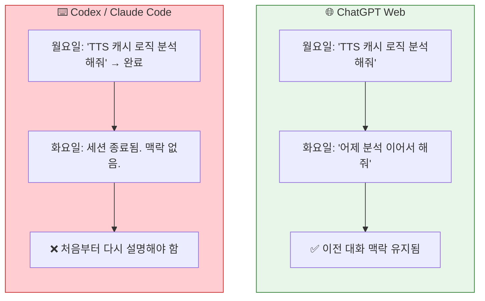
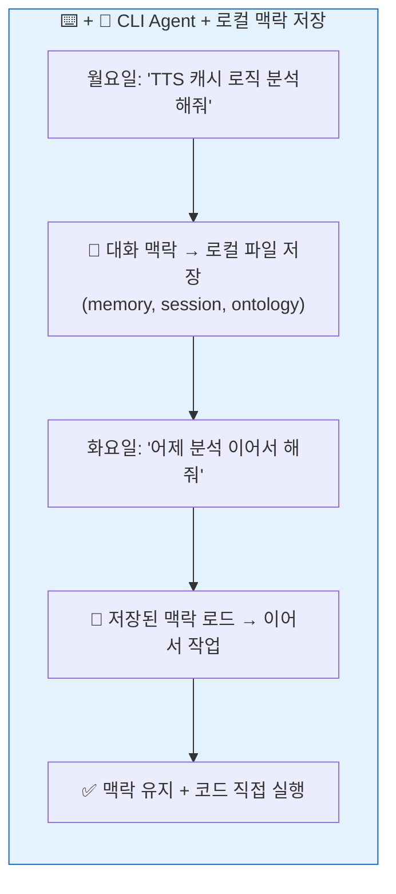
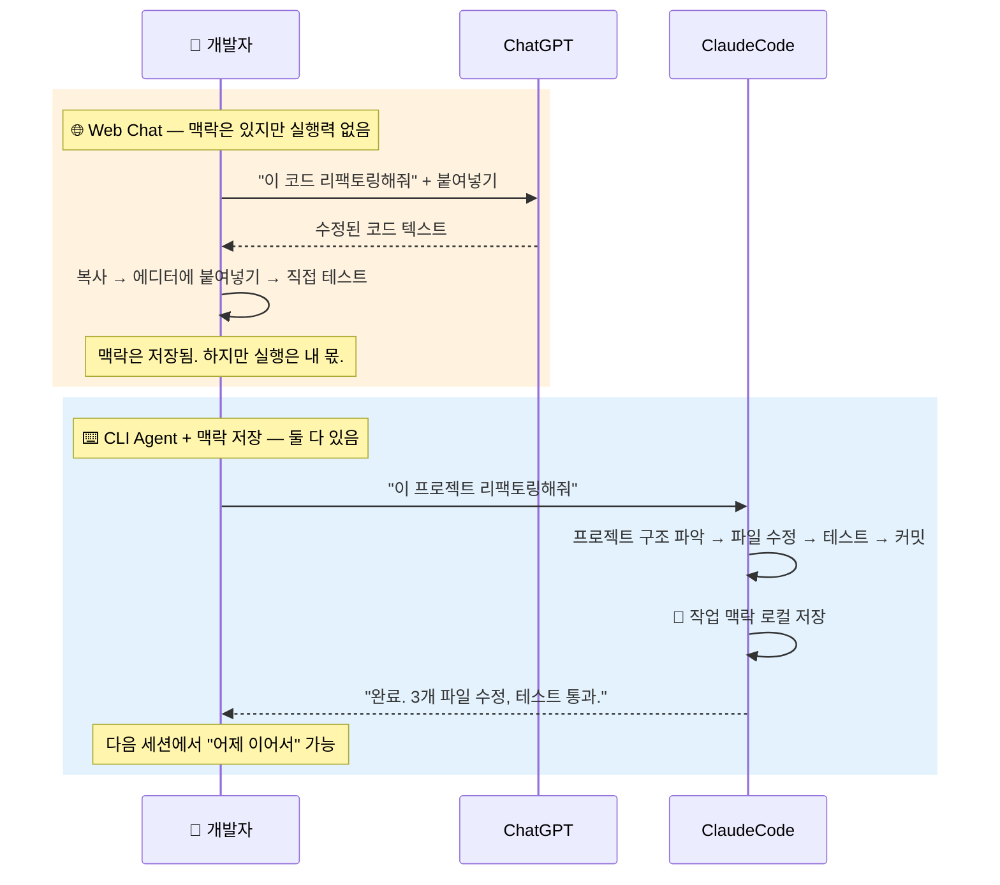

# 내가 경험한 OpenClaw — 0. 개요

> **ChatGPT 웹을 쓰는 것과 Codex/Claude Code를 쓰는 것은 완전히 다른 경험이다.
> 그리고 OpenClaw는 그 둘을 넘어서, 내 인프라 위에서 24/7 돌아가는 AI 에이전트가 된다.**

---

## 0.1 두 가지 AI 사용 방식

AI를 코딩에 쓰는 방법은 크게 두 가지다.

---

## 0.2 진짜 차이: "대화 맥락"이 어디에 저장되는가

실행 능력보다 더 근본적인 차이가 있다. **대화 맥락의 저장 여부**다.

| | 🌐 Web Chat (ChatGPT 등) | ⌨️ CLI Agent (Codex / Claude Code) |
|---|---|---|
| **대화 맥락 저장** | ✅ 서버에 자동 저장 | ❌ 세션 종료 시 유실 |
| **이전 대화 이어가기** | ✅ 언제든 이전 대화 열기 | ❌ 매번 처음부터 설명 |
| **코드 접근** | 사용자가 복붙으로 전달 | AI가 파일시스템을 직접 읽기/쓰기 |
| **실행 능력** | 없음 (코드 제안만) | 셸 명령, 테스트, 빌드 직접 실행 |
| **결과물** | 텍스트 응답 (사람이 적용) | 파일 수정 + 커밋 (AI가 적용) |

### 그런데 — CLI Agent가 맥락을 로컬에 저장하면?

여기서 핵심 전환이 일어난다.
**CLI Agent의 대화 맥락을 로컬 파일에 저장하고 다음 세션에서 불러오면**, Web Chat의 "맥락이 이어진다"는 장점을 그대로 가져올 수 있다.

> **ChatGPT Web의 강점** = 대화 맥락이 이어진다.
> **CLI Agent의 강점** = 코드를 직접 읽고 수정하고 실행한다.
>
> CLI Agent에 맥락 저장을 더하면, **Web Chat의 장점을 흡수하면서 실행력까지 갖춘다.**
> 이것이 OpenClaw가 하는 일의 출발점이다.

| | 🌐 Web Chat | ⌨️ CLI (기본) | ⌨️ + 💾 CLI + 맥락 저장 |
|---|---|---|---|
| **대화 맥락** | ✅ 서버 저장 | ❌ 유실 | ✅ 로컬 저장 |
| **코드 실행** | ❌ 없음 | ✅ 직접 실행 | ✅ 직접 실행 |
| **파일 접근** | ❌ 복붙 | ✅ 직접 읽기/쓰기 | ✅ 직접 읽기/쓰기 |
| **이전 작업 참조** | ✅ 대화 열기 | ❌ 처음부터 | ✅ 메모리에서 검색 |
| **데이터 소유권** | ❌ 클라우드 | ✅ 로컬 | ✅ 로컬 |

---

*다음 단락: 1. 개발 환경*
