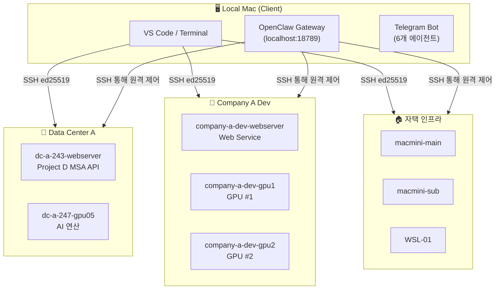
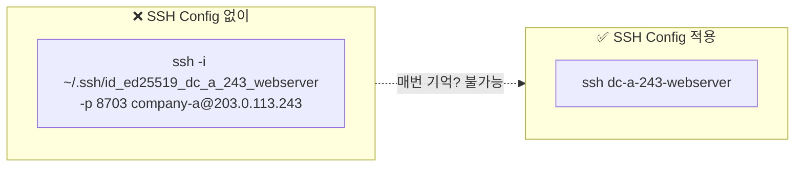
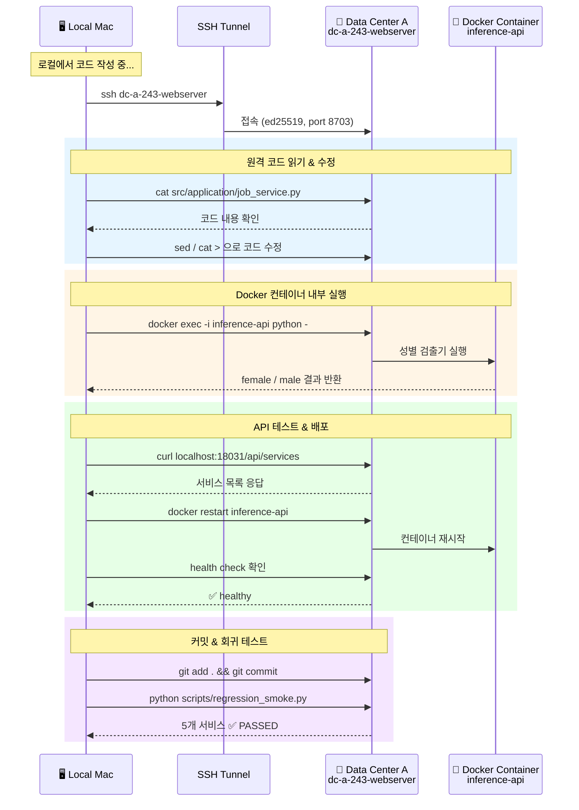
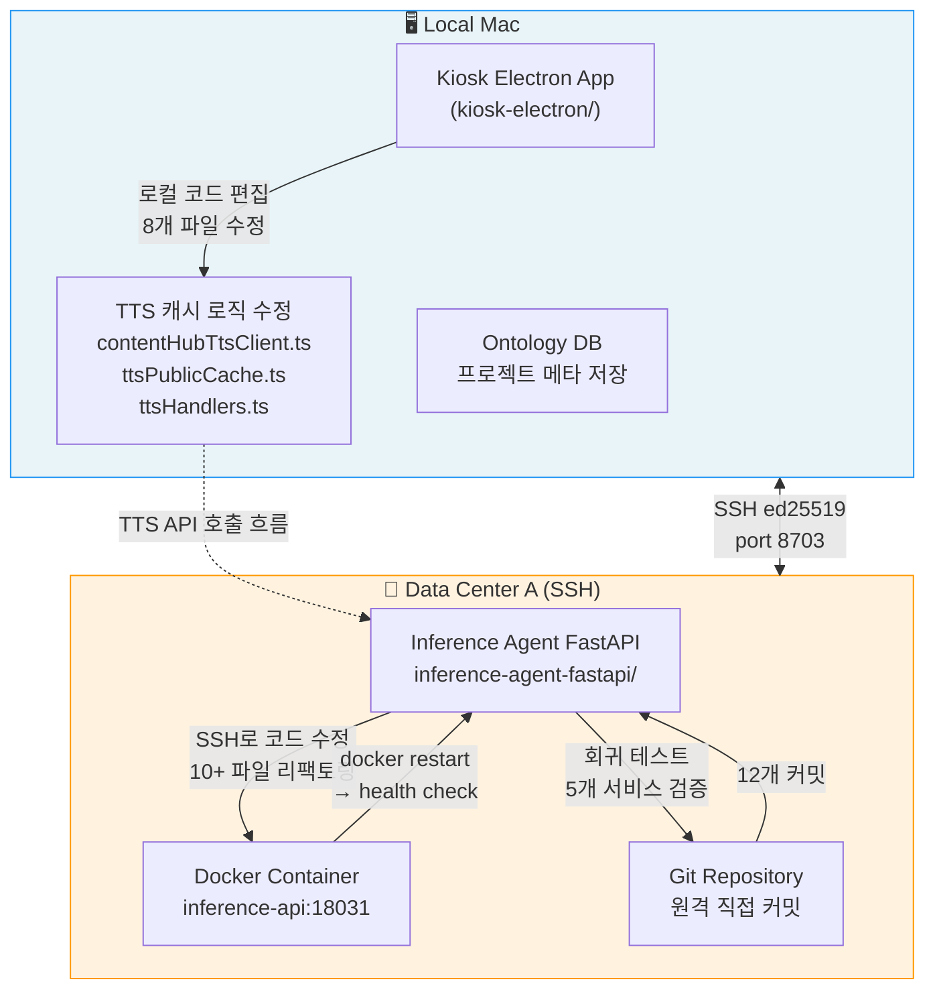
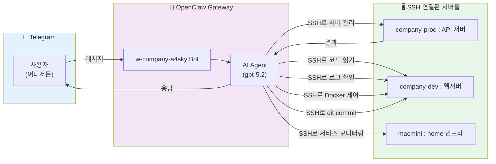

# 내가 경험한 OpenClaw — 1. 개발 환경

> **SSH Key 인증 기반 멀티 서버 개발 환경, 그리고 OpenClaw가 만드는 생산성**

---

## 1.1 전체 개발 환경 구조

---

## 1.2 SSH Config가 만드는 생산성

17개 서버, 포트도 유저도 키도 제각각이다. 그래도 접속은 **한 줄**이면 끝난다.

### 이걸 안 했을 때

> SSH config 정리 전에는 서버 접속 자체가 스트레스였다.
> 포트가 8703인지 22인지 헷갈려서 타임아웃 대기, 키를 잘못 지정해서 인증 실패,
> 심지어 프로덕션 서버에 dev 계정으로 접속하는 실수도 있었다.
> 17개 서버를 머릿속에 담고 다니는 건 불가능하다. alias 하나면 끝나는 일이었다.

### SSH Config 설계 원칙

| 원칙 | 적용 | 효과 |
|------|------|------|
| **서버별 전용 키 분리** | `id_ed25519_dc_a_243_webserver` 등 11개 키 | 키 유출 시 blast radius 최소화 |
| **직관적 alias** | `dc-a-243-webserver`, `company-b-us-ec2-production` | 용도가 이름에 드러남 |
| **Keychain 연동** | `AddKeysToAgent yes` + `UseKeychain yes` | 패스프레이즈 반복 입력 제거 |
| **SSM ProxyCommand** | AWS EC2는 포트 노출 없이 터널링 | 보안과 편의성 동시 확보 |

---

## 1.3 핵심: 로컬에서 떠나지 않고 원격을 제어한다

---

## 1.4 실제 작업 사례: Project D Kiosk ↔ Inference Agent API

2026년 3월 14~15일, 약 4시간 집중 작업의 실제 흐름.

### 작업 타임라인

```mermaid
gantt
    title 3/14~15 Project D Kiosk ↔ Inference Agent 작업 흐름
    dateFormat HH:mm
    axisFormat %H:%M

    section 로컬 (Kiosk)
    TTS 캐시 로직 분석 & 수정 (8파일)       :done, 18:50, 19:19

    section 원격 (Data Center A)
    SSH 접속 확인 (포트 8703)                :done, 17:59, 18:04
    Inference Agent 코드 분석 & 성별 검출 테스트     :done, 18:04, 18:45
    프리셋 추가 & API 설정 업데이트           :done, 19:07, 19:32
    코드 리팩토링 (10+ 파일)                 :done, 21:35, 23:30
    회귀 테스트 & 커밋 (12개)                :done, 23:30, 25:51
```

---

## 1.5 OpenClaw가 이 환경에서 하는 일

### 핵심 가치

> **"내 Mac에서 떠나지 않는다."**
>
> 코드는 로컬에서 작성하고, SSH 하나로 원격 서버의 코드·로그·Docker·배포를 실시간 제어한다.
> OpenClaw는 이 SSH 인프라 위에서 Telegram을 통해 **어디서든** 같은 작업을 가능하게 한다.

| 전통적 방식 | SSH + OpenClaw |
|------------|----------------|
| 서버마다 접속 정보 기억 | alias 한 줄로 즉시 접속 |
| 서버에서 직접 작업 | 로컬에서 원격 실시간 제어 |
| 터미널 앞에 있어야 함 | Telegram으로 어디서든 제어 |
| 수동 배포 & 확인 | SSH → Docker restart → 자동 회귀 테스트 |
| 키 하나로 전체 접속 | 서버별 전용 키 분리 (보안) |

---

*다음 단락: 2. OpenClaw 에이전트 구성과 운영*
