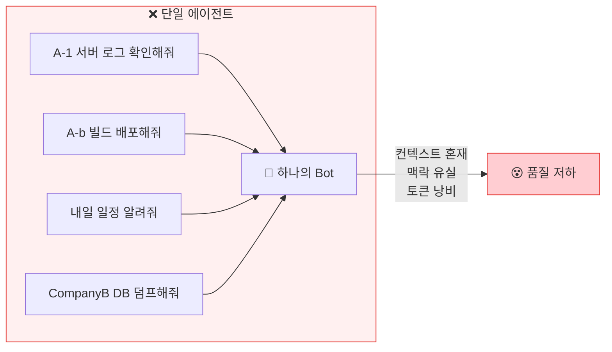
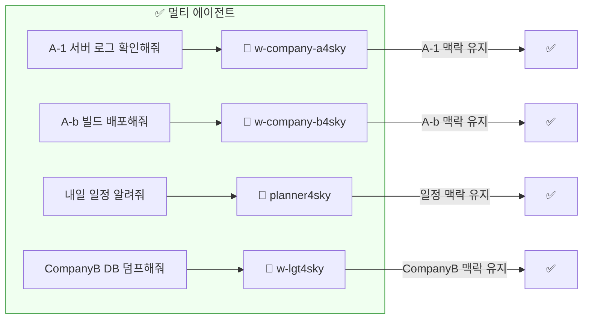
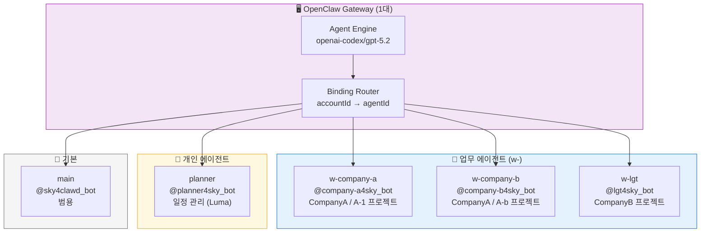
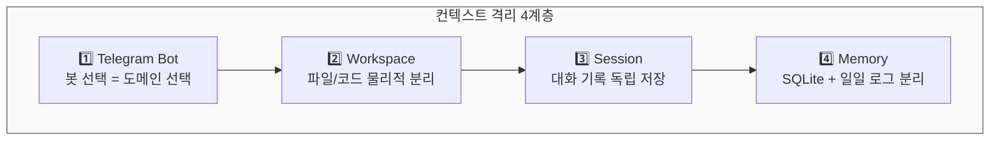
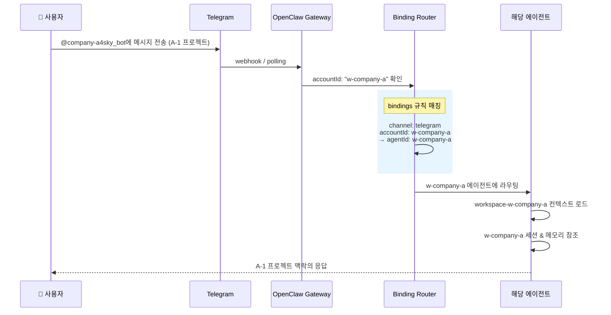
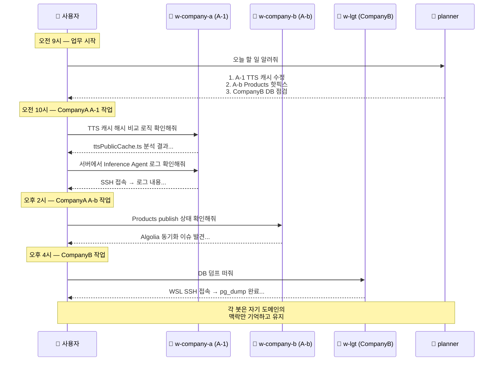

# 내가 경험한 OpenClaw — 2. Multi Agent

> **OpenClaw 1대, Telegram Bot 6개 — 맥락이 끊기지 않는 멀티 에이전트 워크플로우**

---

## 2.1 왜 멀티 에이전트인가?

### 이걸 안 했을 때

> 처음에는 봇 하나로 모든 걸 시켰다.
> CompanyA A-1 프로젝트 코드리뷰를 하다가 CompanyB 배포 이슈를 물어보면, 에이전트가 A-1 프로젝트 파일에서 CompanyB 관련 코드를 찾으려고 했다.
> 대화가 길어질수록 이전 맥락이 희석되고, 여러 프로젝트의 컨텍스트가 뒤섞여서 결국 "처음부터 다시 설명"하는 일이 반복됐다.

AI 에이전트에게 모든 업무를 한 채팅에서 시키면 어떻게 될까?





**요점:** 같은 CompanyA 소속이라도 프로젝트별로 에이전트를 나누면 맥락이 섞이지 않고, 대화가 길어져도 정확도가 유지된다.

---

## 2.2 에이전트 구성 — 1 Gateway, 6 Agents



### 에이전트별 역할과 성격

| 에이전트 | Bot | 도메인 | 성격 | 주요 업무 |
|---------|-----|--------|------|-----------|
| **w-company-a** | @company-a4sky_bot | CompanyA / A-1 | 업무형 | Service Hub, TTS, Kiosk, 서버 운영 |
| **w-company-b** | @company-b4sky_bot | CompanyA / A-b | 업무형 (paul) | CMS/Payload, Products 관리, Algolia 검색, AWS EC2 |
| **w-lgt** | @lgt4sky_bot | CompanyB | 간결/주도적 (paul) | API, DB 덤프/복구, WSL/Docker, 클라이언트 그래프 |
| **planner** | @planner4sky_bot | 일정/계획 | 차분/다정 (Luma) | TODO, 리마인더, 프로젝트 관리, 일정 조율 |
| **main** | @sky4clawd_bot | 범용 | 기본 | DM 전용, 특정 도메인에 속하지 않는 작업 |

---

## 2.3 컨텍스트 격리 아키텍처

각 에이전트는 **완전히 독립된 환경**에서 동작한다.

| 계층 | w-company-a | w-company-b | w-lgt | planner | main |
|------|-----------|---------|-------|---------|------|
| **Workspace** | `workspace-w-company-a/` | `workspace-w-company-b/` | `workspace-w-lgt/` | `workspace-planner/` | `clawd/` |
| **Sessions** | `agents/w-company-a/sessions/` | `agents/w-company-b/sessions/` | `agents/w-lgt/sessions/` | `agents/planner/sessions/` | `agents/main/sessions/` |
| **Memory** | `w-company-a.sqlite` | `w-company-b.sqlite` | `w-lgt.sqlite` | `planner.sqlite` | `main.sqlite` |
| **Ontology** | `graph.sqlite` | `graph.sqlite` | `graph.sqlite` | `graph.sqlite` | — |
| **Config** | AGENTS.md / SOUL.md | AGENTS.md / SOUL.md | AGENTS.md / SOUL.md | AGENTS.md / SOUL.md | CLAUDE.md |

> 모든 행이 에이전트별로 **물리적으로 분리**되어 있다. 데이터가 섞일 여지가 없다.

### 격리 계층



| 계층 | 무엇이 분리되나 | 왜 필요한가 |
|------|----------------|------------|
| **Telegram Bot** | 입력 채널 자체 | 봇을 고르는 순간 도메인이 결정됨 |
| **Workspace** | 파일, 코드, 설정 | 프로젝트 코드가 섞이지 않음 |
| **Session** | 대화 이력 | 과거 맥락이 다른 주제에 오염되지 않음 |
| **Memory** | 장기 기억 (벡터 DB + 일일 로그) | 에이전트가 해당 도메인만 기억함 |


---

## 2.4 Binding Router — 메시지가 에이전트를 찾아가는 방법



### openclaw.json 바인딩 설정

```json
"bindings": [
  { "agentId": "w-company-a", "match": { "channel": "telegram", "accountId": "w-company-a" } },
  { "agentId": "w-company-b",   "match": { "channel": "telegram", "accountId": "w-company-b" } },
  { "agentId": "w-lgt",     "match": { "channel": "telegram", "accountId": "w-lgt" } },
  { "agentId": "planner",   "match": { "channel": "telegram", "accountId": "planner" } }
]
```

규칙은 단순하다. 그런데 이 정도만으로도 **하나의 게이트웨이가 5개의 독립된 AI 에이전트처럼 동작**한다.

---

## 2.5 메모리 시스템 — 맥락이 유지되는 비결

각 에이전트는 독립된 메모리를 가진다. 핵심은 **워크스페이스별 격리**.

| 계층 | 저장소 | 역할 |
|------|--------|------|
| Daily Log | `memory/YYYY-MM-DD.md` | 당일 작업 raw 기록 |
| MEMORY.md | 큐레이팅된 장기 기억 | 중요 결정/패턴만 보존 |
| Vector DB | `memory/{agent}.sqlite` | 임베딩 기반 시맨틱 검색 |
| Ontology | `memory/ontology/graph.sqlite` | 엔티티/관계 구조화 |

> **w-company-a**(A-1)에게 "Inference Agent 성별 검출 로직 확인해줘"라고 말하면 과거 기록을 찾아 응답하지만,
> **w-company-b**(A-b)에게 같은 질문을 하면 **아무 기억이 없다.** 같은 CompanyA 소속이라도 프로젝트별 격리 덕분이다.
>
> *메모리 시스템의 상세 구조는 [4단락 Obsidian & Ontology](openclaw-talk-04-obsidian-ontology.md)에서 다룬다.*

---

## 2.6 실제 운영 패턴 — 하루 동안의 봇 전환



---

## 2.7 핵심 가치

> **"맥락 전환 비용을 제로로 만든다."**
>
> CompanyA의 두 프로젝트(A-1, A-b) + CompanyB + 일정 관리를 하나의 AI로 돌리면 맥락이 뒤섞인다.
> Telegram Bot을 프로젝트별로 분리하면, **봇을 선택하는 것 자체가 컨텍스트 스위칭**이 된다.
> 같은 회사 소속이라도 프로젝트가 다르면 에이전트를 나눈다 — 각자 자기 도메인만 기억하고, 서로 오염되지 않는다.

| 문제 | 멀티 에이전트 해결 |
|------|-------------------|
| 대화가 길어지면 맥락 유실 | 도메인별 세션 분리로 맥락 보존 |
| 프로젝트 간 컨텍스트 혼재 | Workspace + Memory 물리적 격리 |
| "아까 그거" 참조 실패 | Vector DB로 과거 대화 시맨틱 검색 |
| 업무/개인 경계 모호 | w- 접두사 = 업무, 나머지 = 개인 |
| 에이전트 성격 획일화 | 봇별 Identity 설정 (paul, Luma) |

---

*다음 단락: 3. OMX Runbook*
