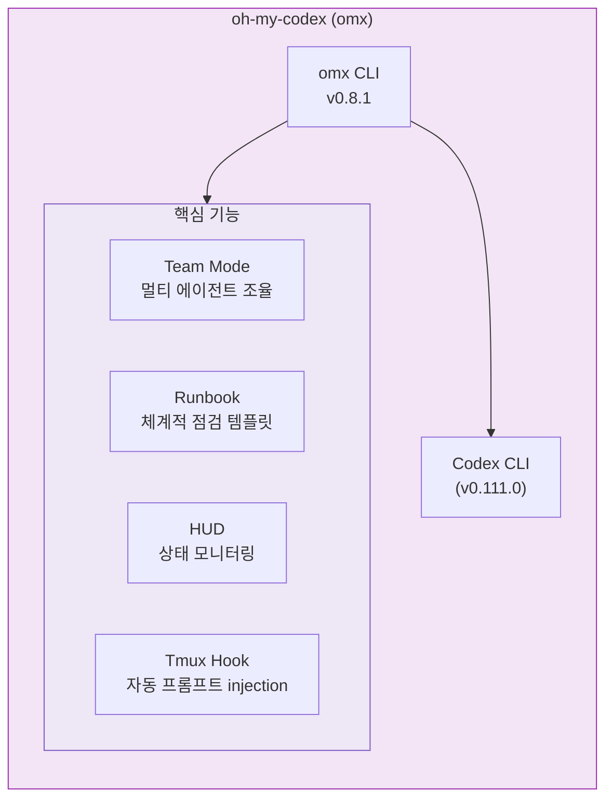
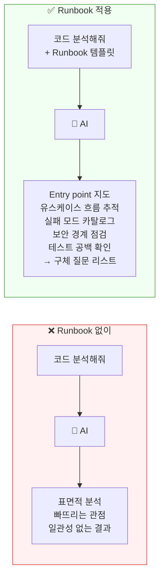
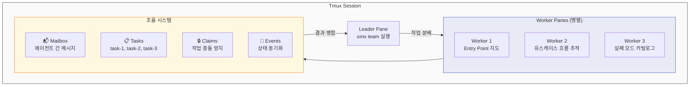
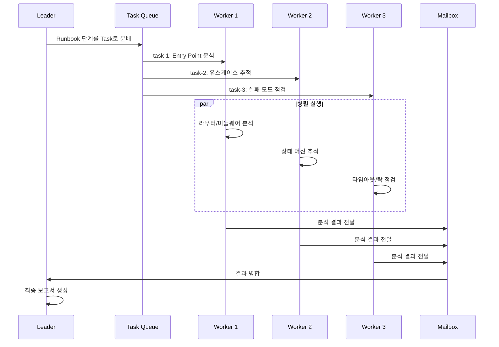
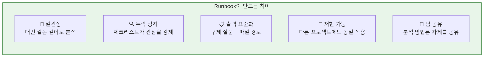

# 내가 경험한 OpenClaw — 3. OMX Runbook

> **omx(oh-my-codex) — 체계적 점검 템플릿으로 AI 에이전트의 분석 품질을 끌어올리다**

*2단락에서 멀티 에이전트 Telegram Bot은 각 주제의 대화 맥락을 유지하기 위한 핵심 요소였다.
그런데 맥락이 유지되는 것만으로는 부족하다. 에이전트에게 "코드 리뷰해줘"라고 하면 1차원적인 표면 분석에 그치기 쉽다.
그래서 OMX Runbook을 도입했다. AI에게 "잘해줘"가 아니라 "이 순서대로 확인해"라고 말하기 위해서다.*

---

## 3.1 OMX란?

OMX(oh-my-codex)는 Codex CLI 위에 멀티 에이전트 오케스트레이션, HUD, Tmux 통합, 그리고 **Runbook 시스템**을 얹은 도구다.

---

## 3.2 Runbook이 필요한 이유

### 이걸 안 했을 때

> Inference Agent 코드를 "리뷰해줘"라고만 시켰을 때, 에이전트는 코드 스타일과 네이밍 정도만 지적했다.
> 정작 문제였던 `normalize_and_validate` 3곳 중복 호출이나 `INVALID_REQUEST`가 500으로 응답되는 버그는 못 찾았다.
> Runbook의 Stage 2(유스케이스 흐름 추적)와 Stage 5(실패 모드 카탈로그)를 적용하고 나서야 이 문제들이 드러났다.
> *(7단계 중 발췌 적용)*

AI 에이전트에게 "이 코드 분석해줘"라고 말하면?

**요점:** Runbook은 AI에게 "어디를 봐야 하는지"를 체크리스트로 고정한다. 그래서 분석이 깊어지고, 결과도 들쭉날쭉하지 않다.

---

## 3.3 Ambiguity Hunt Runbook — 7단계 요약

프로젝트의 **애매함**을 체계적으로 찾아내는 점검 체크리스트다. 핵심은 "AI에게 봐야 할 관점을 순서대로 강제"하는 것.

| 단계 | 한 줄 요약 |
|------|-----------|
| 0️⃣ 스코프 고정 | "오늘은 이것만" 1줄로 적기 |
| 1️⃣ Entry Point 지도 | 진입점, 라우터, 미들웨어, DI 파악 |
| 2️⃣ 유스케이스 흐름 | 요청→검증→상태변경→저장→응답 추적 |
| 3️⃣ 도메인 모델 | 엔티티, 관계, 롤백 규칙 확인 |
| 4️⃣ 설정/환경 | 플래그 영향 범위, 타임존, 키 회전 |
| 5️⃣ 실패 모드 | API 오류, DB 락, 캐시 불일치 카탈로그 |
| 6️⃣ 보안 경계 | 인증, 입력 검증, 민감정보 마스킹 |
| 7️⃣ 테스트 공백 | 깨지면 큰일나는 경로가 보호되는가 |

> 출력물: **애매한 지점 TOP 5** (파일 경로 포함) + **구체 질문 목록** (Yes/No 또는 선택지)

---

## 3.4 적용 사례: Runbook으로 발견한 것들

Inference Agent 리팩토링에 Runbook을 적용했을 때, "코드 분석해줘"만으로는 못 찾던 문제들이 드러났다.

| 심각도 | 발견 | 수정 |
|--------|------|------|
| 🔴 | `normalize_and_validate` 3곳 중복 호출 | 단일 진입점으로 일원화 |
| 🔴 | Chain step0 검증 누락 → 잘못된 입력 무시 | step0 검증 UX 보완 |
| 🟡 | `INVALID_REQUEST`가 500 응답 | InvalidRequest 예외 → 400 응답 |
| 🟡 | `ServiceRequestRegistry.get_model` 중복 조회 | 중복 조회 제거 |
| 🟢 | `parameters_normalized` 플래그 일관성 부족 | 플래그 규칙 통일 |

> Stage 2(유스케이스 흐름)에서 중복 호출을, Stage 5(실패 모드)에서 500 응답 버그를 각각 포착했다.

---

## 3.5 운영 Runbook — 장애 대응에도 같은 원리

코드 분석뿐 아니라 **장애 대응**에도 Runbook을 적용한다. 장애 시 AI가 정해진 순서대로 점검하고 복구하거나 보고한다.

| Runbook | 트리거 | 자동 점검 흐름 |
|---------|--------|---------------|
| **502 에러 대응** | 서버 502 감지 | Docker ps → Nginx 설정 → Health check → 로그 확인 → 복구 or 보고 |
| **부하 일관성** | 부하 이상 감지 | 헬스체크 → Load Reconciler → Stale Job Detector |
| **서버 현황** | 정기 점검 | docker ps 전체 상태 스냅샷 기록 |

---

## 3.6 Team Mode — Runbook + 멀티 에이전트

OMX의 Team Mode는 Runbook을 **여러 에이전트가 병렬로 실행**할 수 있게 한다.

### Team Mode 동작 방식

---

## 3.7 Runbook의 가치

> **"AI에게 '잘 해줘'가 아니라, '이 순서로 이것들을 확인해'라고 말한다."**
>
> Runbook은 AI 에이전트의 분석을 **재현 가능하고 체계적인 프로세스**로 바꾼다.
> 사람이 경험으로 쌓은 점검 노하우를, AI가 빠뜨리지 않고 매번 실행하게 만드는 장치다.

| 기존 방식 | Runbook 방식 |
|-----------|-------------|
| "코드 분석해줘" (자유 형식) | 7단계 체크리스트 순차 실행 |
| 분석 깊이가 들쭉날쭉 | 매번 동일한 관점으로 점검 |
| 결과가 산문형 | 구조화된 출력 (TOP 5 + 질문 목록) |
| 재사용 어려움 | 프로젝트 교체해도 동일 적용 |
| 혼자만 아는 노하우 | 팀 전체가 공유하는 방법론 |

---

*다음 단락: 4. Obsidian & Ontology*
