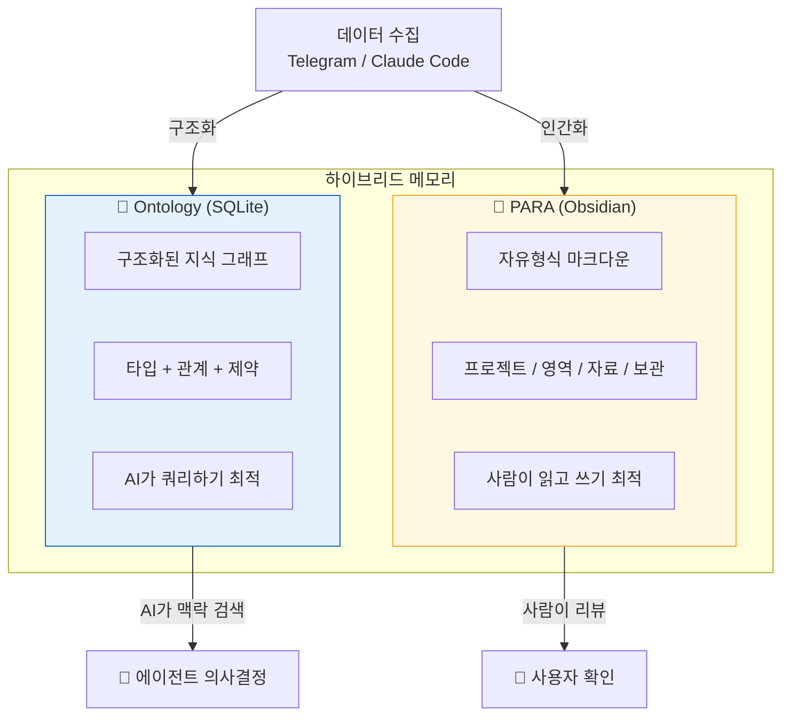
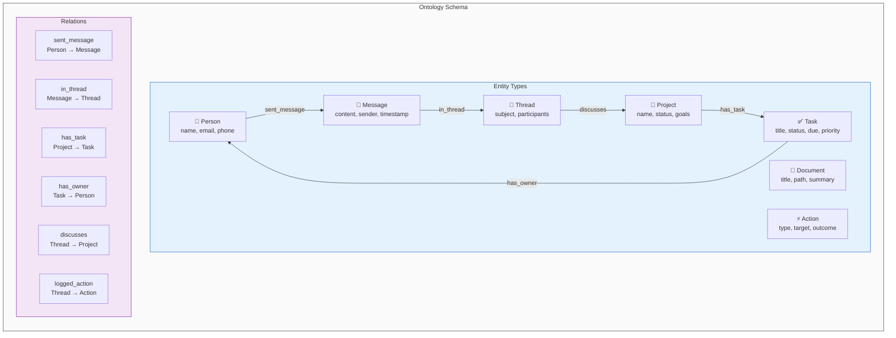
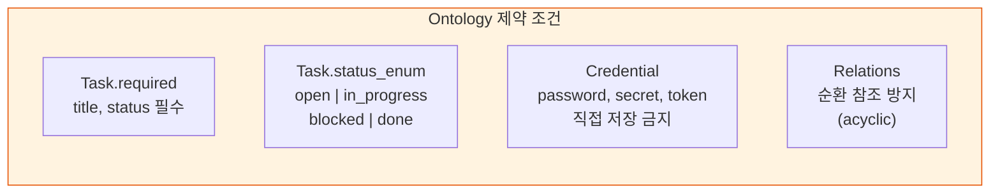
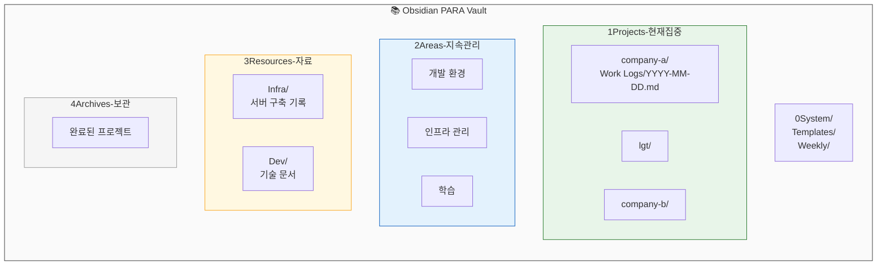
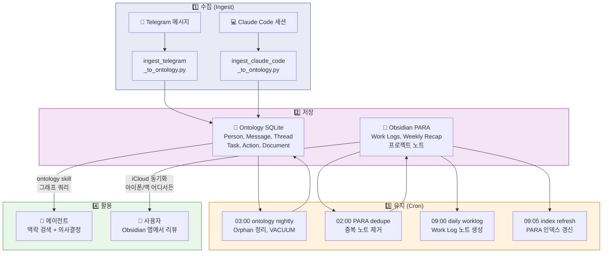
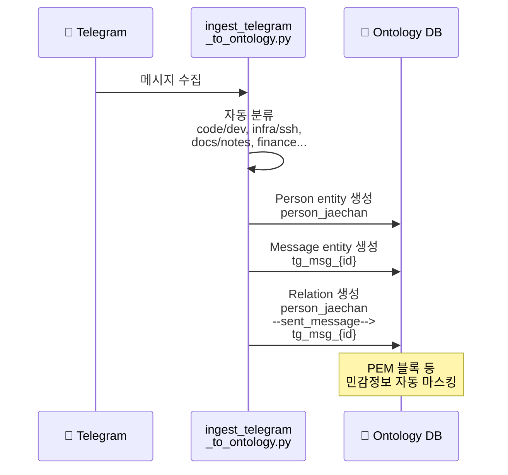
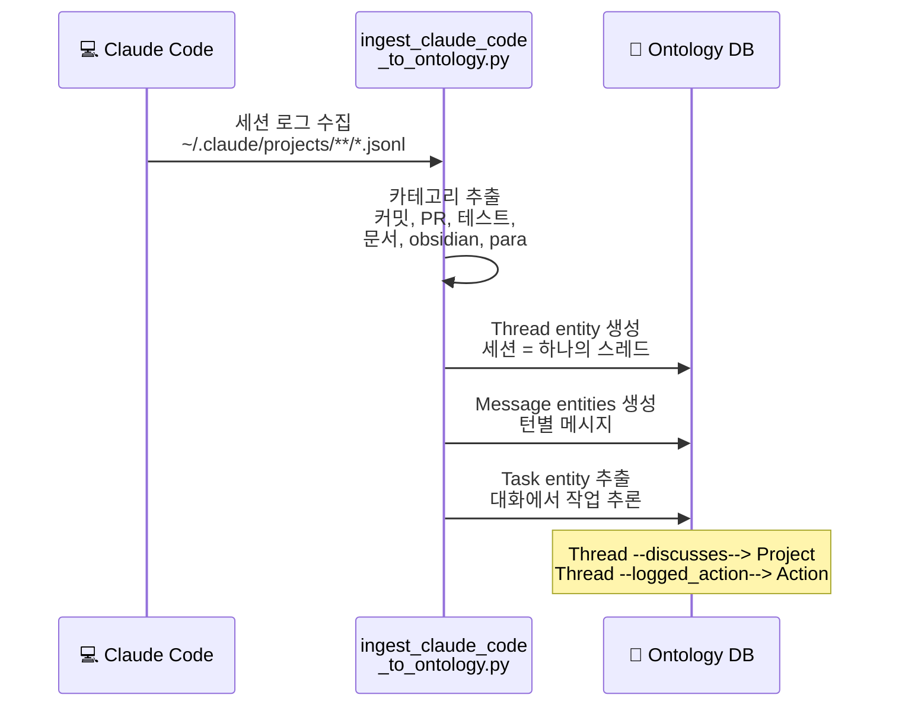
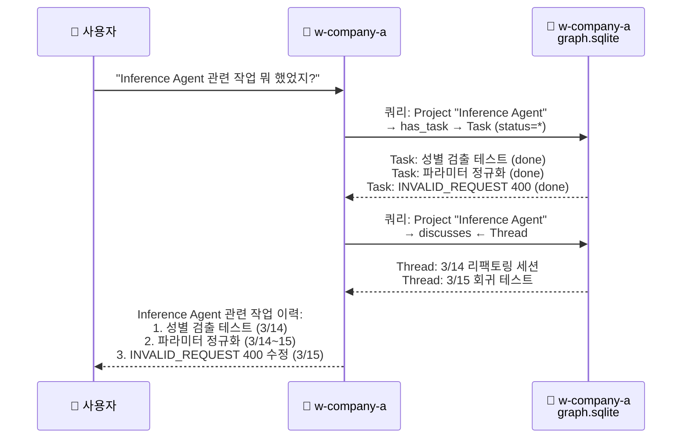
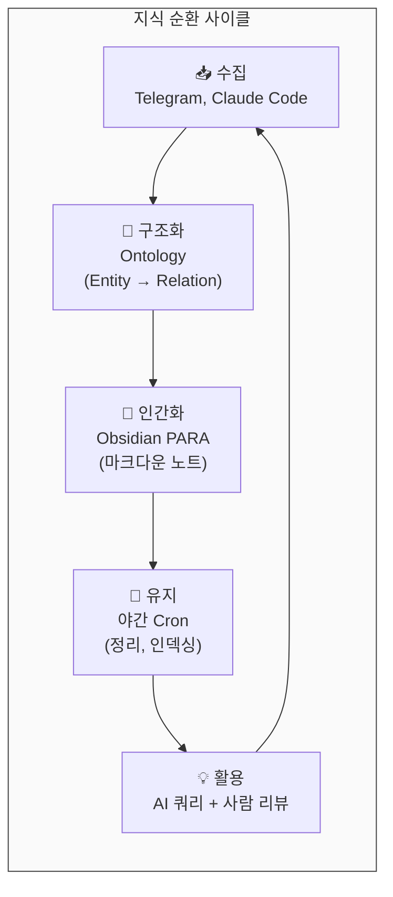

# 내가 경험한 OpenClaw — 4. Obsidian & Ontology

> **기계가 읽는 그래프 + 사람이 읽는 노트 — 하이브리드 메모리 아키텍처**

*Runbook으로 분석하고, 에이전트가 작업한 결과는 어디에 쌓이는가?
AI가 쿼리할 수 있는 구조화된 그래프(Ontology)와, 사람이 읽을 수 있는 마크다운 노트(Obsidian PARA). 이 두 가지를 같이 굴린다.*

---

## 4.1 왜 두 가지 저장소가 필요한가?

| | Ontology | PARA (Obsidian) |
|---|---------|----------------|
| **형식** | SQLite 그래프 DB | 마크다운 파일 |
| **대상** | AI 에이전트 | 사람 |
| **구조** | Entity → Relation → Entity | 폴더 → 파일 → 본문 |
| **강점** | 정확한 쿼리, 관계 추적 | 직관적 탐색, 창의적 사고 |
| **약점** | 사람이 직접 읽기 어려움 | 기계가 의미 파악 어려움 |

---

### 이걸 안 했을 때

> 2주 전에 Inference Agent에서 성별 검출 로직을 테스트했는데, 결과가 기억나지 않았다.
> 메모리 시스템이 없었으면 "353번 이미지가 female, 349번이 male"이라는 결과를 처음부터 다시 실행해야 했다.
> Ontology에 저장되어 있었기 때문에, "Inference Agent 성별 검출 결과 알려줘"라고 물으니 즉시 나왔다.
> 반면 같은 질문을 w-company-b 봇에 하면 아무 결과도 없다 — 워크스페이스별 격리가 정확히 작동하는 것이다.

## 4.2 Ontology — 타입화된 지식 그래프

### 제약 조건 (schema.yaml)

---

## 4.3 PARA — Obsidian 기반 지식 관리

---

## 4.4 데이터 흐름 — 수집에서 활용까지

---

## 4.5 Ingest 파이프라인 상세

### Telegram → Ontology

### Claude Code → Ontology

---

### Ontology Skill 사용 예시

---

## 4.6 자동화와의 연결

Obsidian과 Ontology는 [5단락 스케줄러](openclaw-talk-05-scheduler.md)의 Cron 작업과 연결되어 자동으로 유지된다.

| 시간 | 작업 | 대상 |
|------|------|------|
| 02:00~02:30 | PARA vault 중복 제거 | Obsidian |
| 03:00 | nightly maintenance (Orphan 정리, VACUUM) | Ontology |
| 09:00~09:10 | Work Log / 인덱스 / Weekly Recap 자동 생성 | Obsidian |

> 수집 → 저장 → 유지 → 활용의 전체 사이클이 사람 개입 없이 돌아간다.

---

## 4.7 핵심 가치

> **"AI는 그래프를 쿼리하고, 사람은 노트를 읽는다."**
>
> Ontology는 에이전트가 **구조화된 맥락을 빠르게 검색**할 수 있게 하고,
> Obsidian PARA는 사용자가 **직관적으로 지식을 탐색**할 수 있게 한다.
> 두 저장소가 함께 동작하면서, AI와 사람 모두에게 최적화된 메모리를 제공한다.

| 기존 방식 | Ontology + PARA |
|-----------|----------------|
| 대화 기록만 남김 | 구조화된 그래프로 관계 추적 |
| AI가 과거 맥락 모름 | ontology skill로 즉시 쿼리 |
| 노트 정리는 수동 | Cron이 매일 자동 생성/정리 |
| 프로젝트 간 지식 혼재 | 워크스페이스별 DB 격리 |
| 사람 또는 기계 한쪽만 최적 | 양쪽 모두에 최적화 |

---

*다음 단락: 5. 스케줄러*
