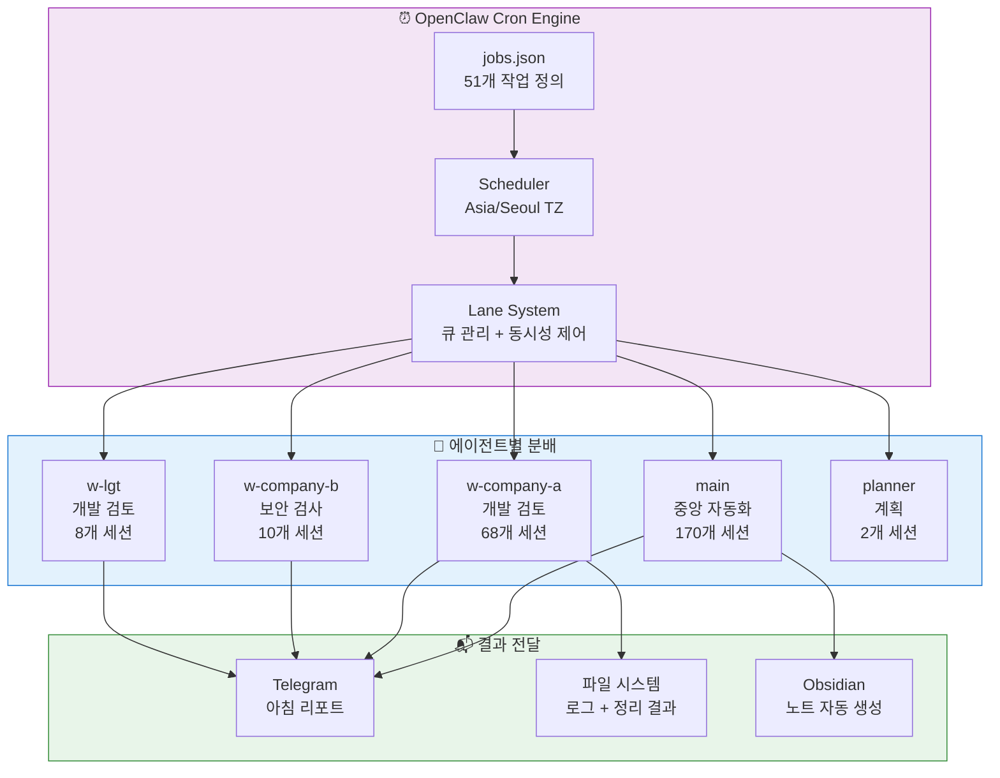
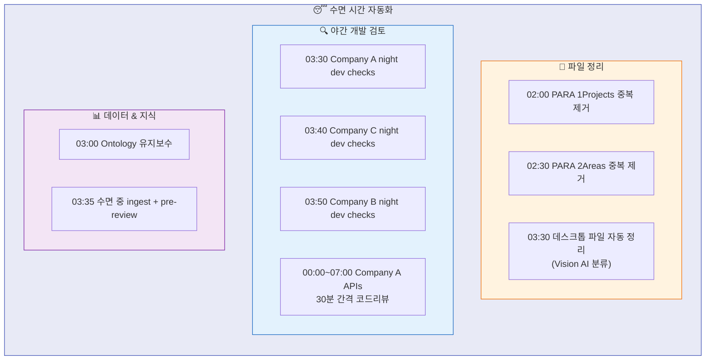
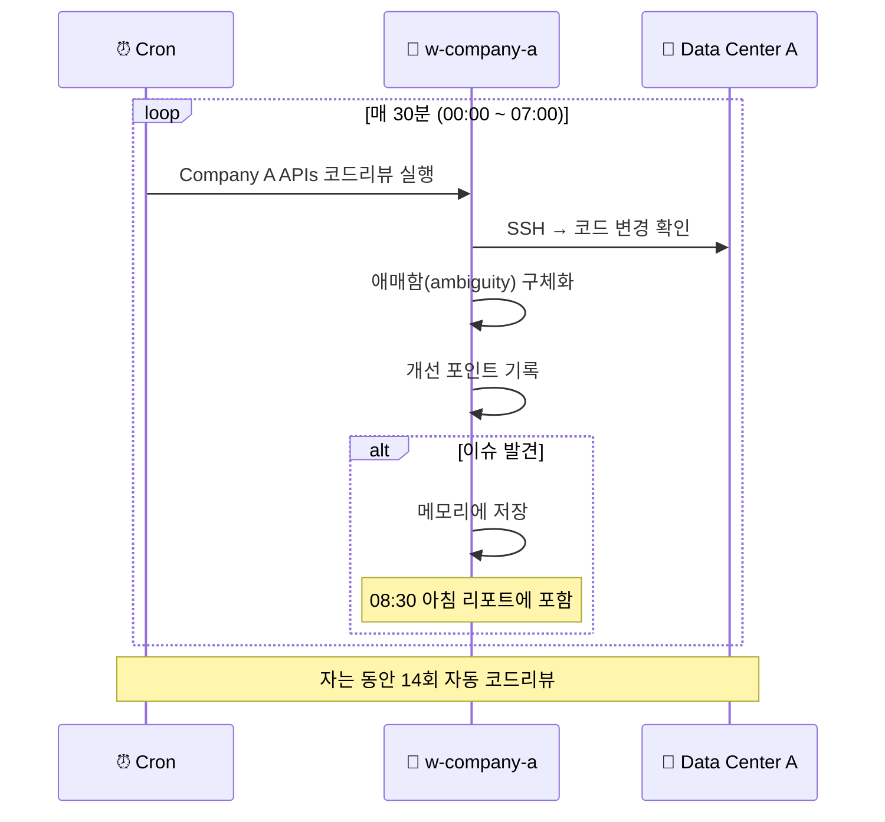
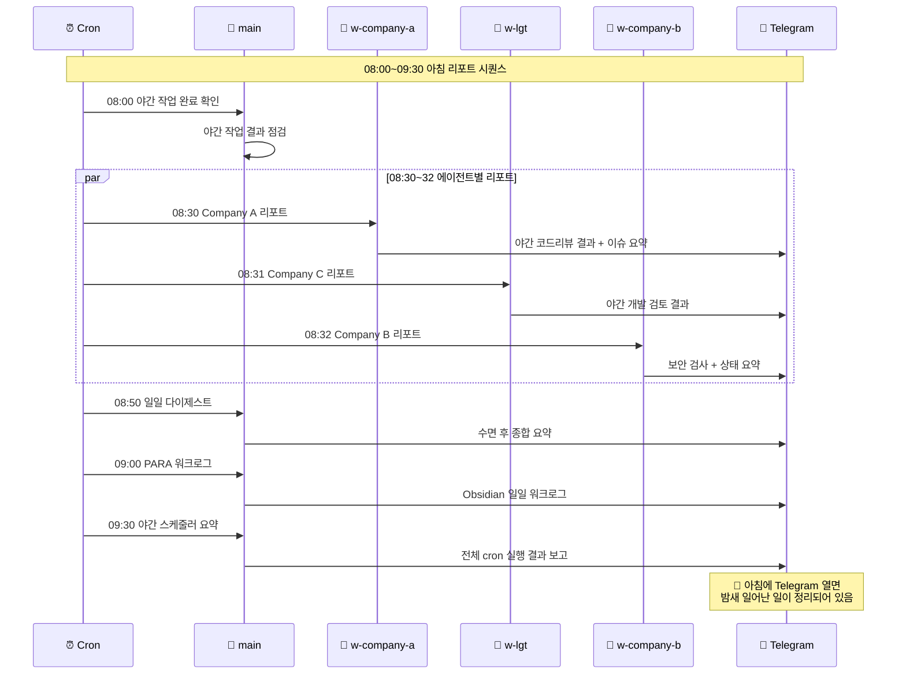
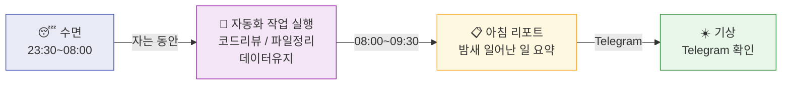

# 내가 경험한 OpenClaw — 5. 스케줄러

> **내가 자는 동안에도 작업이 돌아간다**

*Obsidian과 Ontology라는 저장소가 갖춰졌다. 이제 여기에 데이터를 자동으로 채워야 한다.
코드리뷰, 데이터 정리, 아침 리포트 — 자는 동안에도 에이전트가 일하게 만들고 싶었다.
그래서 OpenClaw의 Cron 스케줄러를 설계했다.*

---

## 5.1 전체 스케줄 타임라인

```mermaid
gantt
    title 밤새 AI가 일하고, 아침에 리포트를 받는다 (KST)
    dateFormat HH:mm
    axisFormat %H:%M

    section 🌙 야간 자동화
    PARA vault 중복 제거               :para, 01:00, 1h
    Ontology 유지보수                  :onto, 02:00, 1h
    데스크톱 파일 정리 (Vision AI)       :desk, 03:00, 1h
    A-1 코드리뷰 + 야간 개발 검토       :cr1, 04:00, 1h
    A-b 코드리뷰 + 야간 개발 검토       :cr2, 05:00, 1h
    CompanyB 코드리뷰 + 야간 개발 검토  :cr3, 06:00, 1h
    야간 작업 결과 취합                 :agg, 07:00, 1h

    section ☀️ 아침 리포트
    Telegram 종합 리포트 전송           :crit, rpt, 08:00, 30min

    section 🧑‍💻 업무 시간
    사용자 대화 기반 작업               :manual, 10:00, 8h

    section 😴 취침
    에이전트 자율 작업 대기              :sleep, 23:00, 2h
```

---

### 이걸 안 했을 때

> 스케줄러 도입 전에는, 아침에 출근하면 각 서버 로그를 하나씩 열어보는 것부터 시작했다.
> Data Center A 서버 접속 → docker logs 확인 → Company B EC2 접속 → 배포 상태 확인 → Project C DB 상태 확인.
> 매일 1시간이 소요됐다. 지금은 Telegram에 아침 리포트가 와 있고, 5분이면 전체 상황 파악이 끝난다.
> 시간도 아꼈지만, 더 좋았던 건 **인지 부하가 줄었다**는 점이다. "혹시 어젯밤에 뭐 터졌나?" 같은 불안이 사라졌다.

## 5.2 자동화 구조

---

## 5.3 수면 시간 자동화 상세

내가 자는 동안(약 23:30 ~ 08:00) 실행되는 작업들.

### 야간 개발 검토 — 30분 간격 코드리뷰

---

## 5.4 아침 리포트 — 잠에서 깨면 Telegram에

---

## 5.5 핵심 가치

> **"자는 동안에도 에이전트는 일한다."**
>
> cron 작업이 파일 정리, 코드 리뷰, 데이터 유지보수를 수행하고,
> 아침에 Telegram을 열면 밤새 일어난 모든 일이 요약되어 기다리고 있다.

| 내가 자는 시간 | AI가 하는 일 |
|----------------|-------------|
| 00:00 ~ 02:00 | Company A API 코드리뷰 (30분 간격) |
| 02:00 ~ 03:00 | PARA vault 중복 제거 |
| 03:00 ~ 04:00 | Ontology 유지보수, 데스크톱 정리, 3개 프로젝트 야간 개발 검토 |
| 05:00 ~ 07:00 | 마감 코드리뷰 |
| 08:00 ~ 09:30 | 완료 확인 → 에이전트별 리포트 → 종합 요약 → Telegram 전송 |

---

*다음 단락: 6. Amphetamine*
