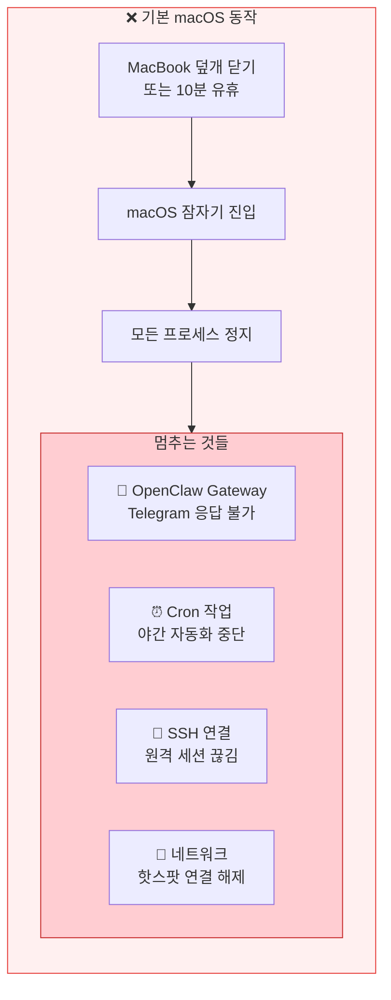
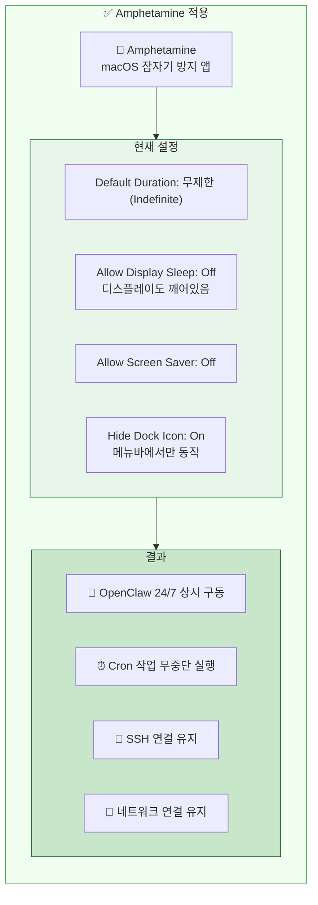
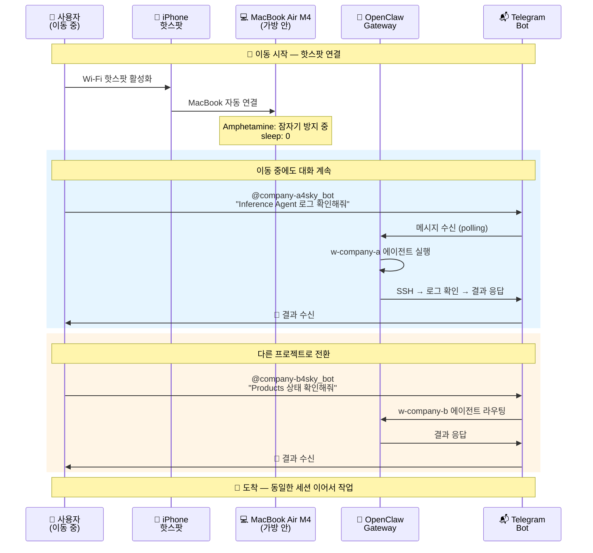
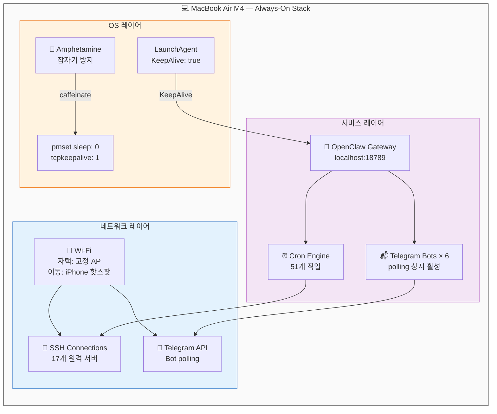
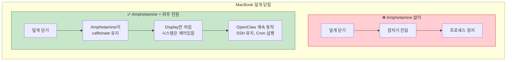
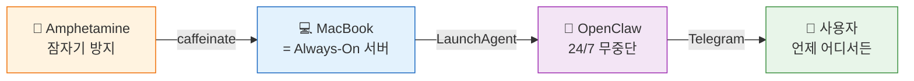

# 내가 경험한 OpenClaw — 6. Amphetamine

> **MacBook을 닫아도, 이동 중에도 — 대화는 끊기지 않는다**

*지금까지 설명한 모든 것 — 멀티 에이전트, Runbook, Obsidian/Ontology, 야간 스케줄러 — 의 전제가 하나 있다.
Mac이 꺼지지 않아야 한다.*

---

## 6.1 문제: Mac이 잠들면 모든 게 멈춘다



OpenClaw Gateway는 **LaunchAgent로 상시 구동**(KeepAlive: true)되지만, Mac이 잠들면 의미가 없다.

### 이걸 안 했을 때

> Amphetamine을 설정하기 전, 밤에 Mac 덮개를 닫고 잤다.
> 아침에 Telegram을 열었는데 리포트가 하나도 와 있지 않았다. 야간 Cron 51개 전부 실패.
> 코드리뷰도, PARA 정리도, 야간 개발 검토도 — 전부 멈춰 있었다.
> Mac이 잠들지 않게 하는 것, 이 하나가 전체 자동화의 전제 조건이었다.

---

## 6.2 해결: Amphetamine으로 잠자기 방지



### pmset 현재 상태

```
sleep: 0 (sleep prevented by coreaudiod, powerd, caffeinate)
displaysleep: 10
tcpkeepalive: 1
powernap: 1
womp: 1 (Wake on LAN)
```

**sleep: 0** — Amphetamine이 caffeinate를 통해 시스템 잠자기를 완전 차단.

---

## 6.3 이동 중 워크플로우: 핫스팟 + Telegram



---

## 6.4 항상 켜져 있는 인프라 스택



---

## 6.5 덮개를 닫아도 동작하는 이유



### 핵심 조건

| 조건 | 역할 |
|------|------|
| **Amphetamine** | caffeinate로 시스템 잠자기 차단 |
| **전원 연결** (자택/사무실) | 배터리 걱정 없이 상시 구동 |
| **핫스팟** (이동 중) | 네트워크 연결 유지 |
| **tcpkeepalive: 1** | TCP 연결 끊김 방지 |
| **womp: 1** | Wake on LAN 지원 |
| **KeepAlive: true** | Gateway 크래시 시 자동 재시작 |

---

## 6.6 핵심 가치

> **"장소가 바뀌어도, Mac 덮개를 닫아도, 대화는 끊기지 않는다."**
>
> Amphetamine 하나로 MacBook Air M4가 **항상 켜진 서버**가 된다.
> 핫스팟만 연결하면 이동 중에도 Telegram으로 6개 에이전트와 대화하고,
> 자는 동안에는 51개 Cron 작업이 멈추지 않는다.



| 일반 MacBook 사용 | Amphetamine + OpenClaw |
|-------------------|----------------------|
| 덮개 닫으면 잠자기 | 덮개 닫아도 시스템 깨어있음 |
| 이동하면 작업 중단 | 핫스팟으로 이동 중 대화 계속 |
| 밤에 Mac 꺼짐 | 야간 자동화 무중단 실행 |
| 크래시 시 수동 재시작 | KeepAlive로 자동 복구 |
| 장소마다 환경 재설정 | 어디서든 동일한 에이전트 접근 |

---

*다음 단락: 7. 자동 에러 감지 & 수정*
