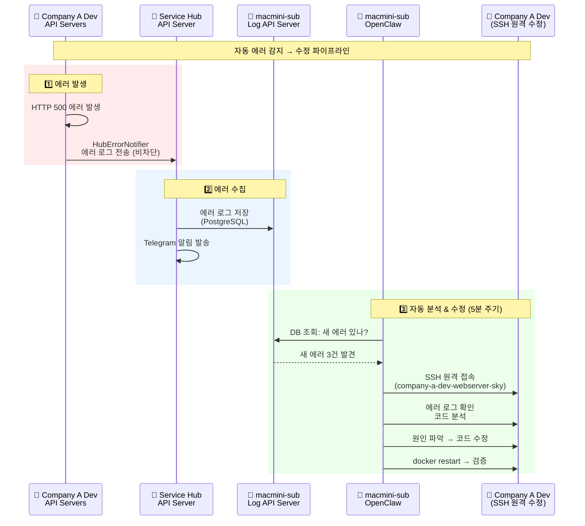
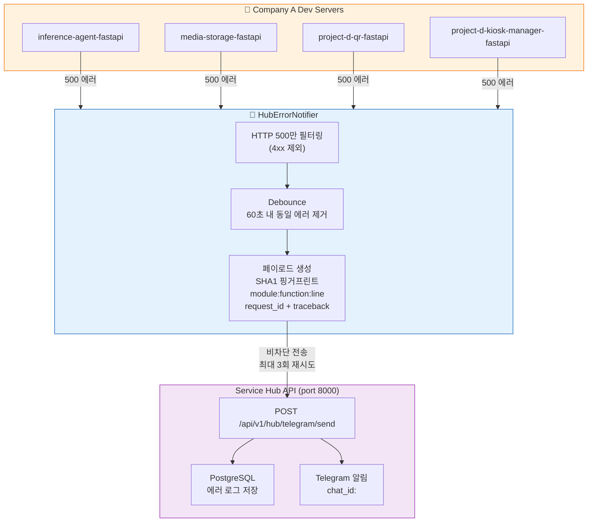
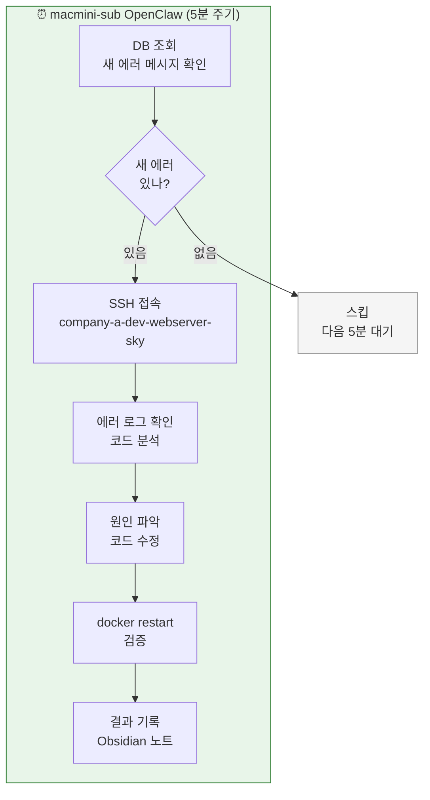
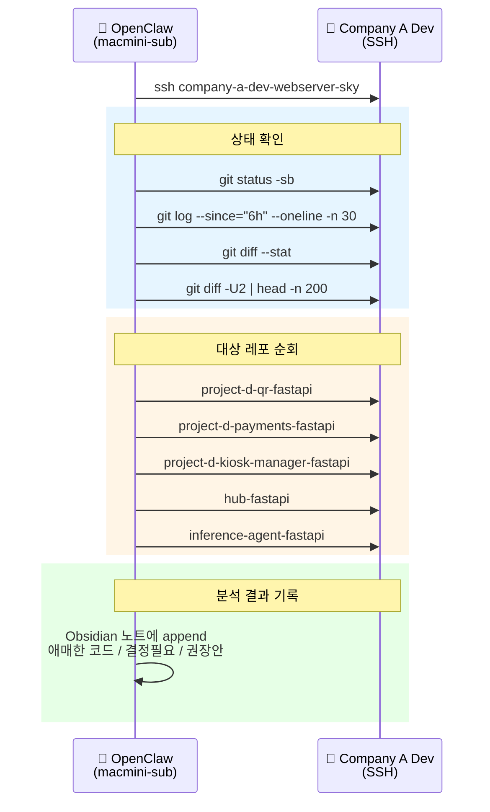
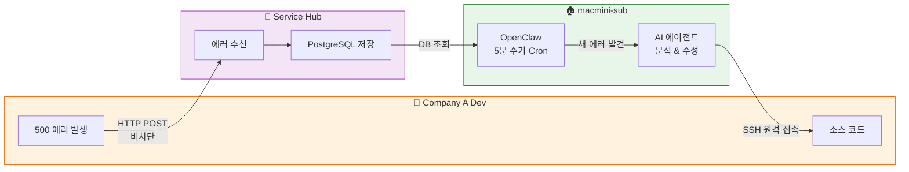

# 내가 경험한 OpenClaw — 7. 자동 에러 감지 & 수정

> **500 에러가 발생하면, AI가 알아서 찾아가서 고친다**

*6단락까지는 "사람이 시키면 에이전트가 한다"였다.
7단락은 한 단계 더 나아간다 — 에러가 발생하면 사람이 시키지 않아도, 에이전트가 스스로 감지하고 원인을 파악하고 수정까지 시도한다.
지금은 망가져서 동작하지 않고 있지만, 실제로 동작했던 파이프라인이다.*

---

## 7.1 전체 파이프라인

---

## 7.2 에러 포워딩 — HubErrorNotifier

### 설계 원칙

| 원칙 | 구현 | 이유 |
|------|------|------|
| **비차단** | 포워딩 실패해도 API 응답에 영향 없음 | 모니터링이 서비스를 죽이면 안 됨 |
| **무한 재귀 방지** | 포워더 내부에서 로거 미사용 (stderr만) | 에러 전송 중 에러 → 무한 루프 방지 |
| **중복 제거** | 60초 내 동일 에러 debounce | Telegram 폭주 방지 |
| **추적성** | request_id + module:function:line + traceback | 정확한 위치 즉시 파악 |
| **재시도** | 최대 3회 retry | 네트워크 일시 장애 대응 |

---

## 7.3 자동 수정 파이프라인 — 5분 주기

### OpenClaw가 SSH로 수행하는 작업

---

## 7.4 데이터 흐름 — 3개 서버를 잇는 파이프라인

### 이걸 안 했을 때

> 야간에 Inference Agent에서 500 에러가 터졌는데, 아침에 출근해서야 알았다.
> 로그를 뒤져서 원인 파악하고 수정하는 데 1시간.
> 이 파이프라인이 동작할 때는, 에러 발생 5분 안에 에이전트가 알아서 로그를 확인하고
> 코드를 분석해서 수정 방안까지 Obsidian에 기록해뒀다.
> 아침에 할 일은 기록을 확인하고 승인하는 것뿐이었다.

---

### 핵심 가치

| 전통적 방식 | 자동 에러 수정 파이프라인 |
|------------|------------------------|
| 에러 발생 → 아침에 발견 | 에러 발생 → 5분 내 감지 |
| 수동 로그 확인 → 원인 분석 | AI가 SSH로 접속 → 자동 분석 |
| 사람이 코드 수정 | AI가 수정안 제시 + 기록 |
| 반복되는 에러에 매번 대응 | debounce + 핑거프린트로 중복 제거 |
| 모니터링 ≠ 해결 | 모니터링 → 분석 → 수정을 하나로 |
