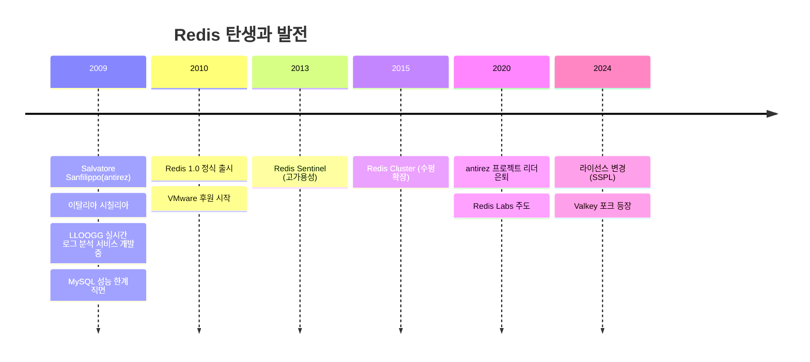
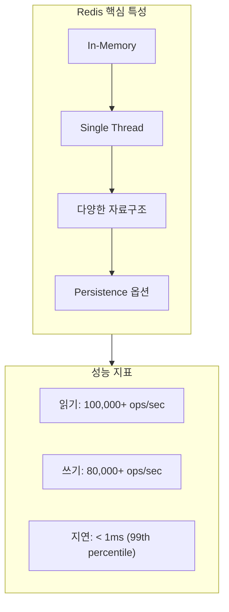
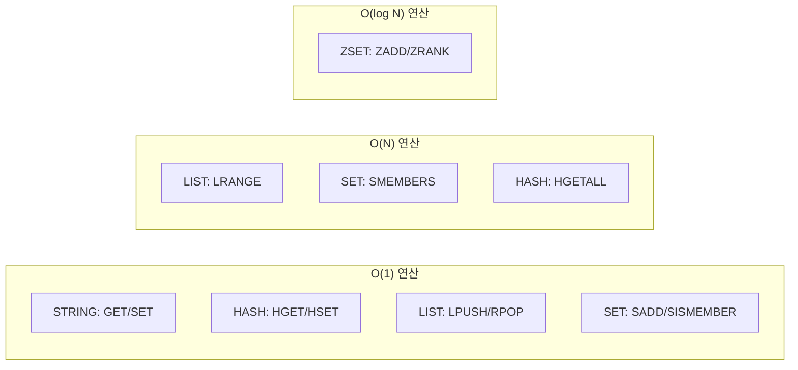
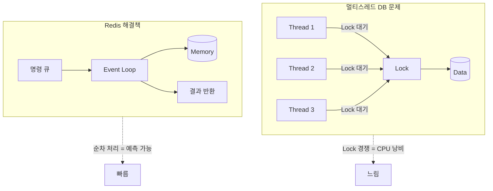

# 내가 경험한 Redis

---

## Redis 탄생 배경

### 왜 만들어졌나?

| 문제 상황 | Redis의 해결책 |
|----------|---------------|
| MySQL로 실시간 페이지뷰 집계 → 느림 | In-Memory 저장소로 μs 단위 응답 |
| 매번 디스크 I/O 발생 | 메모리에서 직접 처리 |
| 복잡한 쿼리 오버헤드 | 단순 Key-Value O(1) 연산 |
| 관계형 DB의 Lock 경쟁 | Single Thread로 Lock-free |

**핵심 철학**: "가장 빠른 데이터 접근은 디스크를 거치지 않는 것"

---

## Redis 기본 상식

### 이름의 의미

**RE**mote **DI**ctionary **S**erver = 원격 딕셔너리 서버

### 핵심 특성 5가지

| 특성 | 설명 | 이점 |
|------|------|------|
| **In-Memory** | 모든 데이터를 RAM에 저장 | μs 단위 응답, 디스크 I/O 제거 |
| **Single Thread** | 명령을 순차 처리 | Lock 없음, 원자성 보장, 경쟁 상태 제거 |
| **다양한 자료구조** | String, Hash, List, Set, ZSet 등 | 용도별 최적 구조 선택 가능 |
| **Persistence** | RDB(스냅샷) / AOF(로그) | 재시작 시 데이터 복구 |
| **Replication** | Master-Replica 구조 | 읽기 분산, 장애 복구 |

### 자료구조별 시간복잡도

### Single Thread인데 왜 빠른가?

| 요소 | 설명 |
|------|------|
| **I/O Multiplexing** | epoll/kqueue로 수천 연결 동시 처리 |
| **메모리 직접 접근** | 디스크 대기 없음 |
| **단순 연산** | 대부분 O(1), 복잡한 쿼리 파싱 없음 |
| **Context Switch 없음** | 스레드 전환 오버헤드 제거 |

## Redis 정의 (요약)

> Redis는 **In-Memory 기반의 Key-Value 자료구조 서버**로,
> O(1) 시간복잡도의 빠른 연산과 다양한 자료구조를 제공하여
> **캐싱, 세션 관리, 메시지 큐**에 가장 널리 사용된다.

---

## 본 문서의 구성

### 1. Cache

- [1계정의 무한 접속 차단](./2-cache.md#1-1계정의-무한-접속-차단)
- [i18n 다국어 캐싱](./2-cache.md#2-i18n)
- [메인 페이지 화면 구성요소](./2-cache.md#3-메인-페이지-화면-구성요소)

### 2. Queue

- [Job Queue 아키텍처](./3-queue.md)
