# 내가 경험한 Redis

---

## Redis 탄생 배경

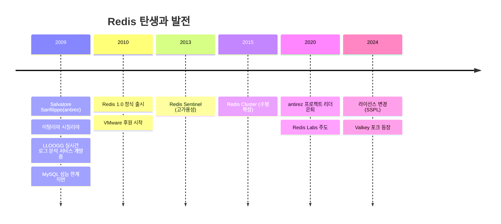

### 왜 만들어졌나?

| 문제 상황 | Redis의 해결책 |
|----------|---------------|
| MySQL로 실시간 페이지뷰 집계 → 느림 | In-Memory 저장소로 μs 단위 응답 |
| 매번 디스크 I/O 발생 | 메모리에서 직접 처리 |
| 복잡한 쿼리 오버헤드 | 단순 Key-Value O(1) 연산 |
| 관계형 DB의 Lock 경쟁 | Single Thread로 Lock-free |

**핵심 철학**: "가장 빠른 데이터 접근은 디스크를 거치지 않는 것"

---

## Redis 기본 상식

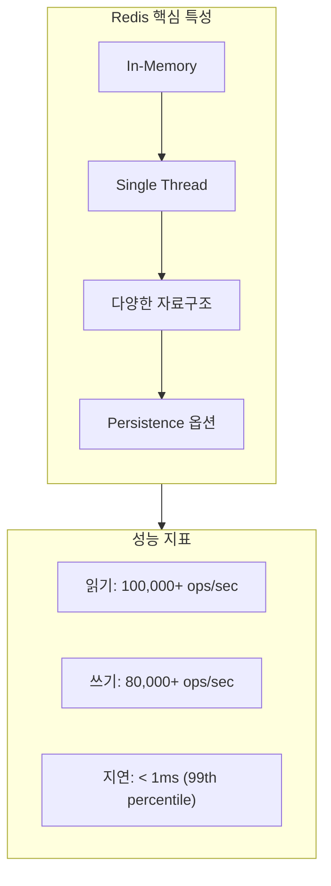

### 이름의 의미

**RE**mote **DI**ctionary **S**erver = 원격 딕셔너리 서버

### 핵심 특성 5가지

| 특성 | 설명 | 이점 |
|------|------|------|
| **In-Memory** | 모든 데이터를 RAM에 저장 | μs 단위 응답, 디스크 I/O 제거 |
| **Single Thread** | 명령을 순차 처리 | Lock 없음, 원자성 보장, 경쟁 상태 제거 |
| **다양한 자료구조** | String, Hash, List, Set, ZSet 등 | 용도별 최적 구조 선택 가능 |
| **Persistence** | RDB(스냅샷) / AOF(로그) | 재시작 시 데이터 복구 |
| **Replication** | Master-Replica 구조 | 읽기 분산, 장애 복구 |

### 자료구조별 시간복잡도

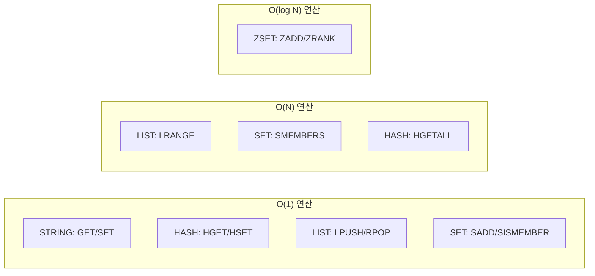

### Single Thread인데 왜 빠른가?

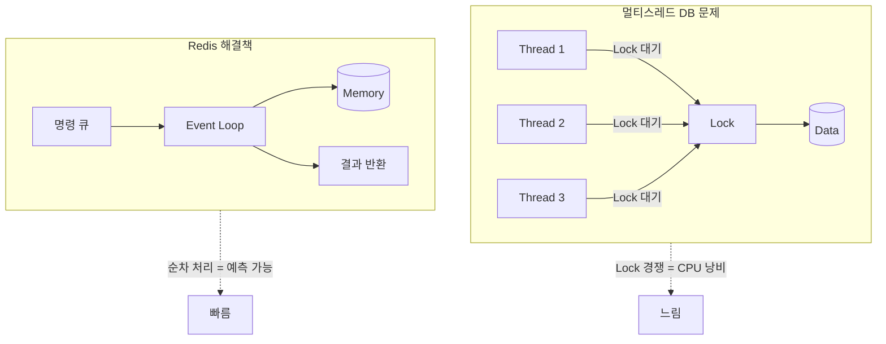

| 요소 | 설명 |
|------|------|
| **I/O Multiplexing** | epoll/kqueue로 수천 연결 동시 처리 |
| **메모리 직접 접근** | 디스크 대기 없음 |
| **단순 연산** | 대부분 O(1), 복잡한 쿼리 파싱 없음 |
| **Context Switch 없음** | 스레드 전환 오버헤드 제거 |

---

## Redis 내부 기능 - 효율적 사용을 위한 핵심 메커니즘

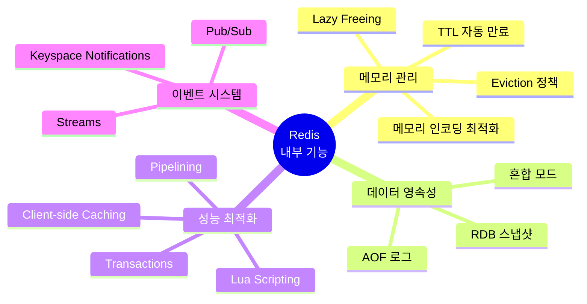

### 1. TTL (Time To Live) - 자동 만료

키에 유효기간을 설정하여 자동 삭제

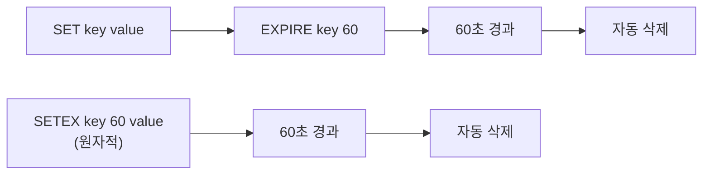

**삭제 메커니즘:**

| 방식 | 동작 | 특징 |
|------|------|------|
| **Passive (Lazy)** | 키 접근 시 만료 확인 후 삭제 | CPU 효율적 |
| **Active (Sampling)** | 100ms마다 랜덤 20개 키 검사 | 메모리 효율적 |

```python
# 주요 명령어
EXPIRE key 60       # 60초 후 만료
EXPIREAT key 1234567890  # Unix timestamp에 만료
PEXPIRE key 60000   # 밀리초 단위
TTL key             # 남은 시간 확인 (-1: 무제한, -2: 없음)
PERSIST key         # TTL 제거 (영구 보관)
```

**활용 예시:**
- 세션 관리 (30분 자동 만료)
- Rate Limiting (분당 요청 수 제한)
- 캐시 자동 갱신
- 임시 토큰/OTP 관리

---

### 2. Eviction Policies - 메모리 초과 시 제거 정책

`maxmemory` 설정 초과 시 키 제거 방식

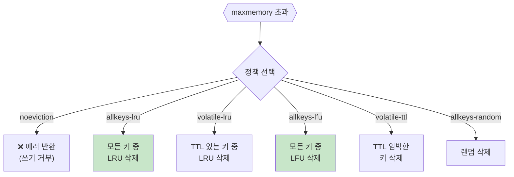

| 정책 | 대상 | 알고리즘 | 권장 용도 |
|------|------|----------|-----------|
| **noeviction** | - | 쓰기 거부 | 데이터 유실 방지 필수 |
| **allkeys-lru** | 모든 키 | 최근 미사용 | 일반 캐시 (권장) |
| **volatile-lru** | TTL 키만 | 최근 미사용 | 캐시 + 영구 데이터 혼용 |
| **allkeys-lfu** | 모든 키 | 사용 빈도 낮은 | 핫 데이터 보존 |
| **volatile-ttl** | TTL 키만 | TTL 짧은 순 | 만료 임박 우선 제거 |
| **allkeys-random** | 모든 키 | 랜덤 | 균등 분포 데이터 |

#### LRU vs LFU 알고리즘

| 약어 | 풀네임 | 의미 | 삭제 기준 |
|------|--------|------|-----------|
| **LRU** | Least Recently Used | 가장 오래 전에 사용된 | **시간** 기반 - 최근 접근하지 않은 키 |
| **LFU** | Least Frequently Used | 가장 적게 사용된 | **빈도** 기반 - 접근 횟수가 적은 키 |

**선택 가이드:**
- **LRU**: 최근 데이터가 다시 사용될 가능성이 높을 때 (일반 캐시)
- **LFU**: 자주 사용되는 "핫 데이터"를 보존해야 할 때 (인기 콘텐츠)

```bash
# 설정
maxmemory 2gb
maxmemory-policy allkeys-lru
maxmemory-samples 10  # LRU 샘플링 수 (정확도↑ = CPU↑)
```

---

### 3. Persistence - 데이터 영속성


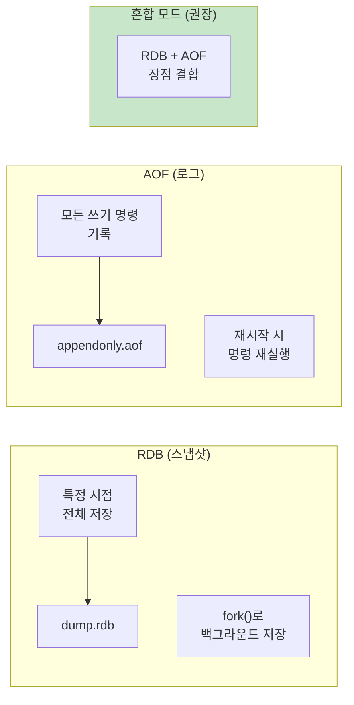

| 방식 | 장점 | 단점 | 복구 속도 |
|------|------|------|-----------|
| **RDB** | 컴팩트, 빠른 복구 | 스냅샷 간 데이터 유실 | 빠름 |
| **AOF** | 데이터 유실 최소화 | 파일 크기 큼, 느린 복구 | 느림 |
| **혼합** | 양쪽 장점 | 설정 복잡 | 빠름 |

```bash
# RDB 설정
save 900 1      # 900초 내 1개 변경 시 저장
save 300 10     # 300초 내 10개 변경 시 저장

# AOF 설정
appendonly yes
appendfsync everysec  # 매초 동기화 (권장)
# appendfsync always  # 매 명령 (느림, 안전)
# appendfsync no      # OS에 위임 (빠름, 위험)
```

#### 약어 설명

| 약어 | 풀네임 | 의미 | 파일명 |
|------|--------|------|--------|
| **RDB** | Redis DataBase | Redis 데이터베이스 스냅샷 | `dump.rdb` |
| **AOF** | Append Only File | 추가 전용 파일 (쓰기 로그) | `appendonly.aof` |

> **주의:** RDB는 관계형 데이터베이스(Relational DB)가 **아닙니다**. Redis의 메모리 스냅샷 파일 형식입니다.

---

### 4. Pipelining - 명령어 배치 처리

네트워크 RTT를 줄여 대량 명령 처리 성능 향상

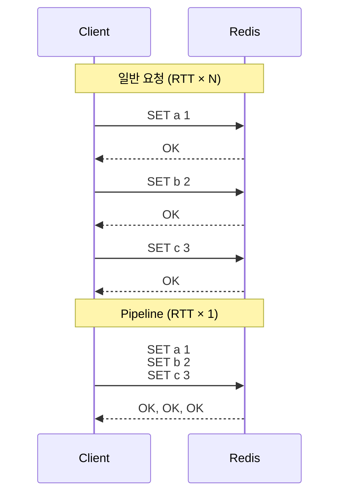

```python
# Python 예시
pipe = redis.pipeline()
for i in range(1000):
    pipe.set(f'key:{i}', i)
results = pipe.execute()  # 한 번에 전송

# 성능 비교
# 일반: 1000 RTT = ~100ms (RTT 0.1ms 가정)
# Pipeline: 1 RTT = ~0.1ms + 처리시간
```

**주의사항:**
- 너무 큰 Pipeline은 메모리 문제 → 적정 크기로 분할 (1000~10000)
- 원자성 없음 (중간 실패 시 일부만 적용)

---

### 5. Transactions - 원자적 명령 그룹

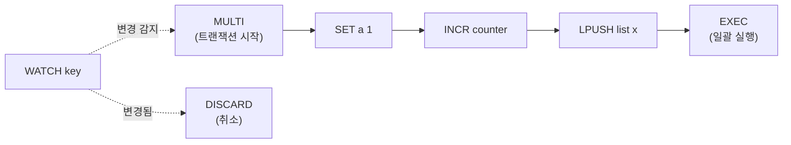

```python
# 낙관적 락 패턴 (WATCH)
while True:
    pipe = redis.pipeline()
    try:
        pipe.watch('balance')
        balance = int(pipe.get('balance'))
        if balance >= 100:
            pipe.multi()
            pipe.decrby('balance', 100)
            pipe.execute()
            break
    except WatchError:
        continue  # 다른 클라이언트가 수정함, 재시도
```

| 명령 | 역할 |
|------|------|
| `MULTI` | 트랜잭션 시작 |
| `EXEC` | 큐잉된 명령 일괄 실행 |
| `DISCARD` | 트랜잭션 취소 |
| `WATCH` | 키 감시 (낙관적 락) |

---

### 6. Lua Scripting - 서버 측 스크립트

복잡한 로직을 원자적으로 실행

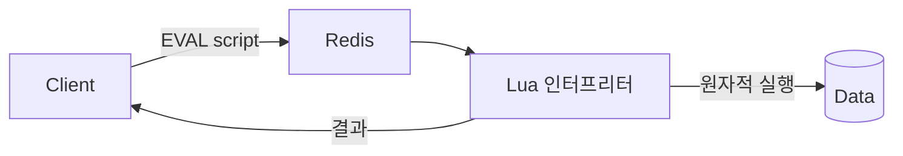

```lua
-- Rate Limiter 예시 (원자적)
local key = KEYS[1]
local limit = tonumber(ARGV[1])
local window = tonumber(ARGV[2])

local current = redis.call('GET', key)
if current and tonumber(current) >= limit then
    return 0  -- 거부
end

redis.call('INCR', key)
redis.call('EXPIRE', key, window)
return 1  -- 허용
```

```python
# Python에서 실행
script = redis.register_script(lua_script)
result = script(keys=['rate:user:123'], args=[100, 60])
```

**장점:**
- 원자성 보장 (중간에 다른 명령 개입 불가)
- 네트워크 왕복 감소
- 복잡한 비즈니스 로직 구현

---

### 7. Pub/Sub - 메시지 발행/구독

실시간 메시지 브로드캐스팅

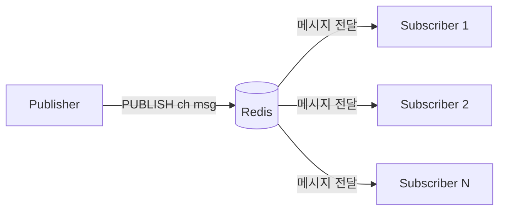

```python
# Publisher
redis.publish('notifications', json.dumps({'event': 'new_order'}))

# Subscriber
pubsub = redis.pubsub()
pubsub.subscribe('notifications')
for message in pubsub.listen():
    print(message['data'])
```

**주의:** 메시지 영속성 없음 (구독자 없으면 유실) → 필요시 Streams 사용

---

### 8. Keyspace Notifications - 키 이벤트 알림

키 변경 이벤트를 Pub/Sub로 수신


```bash
# 활성화 (redis.conf)
notify-keyspace-events Ex  # 만료 이벤트만
notify-keyspace-events AKE # 모든 이벤트
```

```python
# 만료 이벤트 구독
pubsub.psubscribe('__keyevent@0__:expired')
for message in pubsub.listen():
    expired_key = message['data']
    print(f'Key expired: {expired_key}')
```

**활용:** 세션 만료 후처리, 캐시 갱신 트리거

---

### 9. Lazy Freeing - 백그라운드 메모리 해제

대용량 키 삭제 시 블로킹 방지

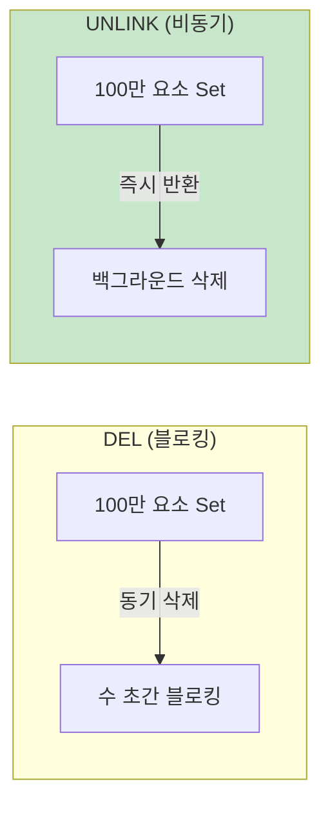

```python
# 동기 삭제 (블로킹)
redis.delete('huge_set')  # 오래 걸림

# 비동기 삭제 (논블로킹)
redis.unlink('huge_set')  # 즉시 반환
```

```bash
# 자동 비동기 설정 (redis.conf)
lazyfree-lazy-eviction yes
lazyfree-lazy-expire yes
lazyfree-lazy-server-del yes
```

---

### 10. 메모리 인코딩 최적화

작은 데이터에 최적화된 내부 인코딩

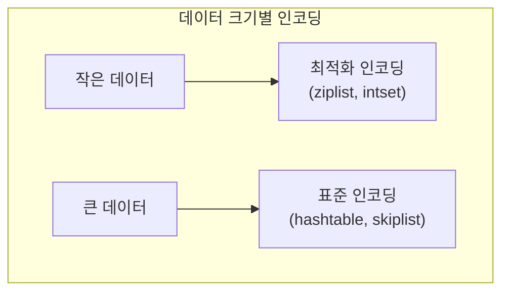

| 자료구조 | 작은 데이터 | 큰 데이터 | 임계값 |
|----------|-------------|-----------|--------|
| Hash | ziplist | hashtable | 512 필드 / 64 bytes |
| List | quicklist | quicklist | - |
| Set | intset | hashtable | 512 요소 |
| ZSet | ziplist | skiplist | 128 요소 / 64 bytes |

```bash
# 임계값 조정
hash-max-ziplist-entries 512
hash-max-ziplist-value 64
set-max-intset-entries 512
```

---

### 기능별 요약

| 기능 | 목적 | 핵심 명령어 |
|------|------|-------------|
| **TTL** | 키 자동 만료 | `EXPIRE`, `TTL`, `SETEX` |
| **Eviction** | 메모리 초과 관리 | `maxmemory-policy` |
| **Persistence** | 데이터 영속성 | `BGSAVE`, `BGREWRITEAOF` |
| **Pipelining** | 배치 처리 | `pipeline()` |
| **Transactions** | 원자적 실행 | `MULTI`, `EXEC`, `WATCH` |
| **Lua Script** | 서버 측 로직 | `EVAL`, `EVALSHA` |
| **Pub/Sub** | 메시지 브로드캐스트 | `PUBLISH`, `SUBSCRIBE` |
| **Keyspace** | 이벤트 알림 | `notify-keyspace-events` |
| **Lazy Free** | 비동기 삭제 | `UNLINK` |

---

## Redis 정의 (요약)

> Redis는 **In-Memory 기반의 Key-Value 자료구조 서버**로,
> O(1) 시간복잡도의 빠른 연산과 다양한 자료구조를 제공하여
> **캐싱, 세션 관리, 메시지 큐**에 가장 널리 사용된다.

---

## 본 문서의 구성

### 1. Cache

- [1계정의 무한 접속 차단](./2-cache.md#1-1계정의-무한-접속-차단)
- [i18n 다국어 캐싱](./2-cache.md#2-i18n)
- [메인 페이지 화면 구성요소](./2-cache.md#3-메인-페이지-화면-구성요소)

### 2. Queue

- [Job Queue 아키텍처](./3-queue.md)
