# Redis Cache 활용 사례

---

# 1. 1계정의 무한 접속 차단

## 1. 미션

유료 계정으로 여럿이서 사용하는 편법을 막아주세요.

## 2. 설계 원칙

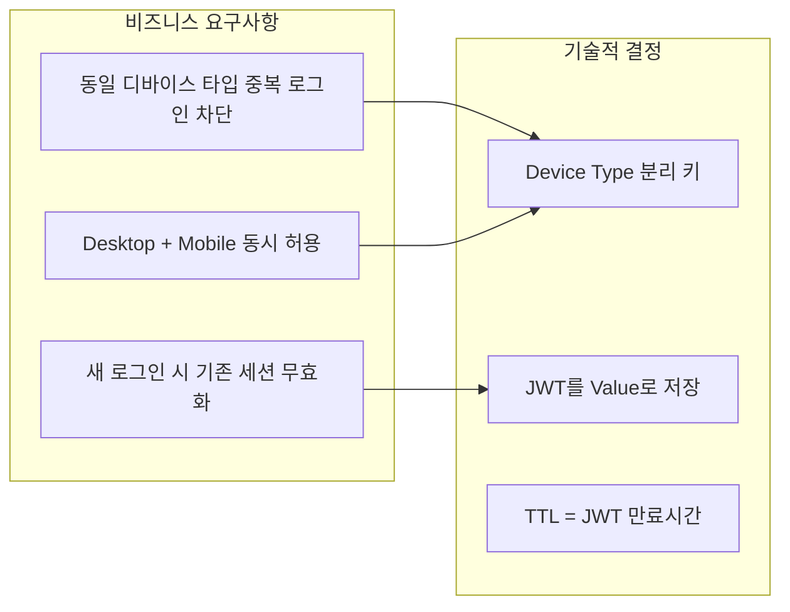

| 정책 | 설명 |
|------|------|
| **디바이스 분리** | Desktop과 Mobile을 별도로 관리하여 합리적 사용 허용 |
| **선점 방식** | 새 로그인이 기존 세션을 대체 (강제 로그아웃) |
| **실시간 검증** | 매 API 호출마다 Redis 토큰 비교 |

## 3. 아키텍처 다이어그램

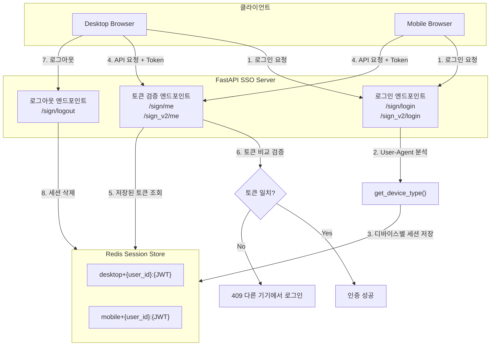

## 4. 세션 키 설계

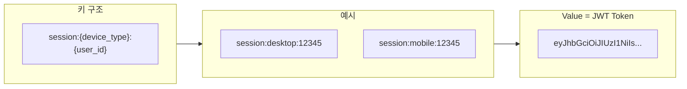

### Redis 명령어 흐름

```redis
# 로그인 시: 세션 저장 (기존 세션 자동 덮어쓰기)
SETEX session:desktop:12345 86400 "eyJhbGciOiJIUzI1NiIs..."

# API 호출 시: 토큰 검증
GET session:desktop:12345
# → 저장된 토큰과 요청 토큰 비교

# 로그아웃 시: 세션 삭제
DEL session:desktop:12345
```

## 5. TTL 전략

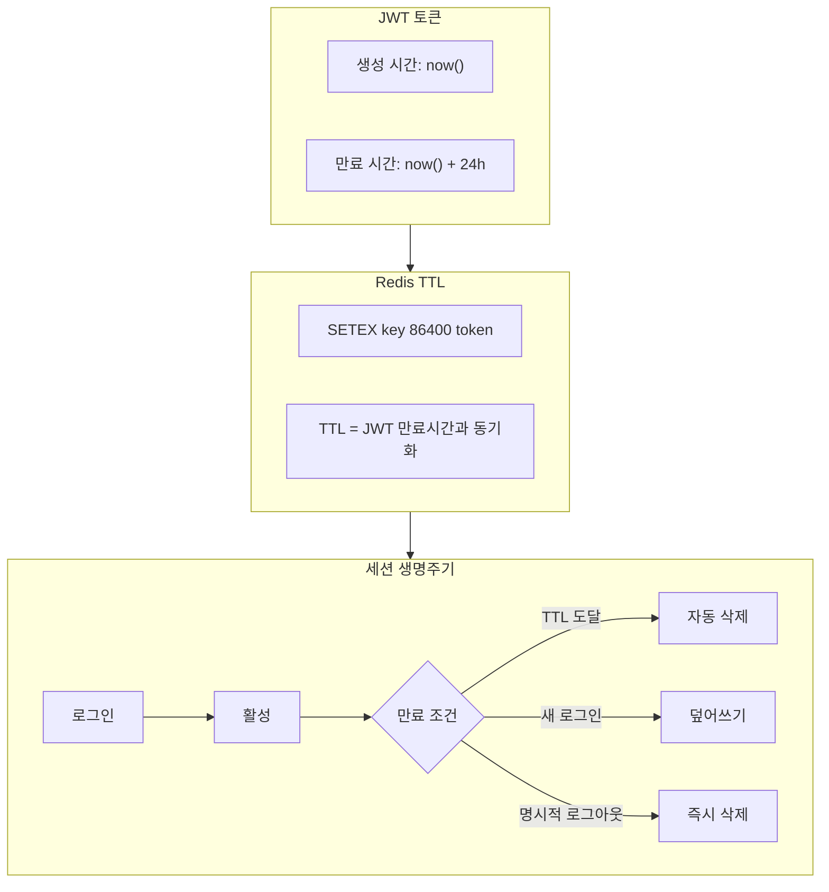

| 상황 | TTL 처리 |
|------|----------|
| **최초 로그인** | `SETEX` - JWT 만료시간과 동일하게 설정 |
| **재로그인 (동일 디바이스)** | 기존 키 덮어쓰기, TTL 갱신 |
| **다른 기기 로그인** | 기존 세션 유지, 새 키 생성 (device_type 다름) |
| **토큰 갱신 (Refresh)** | 새 토큰으로 Value 교체, TTL 리셋 |

## 6. 중복 로그인 감지 시퀀스

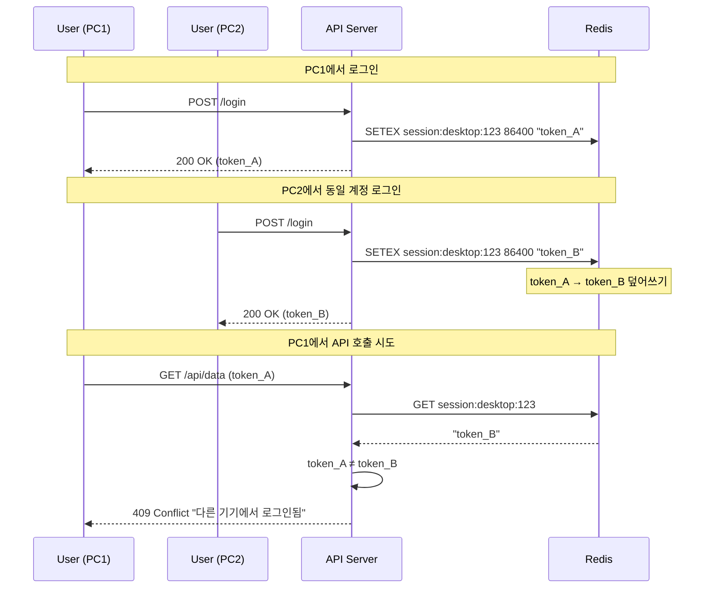

---

# 2. i18n 다국어 캐싱

## 1. 접근 방식 비교

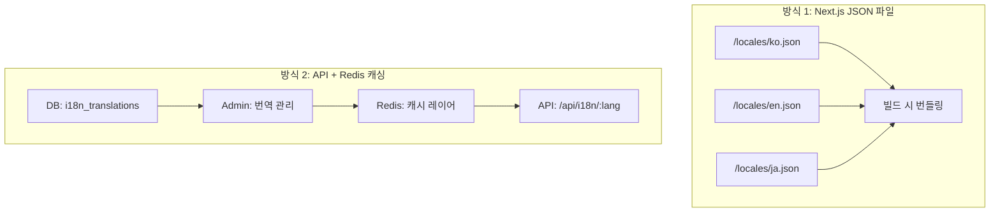

### 방식별 장단점

| 항목 | JSON 파일 방식 | API + Redis 방식 |
|------|---------------|-----------------|
| **수정 반영** | 재빌드/재배포 필요 | 즉시 반영 가능 |
| **개발자 개입** | 매번 필요 | 최소화 |
| **변경 이력** | Git 히스토리 | DB 테이블 추적 |
| **초기 로딩** | 빠름 (번들 포함) | API 호출 필요 |
| **적합한 상황** | 정적 서비스 | 빈번한 문구 변경 |

## 2. API + Redis 아키텍처

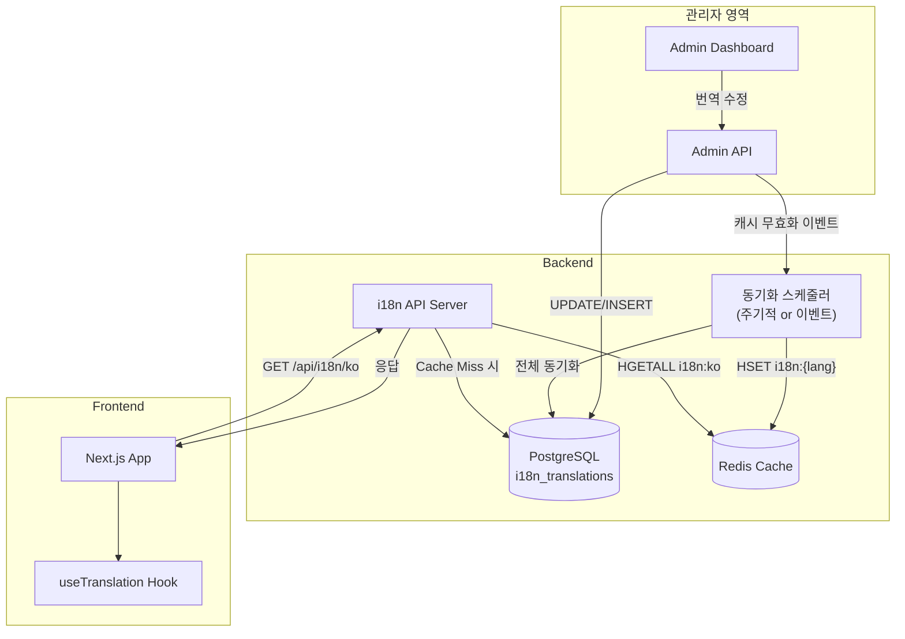

## 3. Redis 데이터 구조

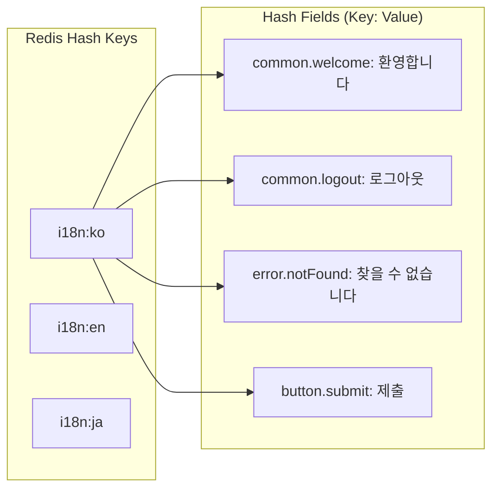

### Redis 명령어

```redis
# 언어별 번역 데이터 저장 (Hash)
HSET i18n:ko common.welcome "환영합니다" common.logout "로그아웃"
HSET i18n:en common.welcome "Welcome" common.logout "Logout"

# 특정 키 조회
HGET i18n:ko common.welcome

# 전체 언어 데이터 조회
HGETALL i18n:ko

# 캐시 갱신 시 TTL 설정 (선택적)
EXPIRE i18n:ko 3600
```

## 4. 동기화 전략

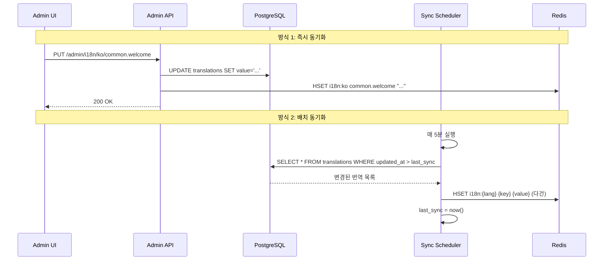

| 동기화 방식 | 트리거 | 장점 | 단점 |
|------------|--------|------|------|
| **즉시 동기화** | DB 변경 시 | 실시간 반영 | 트래픽 증가 |
| **배치 동기화** | 주기적 (5분) | 효율적 | 지연 발생 |
| **이벤트 기반** | Admin 저장 버튼 | 명시적 | 수동 개입 |

---

# 3. 메인 페이지 화면 구성요소 캐싱

## 1. 캐싱 대상

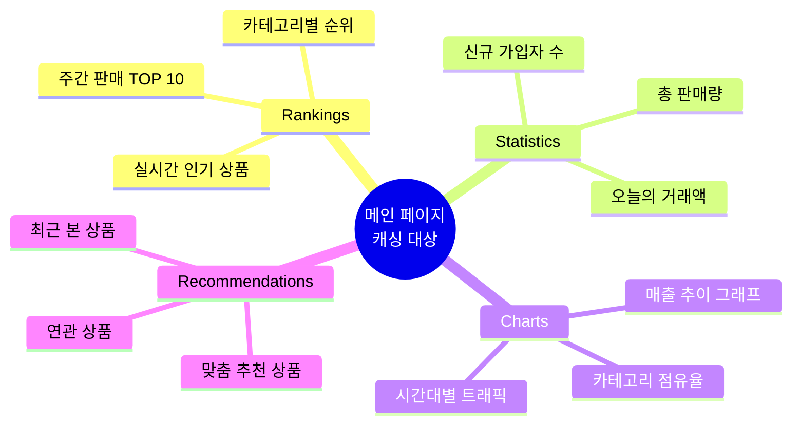

## 2. 캐싱 아키텍처

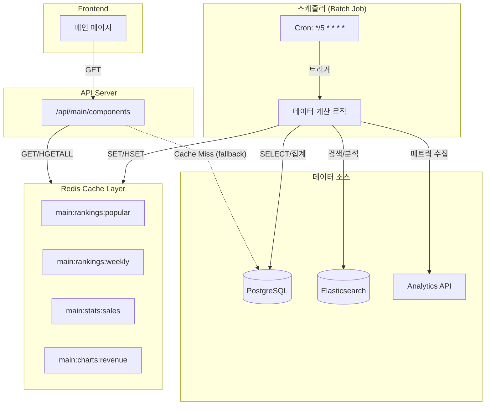

## 3. Redis 키 설계

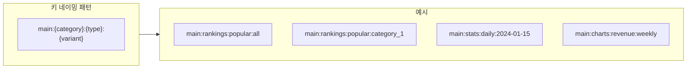

### 데이터 타입별 Redis 구조

| 데이터 | Redis 타입 | 키 예시 | 이유 |
|--------|-----------|---------|------|
| **인기 순위** | Sorted Set | `main:rankings:popular` | 점수 기반 정렬 필요 |
| **통계 수치** | Hash | `main:stats:daily` | 다중 필드 관리 |
| **차트 데이터** | String (JSON) | `main:charts:revenue` | 복잡한 구조 직렬화 |
| **추천 목록** | List | `main:recommendations:{user_id}` | 순서 보장 |

### Redis 명령어

```redis
# 인기 순위 (Sorted Set) - 점수 = 판매량
ZADD main:rankings:popular 1500 "product:101" 1200 "product:102" 980 "product:103"

# 상위 10개 조회 (내림차순)
ZREVRANGE main:rankings:popular 0 9 WITHSCORES

# 일일 통계 (Hash)
HSET main:stats:daily total_sales 15000000 new_users 342 orders 1876

# 차트 데이터 (JSON String)
SET main:charts:revenue '{"labels":["Mon","Tue","Wed"],"data":[100,150,120]}'

# TTL 설정 (5분)
EXPIRE main:rankings:popular 300
```

## 4. 갱신 주기 전략

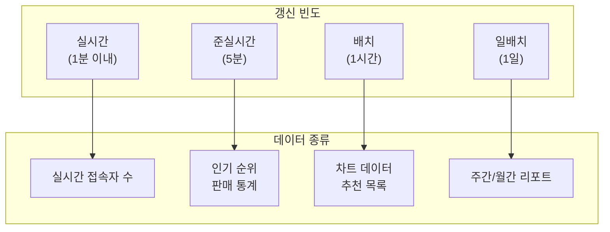

| 갱신 주기 | 대상 데이터 | 구현 방식 | TTL |
|----------|------------|----------|-----|
| **1분** | 실시간 접속자, 현재 거래 | Pub/Sub + 증분 업데이트 | 60초 |
| **5분** | 인기 순위, 판매 통계 | Cron Job | 300초 |
| **1시간** | 차트 데이터, 추천 목록 | Batch Scheduler | 3600초 |
| **1일** | 주간/월간 집계 | Daily Batch | 86400초 |

## 5. Cache Miss 처리

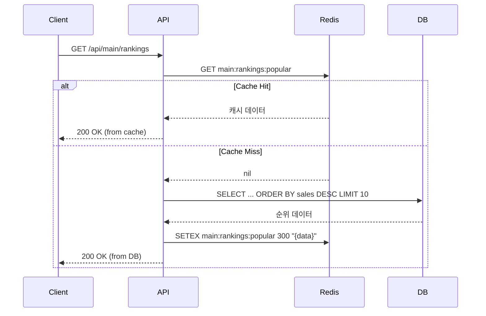

### Fallback 전략

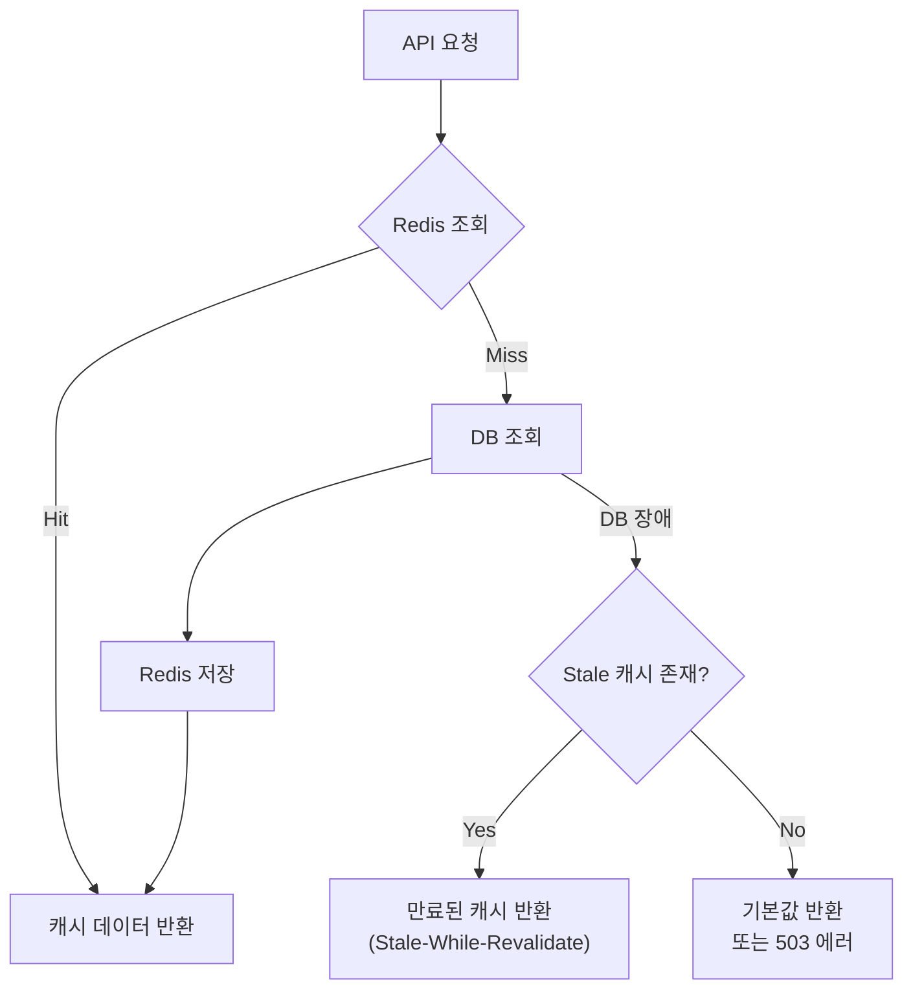

| 장애 상황 | 대응 전략 |
|----------|----------|
| **Redis 장애** | DB 직접 조회 (성능 저하 감수) |
| **DB 장애** | 만료된 캐시라도 반환 (Stale 캐시) |
| **양쪽 장애** | 정적 기본값 또는 503 응답 |

---

# 4. 캐싱 공통 고려사항

## Cache Invalidation 전략

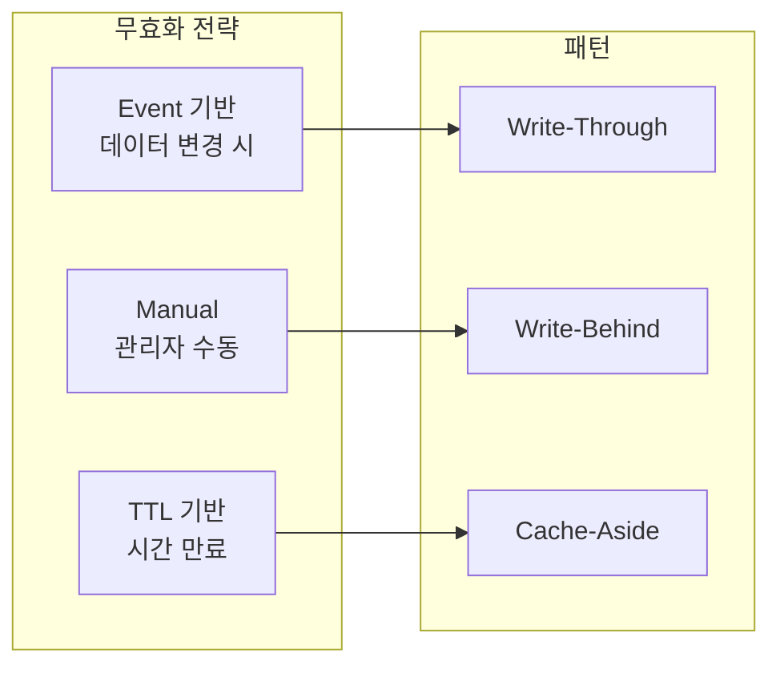

## 모니터링 지표

| 지표 | 설명 | 정상 범위 |
|------|------|----------|
| **Hit Rate** | 캐시 적중률 | > 90% |
| **Memory Usage** | Redis 메모리 사용량 | < 80% |
| **Latency** | 응답 지연 시간 | < 1ms (p99) |
| **Eviction** | 메모리 부족으로 삭제된 키 | 0 (권장) |

```redis
# 캐시 적중률 확인
INFO stats
# keyspace_hits / (keyspace_hits + keyspace_misses) * 100

# 메모리 사용량 확인
INFO memory
# used_memory_human
```
