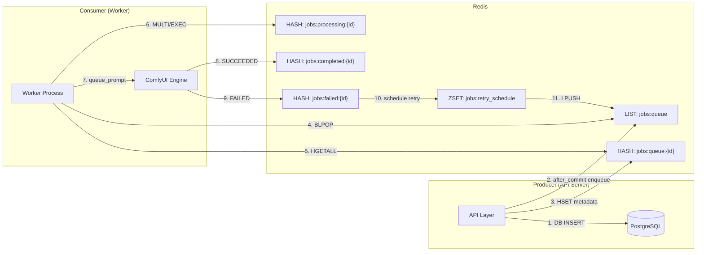
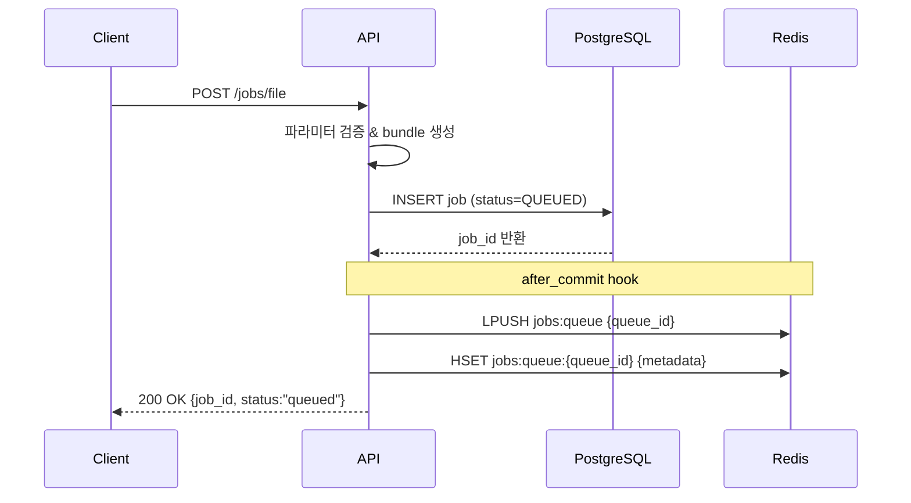
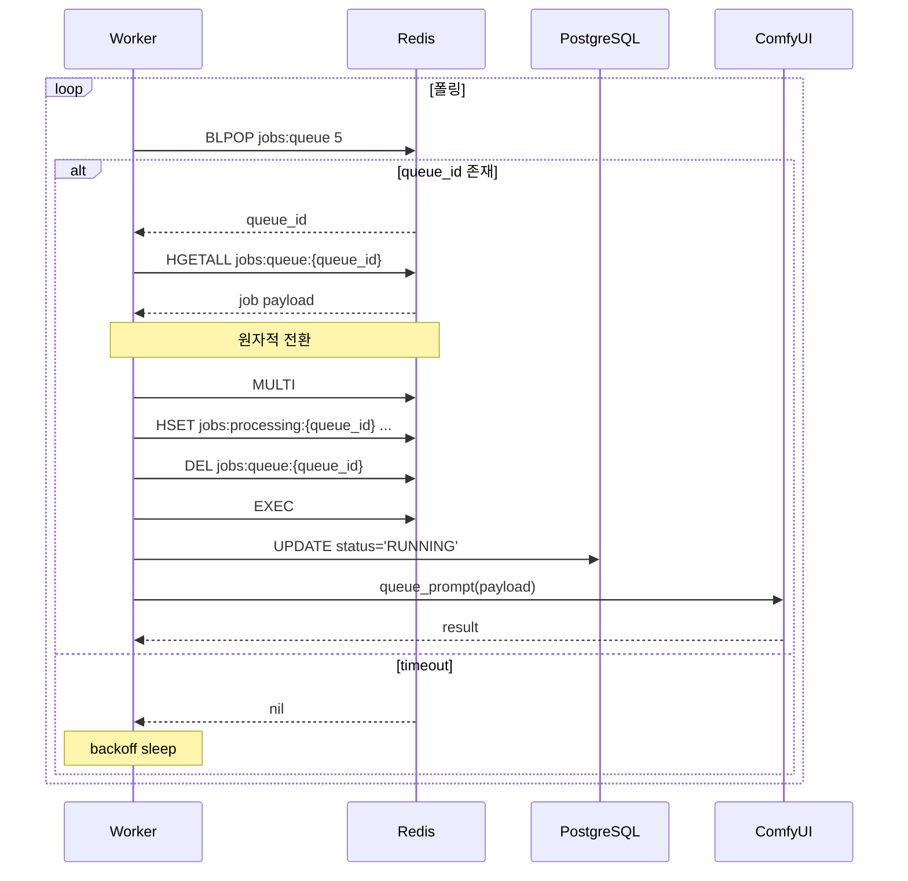

# Job Queue

## 개요

문제: 프로세스 외부(Out-of-Process) Queue → 장애와 재시작에 안전

애플리케이션 내부 queue(List/Array/ConcurrentQueue 등)는 프로세스 메모리에 종속된다.
→ 서버 재시작, 롤링 배포, 예외로 인한 크래시가 발생하면 Queue 데이터가 사라진다.

Redis 사용 시:
- Queue 데이터가 메모리+RDB/AOF에 존재 → 프로세스가 죽어도 작업 유지
- 롤링 업데이트·Scale-in/out에서도 Task 유실 없음
- Worker 장애 시에도 다른 Worker가 이어받을 수 있음

→ 신뢰성 확보(At-least-once 처리)

멀티 서버·멀티 컨테이너 간 공유 Queue 필요

문제:

내부 queue는 서버 인스턴스마다 분리된다.
→ WAS 3대면 queue도 3개 → 작업 분배 불가능 → Race/중복 처리 유발

Redis 사용 시:
- 중앙 Queue 한 곳에서 여러 API 서버 → 여러 Worker → 여러 GPU 서버로 자연스럽게 작업이 흐른다.
- Docker Compose / K8s / Auto Scaling 환경에서 수평 확장 필수 컴포넌트

→ 동시성 제어와 부하 분산의 기준점 제공

언어/서비스 간 결합도 낮추고, 확장 가능한 아키텍처 구성

내부 queue는 같은 프로세스 내부에서만 사용 가능하다.

Redis queue는:
- Python Worker → Node.js Web → Go Orchestrator → Rust GPU Manager 등 서로 다른 언어/서비스 간 메시지 공유 가능
- Message Schema 규약만 유지하면 서비스 분리/확장 쉬움


## 1. 다이어그램 개요



| 핵심 포인트 | 설명 |
|-------------|------|
| **Self-Contained Payload** | 워커가 DB 재조회 없이 실행 가능한 모든 데이터(서비스, 템플릿, 실행 파라미터)를 Redis 해시에 저장한다. |
| **원자적 상태 전환** | `MULTI/EXEC` 로 queue → processing 이동을 원자적으로 처리하여 중복 실행을 차단한다. |
| **TTL 분리 전략** | 완료/실패 해시에는 TTL을 부여하고 대기/처리 해시는 무제한으로 유지한다. |

---

## 2. Producer-Consumer 플로우

### 2.1 Producer (API Server)



**Enqueue 예시**:
```redis
# 1. Queue ID 를 FIFO 로 삽입
LPUSH comfyui:jobs:queue "uuid-1234"

# 2. 실행 번들 전체 저장
HSET comfyui:jobs:queue:uuid-1234
  id "123"
  service_type "multi-style"
  parameters '{"image_data":"...", "gender":"male"}'
  execution_bundle '{"service":{...}, "template":{...}}'
  status "queued"
  retry_count "0"
  callback_url "http://callback.server/webhook"
```

### 2.2 Consumer (Worker)



**Dequeue 예시**:
```redis
# 1. Blocking dequeue (5초)
BLPOP comfyui:jobs:queue 5

# 2. Payload 로드
HGETALL comfyui:jobs:queue:uuid-1234

# 3. Queue → Processing 원자적 이동
MULTI
  HSET comfyui:jobs:processing:uuid-1234 worker_id "worker-01" started_at "..."
  DEL comfyui:jobs:queue:uuid-1234
EXEC
```
