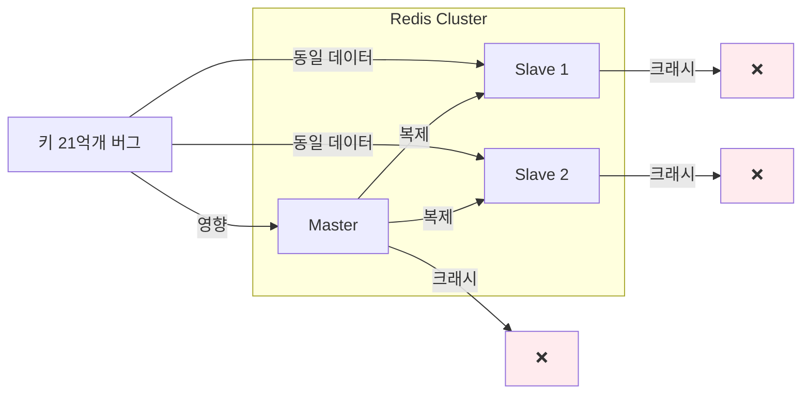
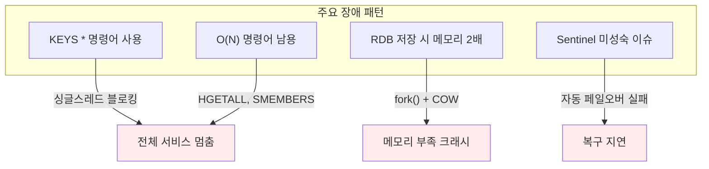
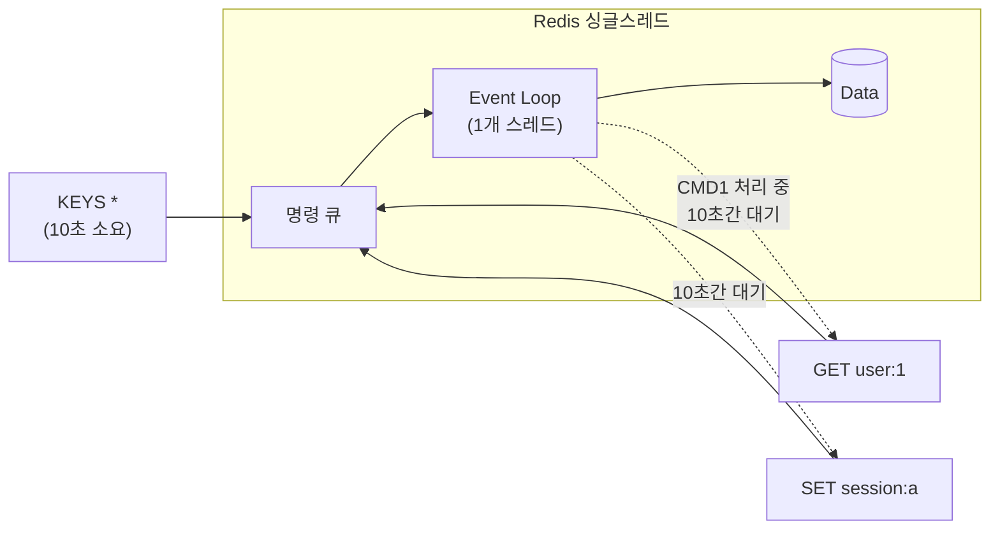
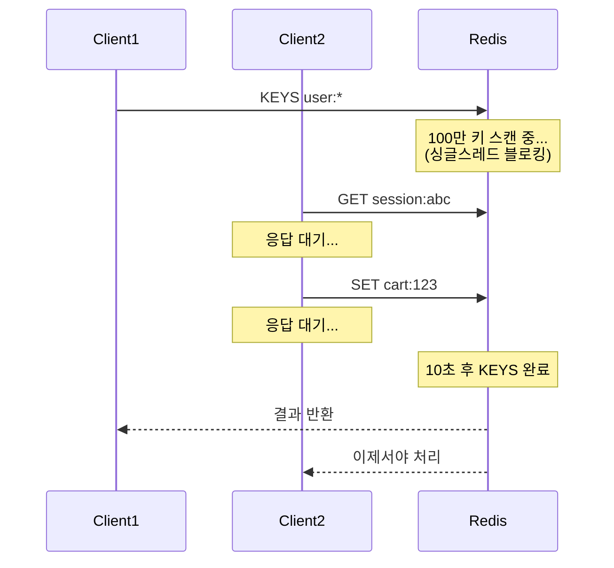
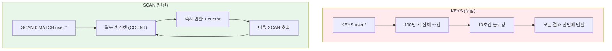
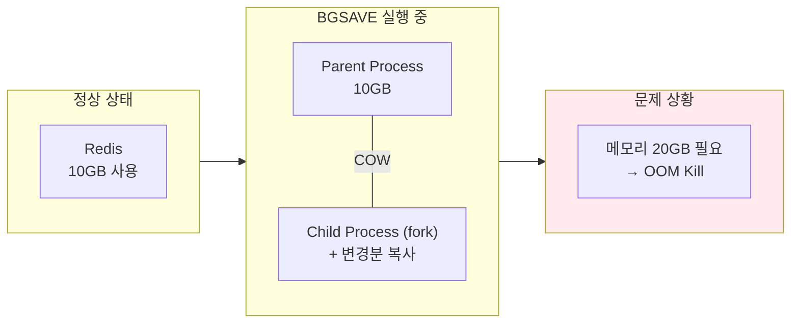
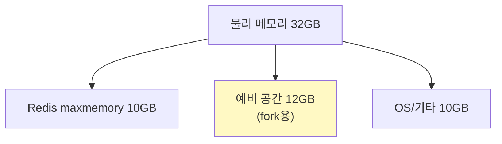
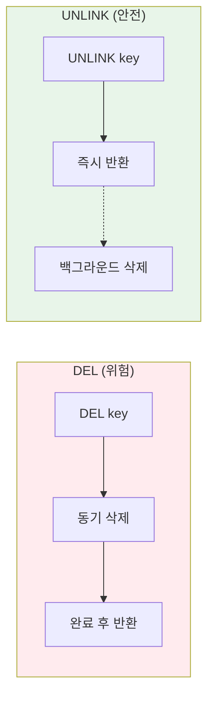

# 대한민국 웹서비스 Redis 장애 사례

국내 주요 웹서비스에서 발생한 Redis 관련 장애 사례와 교훈 정리

---

## 1. 쿠팡 대규모 장애 (2019년 7월)

```mermaid
timeline
    title 쿠팡 Redis 장애 타임라인
    2019-07-24 07:00 : 재고 데이터 '0' 표시 시작
                     : 전 상품 품절 상태
    10시간+ 경과 : 장애 지속
                : 주문/구매 불가
    원인 파악 : Redis int overflow 버그
             : 아이템 21억개 초과
```

### 장애 내용

- 쿠팡 판매 상품의 재고가 모두 `0`으로 표시
- 소비자가 상품 주문/구매 불가능
- **약 10시간 이상** 서비스 장애 지속

### 원인 분석

| 항목 | 내용 |
|------|------|
| **직접 원인** | Redis의 `dictScan` 함수에서 int overflow 버그 |
| **발생 조건** | 아이템(키) 개수가 **21억 개(2^31)** 초과 시 |
| **영향** | Master/Slave 모두 크래시 발생 |
| **해결 버전** | Redis 4.0.8에서 패치됨 |

### 왜 이중화도 소용없었나?



- 이 버그는 **키 개수**에 대한 문제
- Master와 Slave는 동일한 데이터를 가짐
- 따라서 Failover해도 Slave도 동일하게 크래시

### 교훈

- Redis 버전 관리의 중요성
- 대용량 키 사용 시 버전별 제한 사항 확인 필수
- 이중화만으로는 모든 장애에 대응 불가

---

## 2. 카카오 Redis 운영 장애 사례 (2013년 발표)

카카오 강대명 엔지니어가 제10회 ACC에서 공유한 실제 장애 사례들

### 주요 장애 패턴



### "절대 쓰면 안 되는" 패턴

| 위험 명령어 | 문제점 | 대안 |
|------------|--------|------|
| `KEYS *` | O(N) 전체 스캔, 블로킹 | `SCAN` 사용 |
| `HGETALL` | 대용량 Hash 시 블로킹 | `HSCAN` 사용 |
| `SMEMBERS` | 대용량 Set 시 블로킹 | `SSCAN` 사용 |
| `SAVE` | 동기 저장, 서비스 멈춤 | `BGSAVE` 사용 |
| `FLUSHALL` | 전체 삭제, 장시간 블로킹 | 키 설계로 회피 |

### 싱글 스레드의 함정



---

## 3. KEYS 명령어 장애 (업계 공통)

### 장애 시나리오



### 실제 발생한 문제

- 100만 개 키가 있는 환경에서 `KEYS user:*` 실행
- Redis 서버 **수 초~수십 초간 완전 블로킹**
- 해당 시간 동안 모든 요청 타임아웃
- 서비스 전체 장애로 확대

### KEYS vs SCAN 비교



```python
# 위험: KEYS 사용
keys = redis.keys('user:*')  # 블로킹!

# 안전: SCAN 사용
cursor = 0
while True:
    cursor, keys = redis.scan(cursor, match='user:*', count=1000)
    for key in keys:
        process(key)
    if cursor == 0:
        break
```

---

## 4. RDB 저장 시 메모리 장애

### 장애 발생 메커니즘



### 장애 시나리오

1. Redis 메모리 사용량: 10GB
2. `BGSAVE` 실행 → `fork()` 호출
3. 쓰기 트래픽이 많으면 COW(Copy-On-Write)로 메모리 복제
4. 최대 **메모리 2배(20GB)** 필요
5. 물리 메모리 부족 → **OOM Killer가 Redis 종료**

### 예방책

```bash
# redis.conf 설정
maxmemory 10gb                    # 메모리 제한
maxmemory-policy allkeys-lru      # 초과 시 정책

# 시스템 설정
vm.overcommit_memory = 1          # fork 허용
```



**권장:** Redis 메모리의 **2배 이상** 물리 메모리 확보

---

## 5. 대용량 키 삭제 장애

### 문제 상황


### 해결책: UNLINK 사용

```python
# 위험: DEL (동기 삭제)
redis.delete('huge_set')  # 블로킹!

# 안전: UNLINK (비동기 삭제)
redis.unlink('huge_set')  # 즉시 반환, 백그라운드 삭제
```



---

## 6. 장애 예방 체크리스트

```mermaid
mindmap
  root((Redis<br/>장애 예방))
    명령어
      KEYS 금지 → SCAN
      O(N) 명령 주의
      DEL → UNLINK
      Lua 스크립트 시간 제한
    메모리
      maxmemory 설정
      여유 메모리 2배 확보
      eviction 정책 설정
    영속성
      BGSAVE 시간 조절
      AOF rewrite 주의
      디스크 I/O 모니터링
    모니터링
      slowlog 확인
      메모리 사용량
      연결 수 추적
      키 개수 추적
    버전 관리
      최신 안정 버전 유지
      변경 로그 확인
      테스트 환경 검증
```

### slowlog 모니터링

```bash
# 느린 명령어 로깅 설정
slowlog-log-slower-than 10000  # 10ms 이상
slowlog-max-len 128

# 확인
SLOWLOG GET 10
```

### 위험 명령어 차단

```bash
# redis.conf
rename-command KEYS ""
rename-command FLUSHALL ""
rename-command FLUSHDB ""
rename-command DEBUG ""
```

---

## 7. 요약: 장애 원인 Top 5

| 순위 | 원인 | 영향 | 예방책 |
|------|------|------|--------|
| 1 | **KEYS 명령어** | 전체 블로킹 | SCAN 사용 |
| 2 | **메모리 부족** | OOM 크래시 | maxmemory + 여유 2배 |
| 3 | **버전 버그** | 예측 불가 장애 | 최신 안정 버전 유지 |
| 4 | **RDB 저장** | fork() 메모리 2배 | 트래픽 적은 시간대 |
| 5 | **대용량 키** | 삭제/조회 시 블로킹 | 키 분산 설계, UNLINK |

---

## 참고 자료

- [카카오 "레디스, 잘못쓰면 망한다" - ZDNet](https://zdnet.co.kr/view/?no=20131119174125)
- [쿠팡 오류 원인은 오픈소스 '레디스 DB' 때문 - 디지털투데이](https://www.digitaltoday.co.kr/news/articleView.html?idxno=212904)
- [Redis의 SCAN은 어떻게 동작하는가? - 카카오 기술블로그](https://tech.kakao.com/2016/03/11/redis-scan/)
- [Redis KEYS: 성능 저하의 원인](https://rerewww.github.io/redis/redis-keys/)
- [Redis를 실무에 사용하기 전 꼭 알아야 하는 전략](https://velog.io/@youngerjesus/Redis-를-실무에-사용하기-전-꼭-알아야-하는-전략)
