# RQ vs Dramatiq 비교 분석

Python 생태계의 대표적인 Redis 기반 작업 큐 라이브러리 비교

---

## 📊 아키텍처 비교 개요

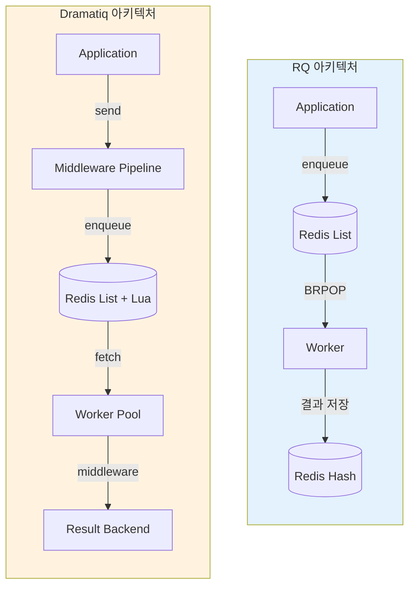

---

## 🔴 Redis 활용 방식 비교

### RQ의 Redis 사용

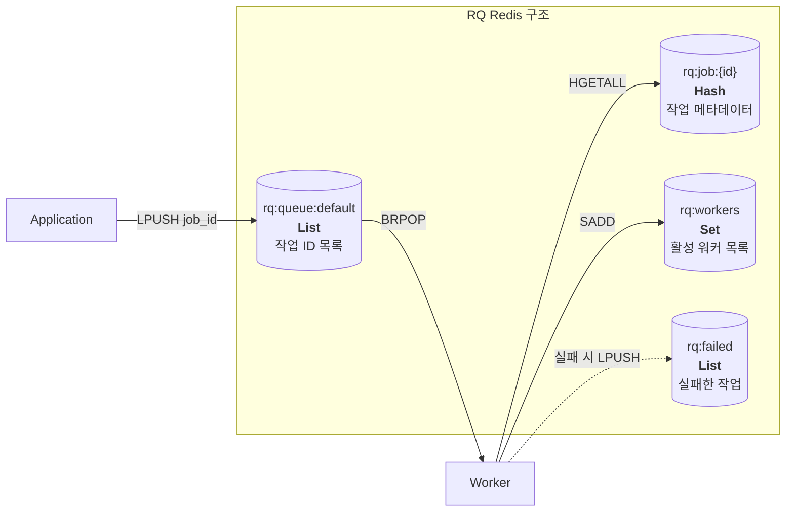

**RQ Redis 명령어 흐름:**
```python
# 작업 등록
HSET rq:job:{job_id} data {...}      # 작업 데이터 저장
LPUSH rq:queue:default {job_id}       # 큐에 ID 추가

# 작업 소비
BRPOP rq:queue:default 5              # 블로킹 pop (5초 타임아웃)
HGETALL rq:job:{job_id}               # 작업 데이터 조회

# 작업 완료
HSET rq:job:{job_id} status finished  # 상태 업데이트
EXPIRE rq:job:{job_id} 500            # TTL 설정
```

---

### Dramatiq의 Redis 사용

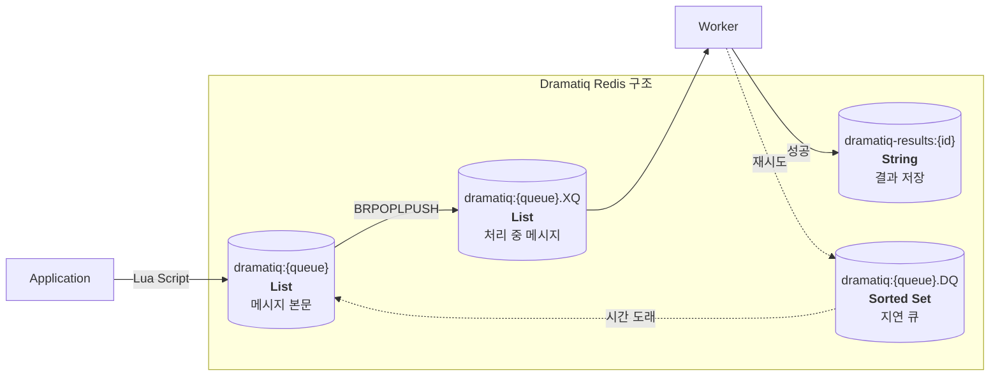

**Dramatiq Redis 명령어 흐름:**
```python
# 작업 등록 (Lua 스크립트로 원자적 실행)
LPUSH dramatiq:default {message_json}

# 작업 소비 (신뢰성 보장)
BRPOPLPUSH dramatiq:default dramatiq:default.XQ 5
# → 원본 큐에서 pop + 처리중 큐로 push (원자적)

# 작업 완료
LREM dramatiq:default.XQ 1 {message}  # 처리중 큐에서 제거

# 재시도 (지연 큐 활용)
ZADD dramatiq:default.DQ {retry_at} {message}  # Sorted Set에 추가
# → 스케줄러가 ZRANGEBYSCORE로 조회 후 메인 큐로 이동
```

---

## ⚙️ 작업 관리 흐름 상세 비교

### RQ 작업 흐름

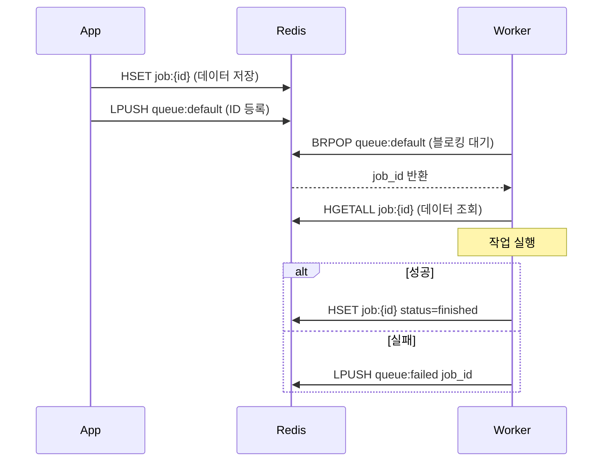

### Dramatiq 작업 흐름

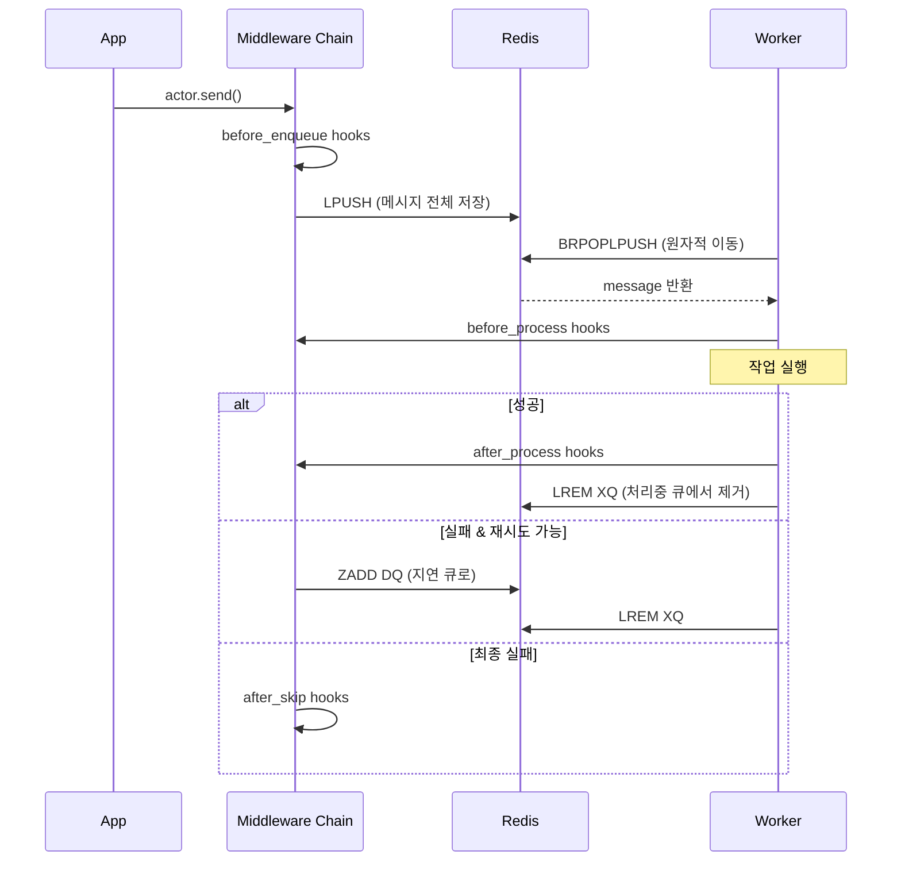

---

## 🔄 스케줄러 동작 방식 비교

### RQ + rq-scheduler

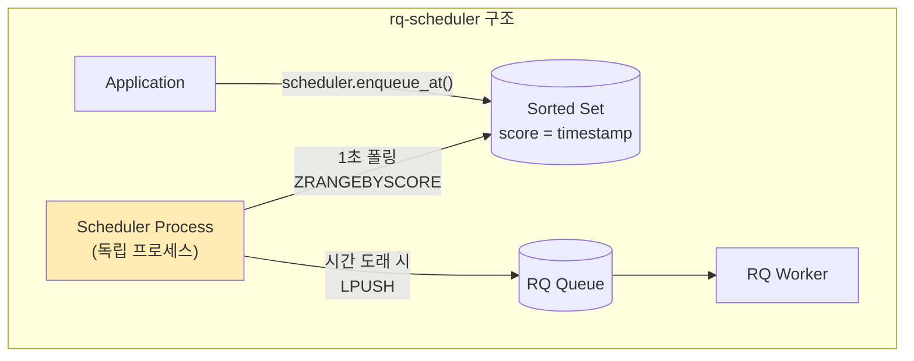

**특징:**
- 별도 `rq-scheduler` 패키지 필요
- 독립적인 Scheduler 프로세스 실행 필요
- Sorted Set의 score를 timestamp로 활용
- 1초 간격 폴링

### Dramatiq + APScheduler / dramatiq-crontab

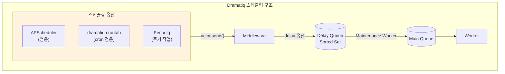

**Dramatiq 내장 지연 실행:**
```python
# Dramatiq은 자체 delay 옵션 제공
@dramatiq.actor
def my_task(x):
    pass

# 지연 실행 (내장)
my_task.send_with_options(args=(1,), delay=60000)  # 60초 후 실행
# → ZADD dramatiq:default.DQ {now+60} {message}
```

---

## 📋 기능별 상세 비교

| 기능 | RQ | Dramatiq |
|------|-----|----------|
| **Redis 구조** | List + Hash | List + Sorted Set + Lua |
| **메시지 저장** | ID만 큐에, 데이터는 Hash | 전체 메시지를 큐에 |
| **신뢰성 보장** | 없음 (BRPOP만) | BRPOPLPUSH + XQ |
| **재시도** | 수동 구현 | 내장 (미들웨어) |
| **지연 실행** | rq-scheduler 필요 | 내장 (delay 옵션) |
| **Cron 스케줄링** | rq-scheduler | 별도 패키지 필요 |
| **미들웨어** | 없음 | 완전 지원 |
| **결과 저장** | 내장 | 별도 backend 필요 |
| **우선순위 큐** | 큐 분리로 구현 | 큐 분리로 구현 |
| **Rate Limiting** | 없음 | 미들웨어로 구현 |

---

## 🗑️ Redis TTL / 자동 만료 전략 비교

### 메모리 관리 방식

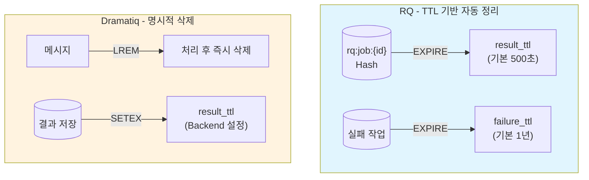

### RQ의 TTL 활용 (적극적)

```python
from rq import Queue

q = Queue(connection=redis_conn)

job = q.enqueue(
    my_task,
    result_ttl=600,      # 성공 시 600초 후 자동 삭제
    failure_ttl=86400,   # 실패 시 24시간 후 자동 삭제
    ttl=3600,            # 작업 대기 TTL (실행 전 만료 가능)
)

# TTL 옵션
# result_ttl=0   → 즉시 삭제 (결과 불필요 시)
# result_ttl=-1  → 영구 보관
```

**내부 동작:**
```python
# Worker 작업 완료 시
HSET rq:job:{job_id} status finished
EXPIRE rq:job:{job_id} 500  # result_ttl 적용
```

### Dramatiq의 TTL 활용 (제한적)

```python
from dramatiq.results.backends import RedisBackend

# 결과 Backend에서만 TTL 설정
backend = RedisBackend(
    url="redis://localhost",
    result_ttl=600000  # 밀리초 (10분)
)

@dramatiq.actor(store_results=True)
def my_task(x):
    return x * 2
```

**내부 동작:**
```python
# 메시지 처리 완료 시
LREM dramatiq:default.XQ 1 {message}  # 명시적 삭제 (TTL 아님)

# 결과 저장 시
SETEX dramatiq-results:{id} 600 {result}  # TTL 적용
```

### TTL 전략 비교

| 항목 | RQ | Dramatiq |
|------|-----|----------|
| **작업 데이터** | `EXPIRE` (기본 500초) | `LREM` (명시적 삭제) |
| **실패 작업** | `EXPIRE` (기본 1년) | 재시도 후 삭제 |
| **결과 저장** | 내장 TTL | Backend 설정 필요 |
| **대기 작업** | `ttl` 옵션 | `max_age` 옵션 |
| **메모리 관리** | Redis에 위임 | 애플리케이션 책임 |

> **핵심 차이:**
> - **RQ**: Redis TTL에 의존 → 설정만 하면 자동 정리
> - **Dramatiq**: 명시적 삭제 위주 → 메시지 유실 방지에 집중, 결과만 TTL

---

## ⚖️ 장단점 비교

### RQ

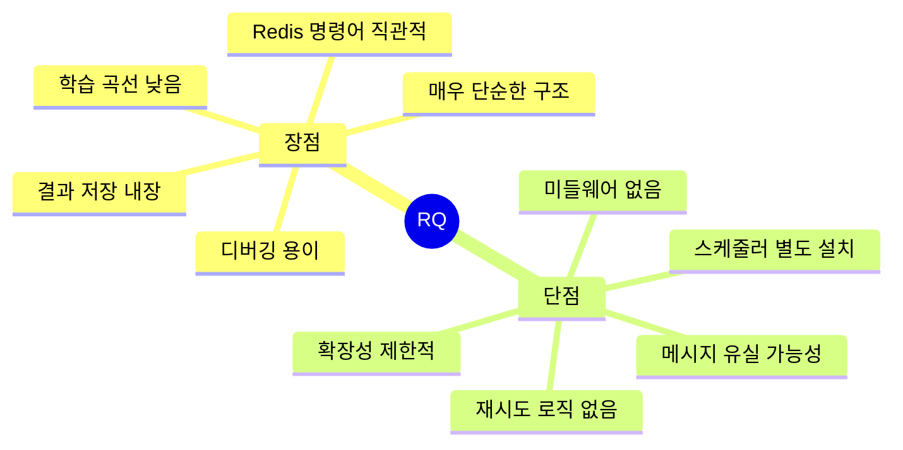

### Dramatiq

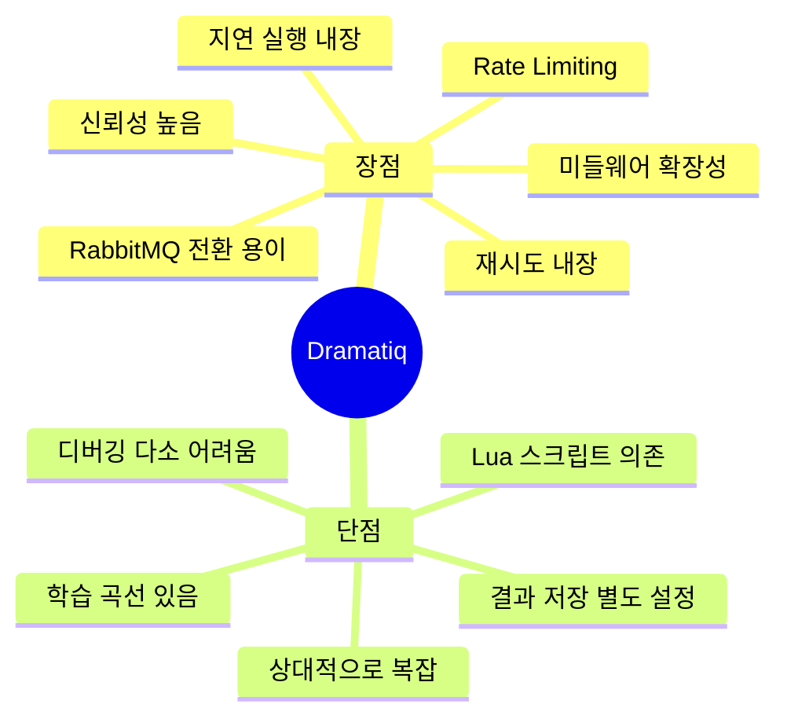

---

## 🎯 사용 시나리오별 추천

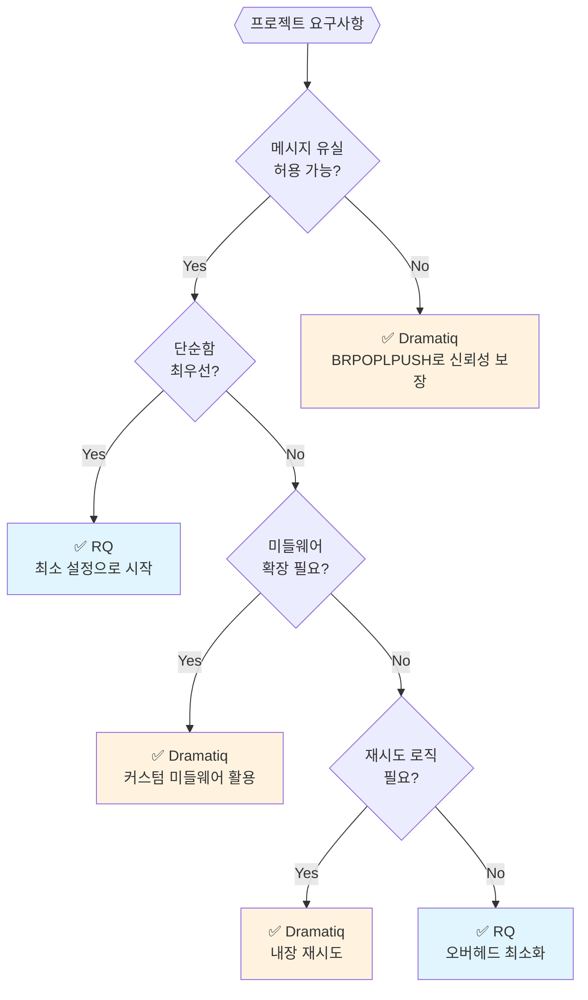

---

## 📝 Quick Reference

### RQ 기본 설정

```python
from redis import Redis
from rq import Queue, Worker

redis_conn = Redis()
q = Queue(connection=redis_conn)

# 작업 등록
job = q.enqueue(my_task, arg1, arg2)

# 결과 확인
job.result  # 내장 결과 저장

# Worker 실행
# $ rq worker
```

### Dramatiq 기본 설정

```python
import dramatiq
from dramatiq.brokers.redis import RedisBroker
from dramatiq.results import Results
from dramatiq.results.backends import RedisBackend

# 브로커 설정
broker = RedisBroker(host="localhost")
broker.add_middleware(Results(backend=RedisBackend()))
dramatiq.set_broker(broker)

@dramatiq.actor(max_retries=3)
def my_task(x):
    return x * 2

# 작업 등록
my_task.send(42)

# 지연 실행
my_task.send_with_options(args=(42,), delay=60000)

# Worker 실행
# $ dramatiq my_module
```

---

## 🔗 참고 자료

- [RQ Documentation](https://python-rq.org/)
- [rq-scheduler](https://github.com/rq/rq-scheduler)
- [Dramatiq Documentation](https://dramatiq.io/)
- [Dramatiq Source - Redis Broker](https://github.com/Bogdanp/dramatiq/blob/master/dramatiq/brokers/redis)
