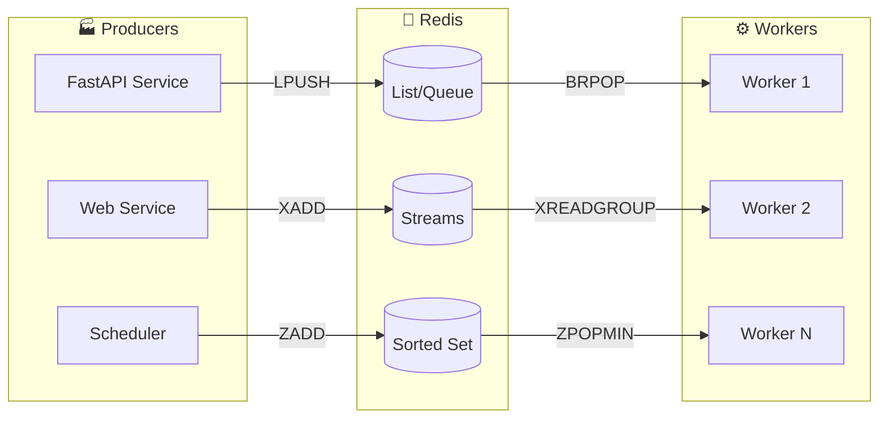
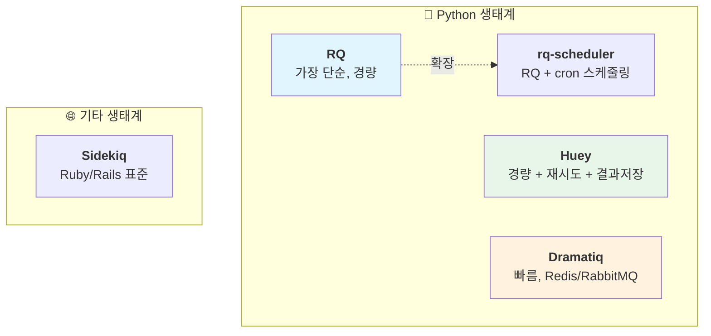
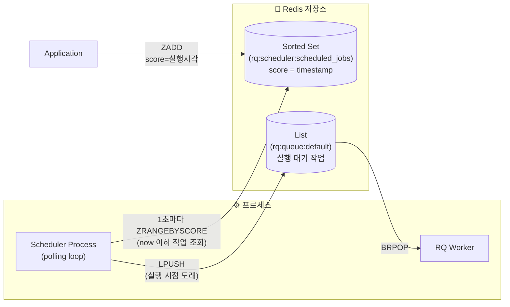
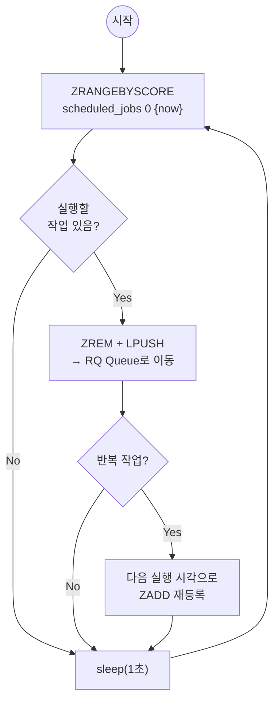
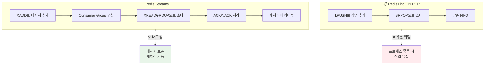
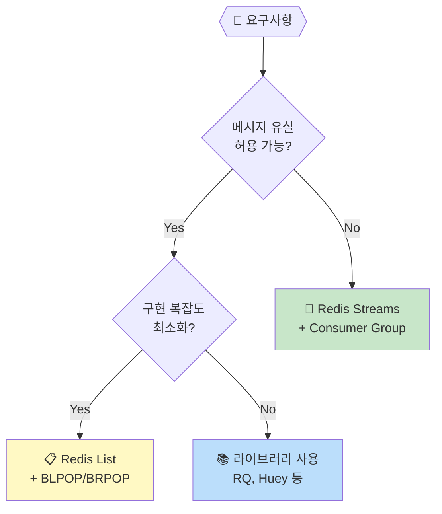
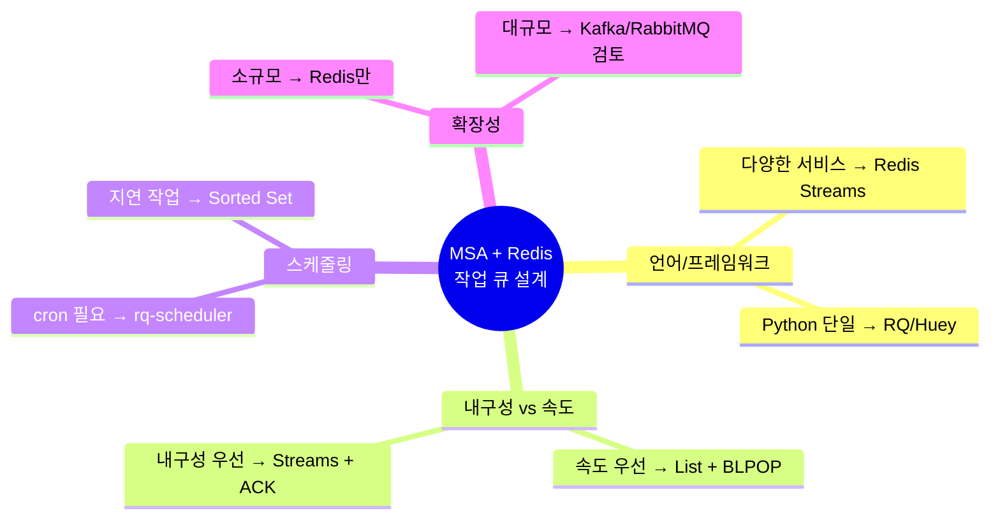
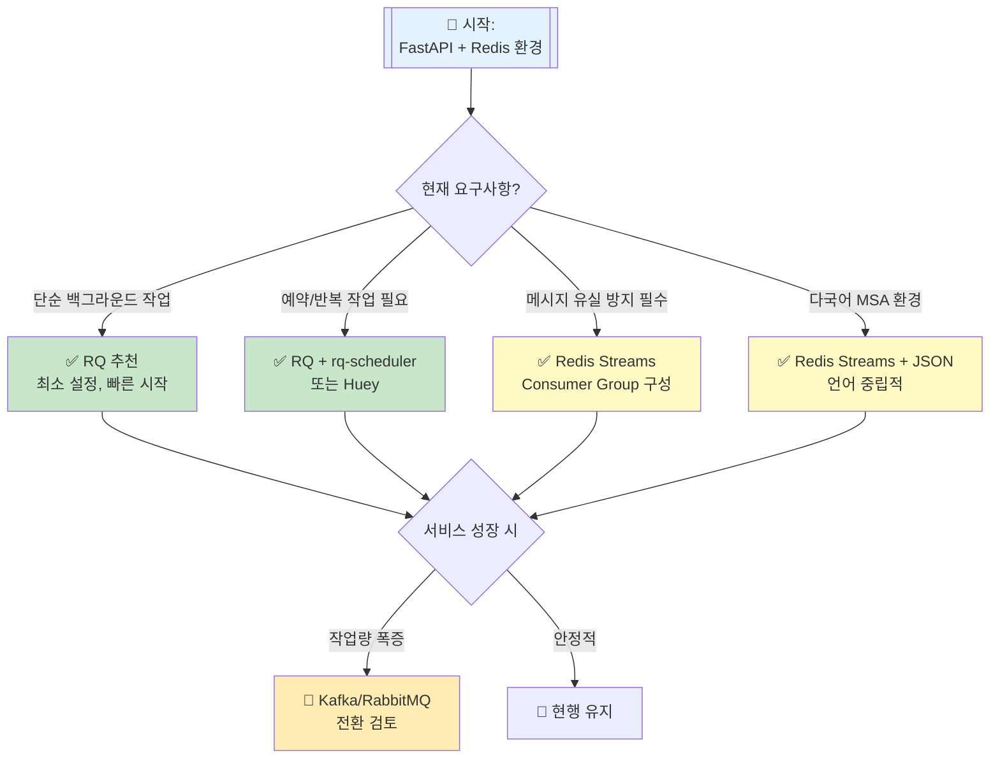

# Redis 기반 작업 큐 & 스케줄러 가이드

MSA 환경에서 Redis를 활용한 작업 큐(task queue) / 스케줄러(scheduler) 솔루션 정리

---

## 📊 전체 아키텍처 개요



---

## ✅ 대표 라이브러리 비교



### 라이브러리별 특징

| 이름 | 복잡도 | 스케줄링 | 재시도 | 결과저장 | 적합한 용도 |
|------|--------|----------|--------|----------|-------------|
| **RQ** | ⭐ | ❌ | ❌ | ✅ | 단순 백그라운드 작업 |
| **rq-scheduler** | ⭐⭐ | ✅ | ❌ | ✅ | 예약/반복 작업 |
| **Huey** | ⭐⭐ | ✅ | ✅ | ✅ | 소규모 서비스 올인원 |
| **Dramatiq** | ⭐⭐⭐ | ✅ | ✅ | ✅ | 성능 중시 서비스 |

---

## ⏰ rq-scheduler 동작 메커니즘

### 핵심 구조



### Scheduler 프로세스 (polling loop)



### 사용 예시

```python
from rq_scheduler import Scheduler
from datetime import datetime, timedelta

scheduler = Scheduler(connection=redis_conn)

# 특정 시점 실행
scheduler.enqueue_at(
    datetime(2024, 12, 1, 9, 0),  # 실행 시각
    my_task, arg1, arg2
)
# → ZADD rq:scheduler:scheduled_jobs 1733043600 <job_id>

# 지연 실행
scheduler.enqueue_in(
    timedelta(minutes=30),  # 30분 후
    my_task
)

# 반복 실행 (cron)
scheduler.cron(
    "0 9 * * *",  # 매일 09:00
    func=daily_report
)
```

### 내부 동작 (의사 코드)

```python
while True:
    now = time.time()

    # score(실행시각) <= now 인 작업들 조회
    due_jobs = redis.zrangebyscore(
        'rq:scheduler:scheduled_jobs', 0, now
    )

    for job_id in due_jobs:
        redis.zrem('rq:scheduler:scheduled_jobs', job_id)
        redis.lpush('rq:queue:default', job_id)

        # cron 작업이면 다음 실행시각 재등록
        if job.is_cron:
            next_run = calculate_next_run(job.cron_expr)
            redis.zadd('rq:scheduler:scheduled_jobs',
                      {job_id: next_run.timestamp()})

    time.sleep(1)
```

### 핵심 포인트

| 구성 요소 | 역할 | Redis 자료구조 |
|-----------|------|----------------|
| **Scheduler** | 1초마다 폴링, 실행시점 도래 작업을 큐로 이동 | - |
| **Scheduled Jobs** | 예약된 작업 저장 (score = timestamp) | `Sorted Set` |
| **RQ Queue** | 실행 대기 작업 | `List` |
| **Worker** | 큐에서 작업 꺼내 실행 | - |

> **Why Sorted Set?**
> - score를 timestamp로 활용 → 시간순 정렬 자동 보장
> - `ZRANGEBYSCORE`로 O(log N + M) 효율적 조회
> - Scheduler는 단일 프로세스로 실행 (중복 실행 방지 필요)

---

## 🔄 Redis 자체 구조 활용

### Redis List vs Streams 비교



### 구현 방식 선택 기준



---

## 💡 설계 관점 체크리스트



---

## 🎯 FastAPI + Python 환경 의사결정 트리



---

## 📝 Quick Reference

### RQ 기본 사용

```python
from redis import Redis
from rq import Queue

redis_conn = Redis()
q = Queue(connection=redis_conn)

# 작업 등록
job = q.enqueue(my_function, arg1, arg2)
```

### Redis Streams Consumer Group

```python
import redis

r = redis.Redis()

# Consumer Group 생성
r.xgroup_create('mystream', 'mygroup', mkstream=True)

# 메시지 소비
messages = r.xreadgroup('mygroup', 'consumer1', {'mystream': '>'})

# ACK 처리
r.xack('mystream', 'mygroup', message_id)
```

---

## 🔗 참고 링크

- [RQ Documentation](https://python-rq.org/)
- [rq-scheduler](https://github.com/rq/rq-scheduler)
- [Huey](https://huey.readthedocs.io/)
- [Dramatiq](https://dramatiq.io/)
- [Redis Streams](https://redis.io/docs/data-types/streams/)
