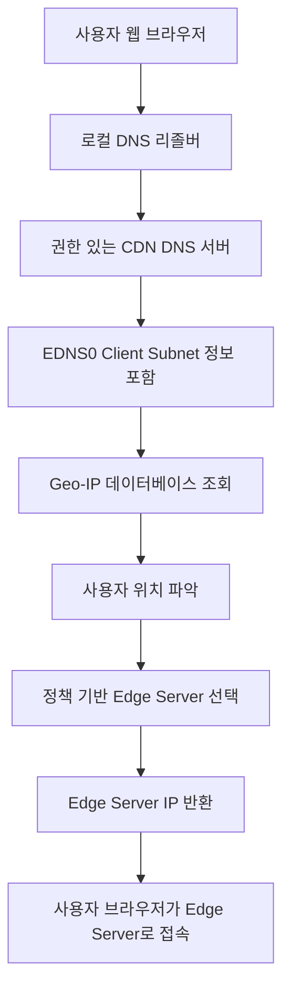
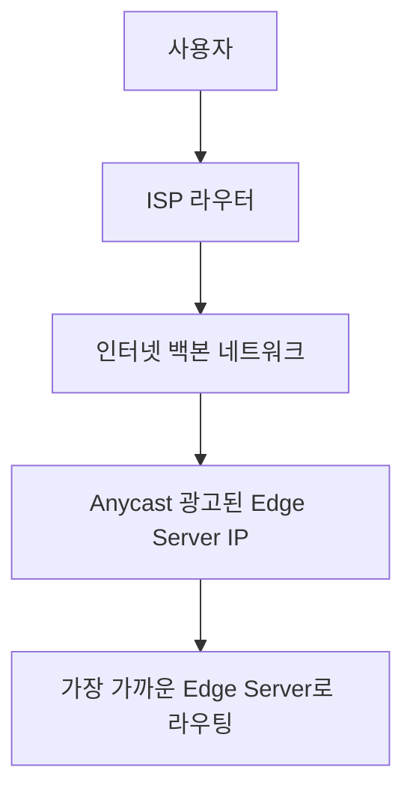
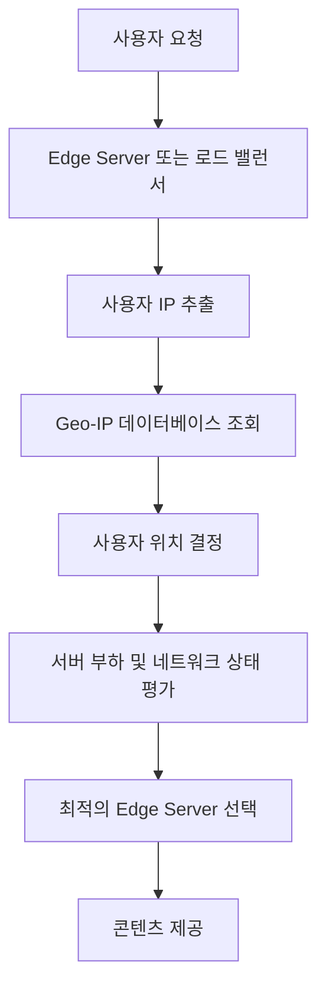

# CDN에서 사용자 위치 기반 Edge Server 선택 방법

CDN(Content Delivery Network)은 전 세계에 분산된 Edge Server를 활용하여 사용자에게 빠르고 안정적인 콘텐츠 전달을 목표로 합니다. 사용자의 위치에서 가장 가까운 Edge Server를 선택하는 것은 지연 시간(Latency)을 최소화하고, 네트워크 혼잡을 피하며, 사용자 경험을 향상시키는 데 매우 중요합니다. 이를 위해 CDN은 주로 **DNS 기반 라우팅**, **Anycast 라우팅**, 그리고 **Geo-IP 기반 라우팅** 등의 기술을 사용합니다.

---

## 1. DNS 기반 라우팅 (Geo DNS)

### 동작 원리

1. **사용자 요청 및 DNS 조회:**
   - 사용자가 웹 브라우저에 CDN 도메인(예: `cdn.example.com`)을 입력하면, 클라이언트의 로컬 DNS 리졸버(Recursive Resolver)가 CDN의 권한 있는 DNS 서버(Authoritative DNS Server)에 질의합니다.
   - 이 때, 최신 기술에서는 EDNS0 Client Subnet 확장을 통해 사용자의 IP 서브넷 정보를 전달하여, 보다 정확한 지리 정보를 반영할 수 있습니다.

2. **사용자 위치 파악:**
   - 권한 있는 DNS 서버는 전달받은 IP 주소(또는 서브넷)를 기반으로 Geo-IP 데이터베이스(예: MaxMind GeoIP 등)를 활용하여 사용자의 위치(국가, 도시, ISP 등)를 추정합니다.

3. **최적의 Edge Server 선택:**
   - DNS 서버는 사전에 구성된 정책(예: 지리적 근접성, 네트워크 상태, 서버 부하 등)을 바탕으로 사용자의 위치와 가장 가까운(또는 최적의) Edge Server를 선택합니다.
   - 선택된 Edge Server의 IP 주소를 DNS 응답으로 반환합니다.

4. **콘텐츠 제공:**
   - 사용자는 반환된 IP 주소로 콘텐츠 요청을 보내고, 가장 가까운 Edge Server에서 콘텐츠를 빠르게 전달받습니다.

### 상용 서비스에서의 일반적 적용

- **Cloudflare, Akamai, Fastly 등**과 같은 CDN 서비스 제공업체는 DNS 기반 라우팅을 통해 전 세계 수백 개 이상의 Edge Server 중 최적의 서버를 선택합니다.
- EDNS0 Client Subnet 확장 사용으로 사용자 위치를 보다 정확하게 파악하며, DNS TTL(Time-To-Live) 값을 적절하게 조정하여 빠른 업데이트 및 장애 복구를 지원합니다.

### EDNS0 Client Subnet(이하 ECS)

- EDNS0 Client Subnet(이하 ECS)은 DNS(Domain Name System) 요청 시 클라이언트의 IP 주소 일부를 포함하여 전달하는 확장 기능입니다. 이를 통해 DNS 서버는 클라이언트의 지리적 위치를 기반으로 최적의 응답을 제공할 수 있습니다.

### ECS의 작동 방식

1. **클라이언트 요청**: 사용자가 웹사이트에 접속할 때, DNS 요청이 발생합니다.
2. **ECS 정보 포함**: DNS 리졸버는 클라이언트의 IP 주소 일부(일반적으로 서브넷)를 포함하여 권한 DNS 서버에 요청을 보냅니다.
3. **최적의 응답 제공**: 권한 DNS 서버는 ECS 정보를 기반으로 클라이언트의 지리적 위치를 추정하고, 가장 가까운 서버의 IP 주소를 응답으로 제공합니다.
4. **응답 전달**: 리졸버는 권한 DNS 서버로부터 받은 응답을 클라이언트에게 전달합니다.

### Mermaid 다이어그램: DNS 기반 라우팅 흐름

---

## 2. Anycast 라우팅

### 동작 원리

- **단일 IP 주소, 다중 위치:**
  - Anycast는 하나의 IP 주소를 여러 Edge Server가 공유하도록 설정하는 방식입니다. 즉, 전 세계 여러 위치에 같은 IP 주소를 광고합니다.
- **BGP를 통한 라우팅:**
  - 인터넷의 경로 결정 프로토콜인 BGP(Border Gateway Protocol)를 활용하여, 네트워크 라우터들은 물리적/네트워크적으로 가장 가까운(또는 경로가 가장 짧은) Edge Server로 트래픽을 전달합니다.
- **자동 최적화:**
  - 네트워크 상황이나 장애가 발생하면 BGP 경로가 자동으로 재계산되어 다른 최적의 Edge Server로 트래픽이 라우팅됩니다.

### 상용 서비스에서의 일반적 적용

- Anycast는 DNS 서버와 Edge Server 모두에 적용되어, 글로벌 DNS 응답과 콘텐츠 전달에 있어서 빠른 응답과 높은 가용성을 보장합니다.
- **Google, Cloudflare 등**은 Anycast를 적극 활용하여 장애 상황에서도 사용자에게 신속한 서비스를 제공합니다.

### Mermaid 다이어그램: Anycast 라우팅 흐름

---

## 3. Geo-IP 기반 라우팅 (Application Layer Routing)

### 동작 원리

- **실시간 위치 파악:**
  - CDN 애플리케이션 레벨에서, 사용자 요청 시 서버 측에서 직접 사용자의 IP를 분석하여 Geo-IP 데이터베이스를 통해 위치를 파악합니다.
- **동적 라우팅:**
  - 분석된 위치 정보를 바탕으로, Edge Server 선택 로직(예: 로드 밸런서 또는 애플리케이션 서버)이 최적의 서버를 결정합니다.
- **추가 메트릭 고려:**
  - 단순 지리적 거리에 더해, 네트워크 지연 시간, 서버 부하, 트래픽 상황 등 다양한 요소를 고려하여 최적의 경로를 선택할 수 있습니다.

### 상용 서비스에서의 일반적 적용

- 일부 CDN은 DNS나 Anycast 방식과 함께 애플리케이션 레벨의 라우팅을 추가로 활용하여 더욱 정교한 최적화된 콘텐츠 제공을 실현합니다.
- **실시간 모니터링**과 **부하 분산 정책**을 결합하여, 네트워크 혼잡이나 장애 발생 시 자동으로 우회 경로를 선택합니다.

### Geo-IP 기반 애플리케이션 레벨 라우팅

---

## 결론

CDN에서 사용자 위치 기반으로 가장 가까운 Edge Server를 찾는 방법은 다음과 같은 여러 기술을 조합하여 이루어집니다:

- **DNS 기반 라우팅:** 사용자 IP 정보(EDNS0 Client Subnet 활용)를 통해 Geo-IP 데이터베이스로 위치 파악 후 최적의 서버 IP 반환.
- **Anycast 라우팅:** 단일 IP 주소를 여러 위치에서 광고하고, BGP를 통해 물리적으로 가장 가까운 Edge Server로 트래픽 라우팅.
- **Geo-IP 기반 애플리케이션 라우팅:** 서버 측에서 실시간으로 사용자 위치 및 부하 정보를 분석하여 최적의 Edge Server 결정.

이러한 방법들은 상용 CDN 서비스에서 모두 채택되어, 빠른 응답 시간, 높은 가용성, 그리고 효율적인 부하 분산을 실현하고 있습니다.