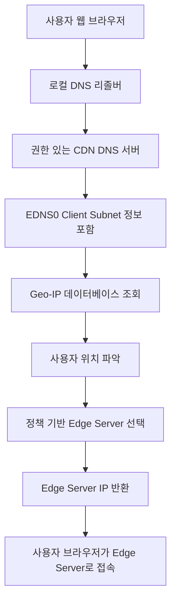

    # DNS 기반 라우팅 (Geo DNS) 친절한 설명

CDN(Content Delivery Network)은 전 세계에 분산된 **Edge Server**(사용자와 가까운 서버)를 이용해 콘텐츠를 빠르게 전달합니다. 그 중 하나의 방법이 **DNS 기반 라우팅**입니다. 주니어 백엔드 개발자 분들을 위해 아래에서 관련 용어와 동작 원리를 쉽게 설명해보겠습니다.

---

## 주요 용어 설명

- **DNS (Domain Name System):**  
  인터넷에서 도메인 이름(예: `cdn.example.com`)을 실제 서버의 IP 주소로 변환하는 시스템입니다.

- **로컬 DNS 리졸버 (Recursive Resolver):**  
  사용자의 컴퓨터나 인터넷 서비스 제공자(ISP:[sk 브로드밴드,kt, lg uplus])가 운영하는 DNS 서버입니다. 사용자가 도메인을 요청하면, 이 서버가 다른 DNS 서버들과 통신하여 최종 IP 주소를 찾아 반환합니다.

- **권한 있는 DNS 서버 (Authoritative DNS Server):**  
  특정 도메인에 대한 정식 DNS 정보를 가지고 있는 서버입니다. CDN에서는 이 서버가 사용자의 위치에 맞춰 가장 적합한 Edge Server의 IP 주소를 결정합니다.

- **EDNS0 Client Subnet:**  
  DNS 요청 시 사용자의 IP 주소 일부(서브넷)를 포함하여, 권한 있는 DNS 서버가 사용자의 대략적인 위치를 파악할 수 있도록 돕는 기술입니다.

- **Geo-IP 데이터베이스:**  
  IP 주소와 지리적 위치(국가, 도시 등)를 매핑해 놓은 데이터베이스입니다. 예를 들어, MaxMind GeoIP 같은 서비스가 있습니다. 이 데이터베이스를 통해 DNS 서버는 사용자의 위치를 추정할 수 있습니다.

- **Edge Server:**  
  CDN 네트워크에서 사용자와 물리적으로 가까운 서버입니다. 콘텐츠를 캐시하여 사용자에게 빠르게 제공하는 역할을 합니다.

- **TTL (Time-To-Live):**  
  DNS 응답에 포함되는 값으로, 해당 정보가 캐시된 후 얼마 동안 유효한지를 나타냅니다. 적절한 TTL 설정은 업데이트와 장애 복구에 중요한 역할을 합니다.

---

## DNS 기반 라우팅 동작 원리

1. **사용자 요청 및 DNS 조회:**
   - 사용자가 웹 브라우저에 `cdn.example.com`과 같은 CDN 도메인을 입력합니다.
   - 이 요청은 **로컬 DNS 리졸버**(예: ISP가 제공하는 DNS 서버)로 전달됩니다.
   - 로컬 DNS 리졸버는 도메인 정보를 찾기 위해 **권한 있는 CDN DNS 서버**에 질의를 보냅니다.
   - 이 과정에서 **EDNS0 Client Subnet** 기술을 활용하면 사용자의 IP 서브넷 정보가 함께 전달되어, 권한 있는 DNS 서버가 사용자의 위치를 보다 정확하게 파악할 수 있습니다.

2. **사용자 위치 파악:**
   - 권한 있는 DNS 서버는 전달받은 IP 주소(또는 서브넷)를 기반으로 **Geo-IP 데이터베이스**를 조회합니다.
   - 이를 통해 사용자의 대략적인 위치(국가, 도시 등)를 확인합니다.

3. **최적의 Edge Server 선택:**
   - DNS 서버는 미리 설정된 정책(예: 지리적 근접성, 네트워크 상태, 서버 부하 등)을 기준으로, 사용자의 위치에 가장 가까운 혹은 최적의 **Edge Server**를 선택합니다.
   - 선택된 Edge Server의 IP 주소가 DNS 응답에 포함되어 로컬 DNS 리졸버로 반환됩니다.

4. **콘텐츠 제공:**
   - 사용자는 반환된 IP 주소를 통해 Edge Server에 직접 접속하고, 해당 서버로부터 콘텐츠를 빠르게 전달받게 됩니다.

---

## 상용 서비스에서의 적용 사례

- **Cloudflare, Akamai, Fastly** 등의 CDN 서비스는 DNS 기반 라우팅을 사용하여 전 세계 수백 개의 Edge Server 중 최적의 서버를 선택합니다.
- **EDNS0 Client Subnet**을 사용하면 보다 정밀한 사용자 위치 파악이 가능하여, 콘텐츠 전송 지연(Latency)을 최소화할 수 있습니다.
- 적절한 **DNS TTL** 설정은 장애 발생 시 빠른 복구와 캐시 업데이트에 중요한 역할을 합니다.

---

## Mermaid 다이어그램: DNS 기반 라우팅 흐름




# Geo-IP 데이터베이스 구성 및 위치 확인 방법

**Geo-IP 데이터베이스**는 전 세계 IP 주소와 이들에 해당하는 지리적 정보를 매핑해 놓은 데이터베이스입니다. 이 데이터베이스를 통해 사용자의 IP 주소를 입력받으면, 해당 IP가 어느 국가, 지역, 도시 등에 속하는지 확인할 수 있습니다.

---

## 1. Geo-IP 데이터베이스의 주요 구성 요소

Geo-IP 데이터베이스는 보통 아래와 같은 정보를 포함합니다:

- **국가 정보 (Country):**  
  IP 주소가 속한 국가 코드와 국가 이름을 제공합니다.

- **지역/도시 정보 (Region/City):**  
  좀 더 세부적인 지리 정보를 제공하여, 사용자가 어느 지역 또는 도시에서 접속했는지 파악할 수 있습니다.

- **우편번호 (Postal Code):**  
  특정 국가 내에서의 보다 세부적인 위치 정보를 제공합니다.

- **위도 및 경도 (Latitude & Longitude):**  
  지도상에서 정확한 위치를 표시할 수 있는 좌표 정보를 포함합니다.

- **시간대 (Time Zone):**  
  해당 IP 주소가 속한 지역의 표준 시간대 정보를 제공합니다.

- **ISP 및 조직 정보:**  
  때때로 해당 IP 주소를 할당받은 인터넷 서비스 제공자(ISP)나 조직에 대한 정보도 포함됩니다.

---

## 2. 위치 확인 방법

Geo-IP 데이터베이스는 다양한 출처의 데이터를 종합하여 구성됩니다:

- **RIR (Regional Internet Registries) 데이터:**  
  각 지역의 IP 할당 정보를 관리하는 기관(예: ARIN, RIPE NCC, APNIC 등)에서 제공하는 등록 데이터를 기반으로 합니다.

- **WHOIS 정보:**  
  도메인과 IP 주소의 소유자 정보를 조회하여 지리적 위치를 추정합니다.

- **네트워크 트래픽 데이터 및 사용자 피드백:**  
  실제 인터넷 트래픽, 핑(Ping) 테스트, 사용자 보고서 등을 분석하여 데이터의 정확성을 높입니다.

이렇게 수집된 데이터를 기반으로, Geo-IP 데이터베이스는 사용자의 IP 주소를 입력하면 그에 대응하는 국가, 지역, 도시, 우편번호, 좌표, 시간대 등의 정보를 반환합니다.

---

## 3. Mermaid 다이어그램: Geo-IP 조회 흐름

```mermaid
flowchart TD
    A[사용자 IP 주소 입력] --> B[Geo-IP 데이터베이스 조회]
    B --> C[국가 정보 반환]
    B --> D[지역/도시 정보 반환]
    B --> E[우편번호 및 좌표(위도, 경도) 반환]
    B --> F[시간대 정보 반환]
```

## 4. 상용 및 무료 Geo-IP 데이터베이스

- 상용 데이터베이스:

예를 들어, MaxMind GeoIP2나 IP2Location 같은 서비스는 더 정확하고 최신의 데이터를 제공하며, 기업용으로 많이 사용됩니다.

- 무료 데이터베이스:

MaxMind GeoLite2와 같이 무료로 제공되는 버전도 있지만, 상용 제품에 비해 데이터 업데이트 빈도나 정확성이 떨어질 수 있습니다.


## 5. 결론

Geo-IP 데이터베이스는 인터넷에서 IP 주소를 통해 사용자의 대략적인 지리적 위치를 파악할 수 있게 해주는 도구입니다.
이 데이터베이스는 **국가, 지역, 도시, 우편번호, 위도, 경도, 시간대 등의 정보를** 포함하며, 여러 출처의 데이터를 종합하여 구성됩니다.
이를 활용하면 CDN, 웹 애플리케이션, 마케팅 등 다양한 분야에서 사용자 맞춤 서비스를 제공할 수 있습니다.