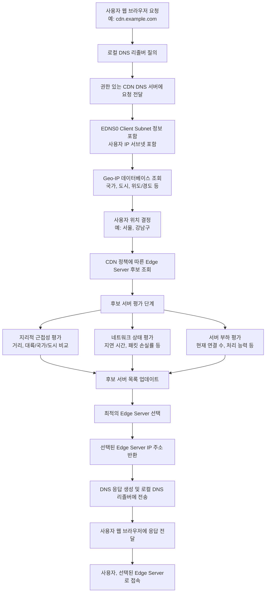

# 사용자 위치 기반 Edge Server 선택 과정

아래 다이어그램은 CDN에서 사용자의 위치를 기반으로 가장 가까운(또는 최적의) Edge Server를 선택하는 과정을 단계별로 보여줍니다. 각 단계에서는 DNS 서버가 어떤 정보를 활용하고 어떤 결정을 내리는지 구체적으로 나타내고 있습니다.

---

## 각 단계 설명

1. **사용자 요청 및 로컬 DNS 리졸버 질의:**  
   - 사용자가 `cdn.example.com`에 접속하면, 로컬 DNS 리졸버(보통 ISP가 제공하는 DNS 서버)가 도메인 이름의 IP 주소를 찾기 위해 요청을 시작합니다.

2. **권한 있는 CDN DNS 서버:**  
   - 로컬 DNS 리졸버는 CDN의 권한 있는 DNS 서버에 질의를 전달합니다.
   - 이때, **EDNS0 Client Subnet** 확장을 이용해 사용자의 IP 서브넷 정보도 함께 전송됩니다.

3. **Geo-IP 데이터베이스 조회 및 사용자 위치 결정:**  
   - CDN DNS 서버는 전달받은 IP 서브넷 정보를 바탕으로 **Geo-IP 데이터베이스**를 조회합니다.
   - 이 데이터베이스를 통해 사용자가 어느 국가, 도시, 혹은 지역에 있는지를 결정합니다.

4. **Edge Server 후보 조회 및 평가:**  
   - 결정된 사용자 위치 정보를 바탕으로 CDN 정책에 따라 후보 Edge Server 목록을 조회합니다.
   - 후보 서버들은 다음 기준으로 평가됩니다:  
     - **지리적 근접성:** 사용자의 위치와 물리적으로 가까운지  
     - **네트워크 상태:** 지연 시간, 패킷 손실률 등 네트워크 성능  
     - **서버 부하:** 현재 처리 중인 연결 수나 서버의 처리 능력 등

5. **최적의 Edge Server 선택 및 응답 반환:**  
   - 여러 평가 기준을 종합하여 최적의 Edge Server를 선택하고, 해당 서버의 IP 주소를 DNS 응답에 포함시킵니다.
   - 로컬 DNS 리졸버는 최종 응답을 사용자에게 전달하고, 사용자는 해당 Edge Server로 접속하여 콘텐츠를 빠르게 전달받게 됩니다.
