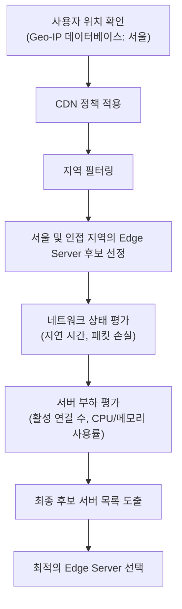

# CDN 정책에 따른 Edge Server 후보 조회 예시

CDN에서는 사용자의 위치에 따라 가장 적합한 Edge Server를 선택하기 위해 미리 정의된 **CDN 정책**을 사용합니다. 이 정책은 여러 기준을 결합하여 후보 서버를 필터링합니다. 예를 들어, 사용자의 위치가 서울인 경우를 가정해보겠습니다.

## 예시: 사용자 위치가 서울일 경우

1. **지역(Geographical) 기준:**
   - **목적:** 사용자의 실제 위치와 물리적으로 가까운 서버를 우선 선정합니다.
   - **실제 예시:**  
     - 사용자가 서울에 있다고 판단되면, 서울 내 또는 인접 지역(예: 경기 지역)에 위치한 Edge Server를 후보로 선정합니다.
     - 후보 예:  
       - **서버 A:** 서울 강남  
       - **서버 B:** 서울 종로  
       - **서버 C:** 경기 수원

2. **네트워크 상태(Network Health) 기준:**
   - **목적:** 서버까지의 네트워크 연결 성능(지연 시간, 패킷 손실 등)을 평가하여 안정적이고 빠른 연결을 보장합니다.
   - **실제 예시:**  
     - 각 후보 서버에 대해 실시간 모니터링 도구를 활용해 레이턴시와 패킷 손실률을 측정합니다.
     - 네트워크 상태가 우수한 서버에 가중치를 부여합니다.

3. **서버 부하(Server Load) 기준:**
   - **목적:** 현재 서버의 처리 능력과 부하 상태를 평가하여, 과부하가 아닌 서버를 선택합니다.
   - **실제 예시:**  
     - 각 후보 서버의 현재 활성 연결 수, CPU/메모리 사용률 등을 확인합니다.
     - 부하가 낮은 서버가 최종 선택에 유리하게 작용합니다.

4. **최종 후보 결정:**
   - 위의 기준(지역, 네트워크 상태, 서버 부하)을 종합하여, 최적의 Edge Server 후보 목록을 결정합니다.
   - 최종적으로 가장 적합한 Edge Server를 선택하여 사용자에게 IP 주소를 반환합니다.

---

## Mermaid 다이어그램: Edge Server 후보 조회 과정

---

## 예시 설명

- **지역 필터링:**  
  사용자의 IP 주소로부터 Geo-IP 데이터베이스를 조회하여 서울에 있다는 정보를 얻습니다.  
  CDN 정책에 따라 서울 및 인접 지역(예: 경기 지역)에 위치한 Edge Server들이 초기 후보로 선정됩니다.

- **네트워크 상태 평가:**  
  각 후보 서버에 대해 실시간 네트워크 데이터를 수집하여, 사용자와의 네트워크 연결 상태를 평가합니다.  
  예를 들어, 서울 지역 내에서도 서버 A가 레이턴시가 낮고 안정적인 연결을 제공한다면, 우선 순위가 높아집니다.

- **서버 부하 평가:**  
  선택된 후보 서버들의 현재 부하 상태(활성 연결 수, CPU 사용률 등)를 확인합니다.  
  부하가 낮은 서버가 최종 후보 목록에서 우선적으로 선택됩니다.

- **최종 선택:**  
  모든 기준을 종합하여 최적의 Edge Server를 결정하고, 해당 서버의 IP 주소를 DNS 응답에 포함시킵니다.
