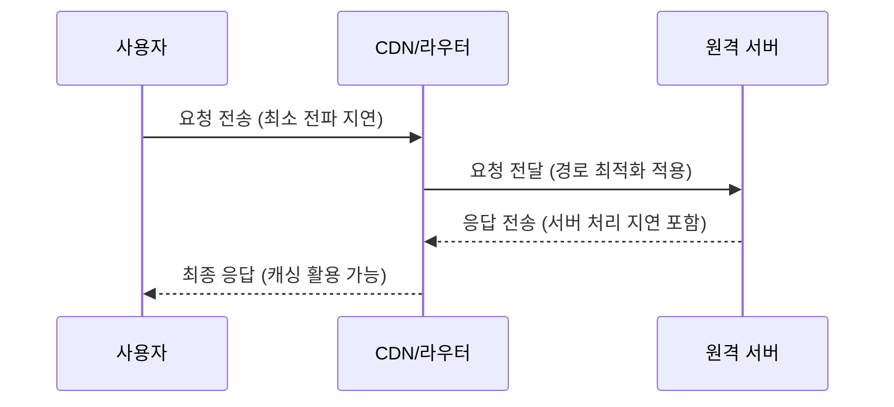
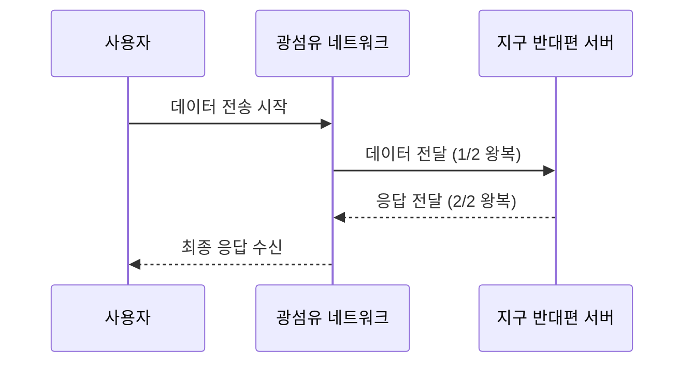

## 1. 빛의 속도와 전송의 한계

- **빛의 속도:**  
  진공에서 빛은 초당 약 **30만 km** (300,000 km/s)로 이동합니다.  
  하지만, 실제 인터넷 통신은 광섬유를 통해 이루어지는데, 광섬유 내에서 빛의 속도는 약 **2/3 정도** 느립니다.

## 2. 간단한 통신 흐름 예제 (Mermaid Diagram)

이 다이어그램은 사용자가 데이터를 요청하고, CDN이나 라우터를 거쳐 원격 서버와 통신하는 기본적인 흐름을 보여줍니다.  
각 단계마다 **전파 지연**과 **처리 지연**이 발생하며, 상용 서비스에서는 이를 최소화하기 위한 다양한 기술들이 사용됩니다.

## 3. 지구 반대편 서버와의 통신 시 1초 내에 몇 번의 신호 왕복계산

- **거리:**  
  지구 반대편의 경우, **지구의 직경** 약 12,700 km를 이동해야 한다고 가정합니다.
  
- **빛의 속도:**  
  - **진공:** 약 300,000 km/s  
  - **광섬유:** 실제 통신에서는 매질의 영향으로 약 2/3 속도인 **200,000 km/s**를 사용합니다.

## 4. 왕복 시간 계산

### 광섬유
1. **한쪽 이동 시간:**  

   $$
   \text{시간} = \frac{12,700 \, \text{km}}{200,000 \, \text{km/s}} \approx 0.0635 \, \text{초}
   $$
   
2. **왕복 시간:**  

   $$
   0.0635 \, \text{초} \times 2 \approx 0.127 \, \text{초}
   $$

3. **1초 내 최대 왕복 횟수:**  

   $$
   \frac{1 \, \text{초}}{0.127 \, \text{초}} \approx 7.87 \quad (\text{즉, 약 7~8회})
   $$

## 5. 통신 과정 예제 (Mermaid Diagram)

이 다이어그램은 1회 왕복의 기본 흐름을 나타내며, 위의 계산에 따라  
진공에서는 약 11~12번, 광섬유에서는 약 7~8번 정도의 왕복이 1초에 가능함을 의미합니다.

- **진공 조건:** 약 11~12번 왕복 가능  
- **광섬유 조건:** 약 7~8번 왕복 가능

## 6. 리그 오브 레전드(LoL)가 아시아에서 원활한 온라인 게임 플레이를 위한 유저 신호

- **게임 통신 주기 (Tick Rate):**  
  대부분의 온라인 게임은 서버가 게임 상태를 주기적으로 갱신하도록 설정합니다. LoL의 경우, 일반적으로 **서버의 업데이트 주기(틱률)가 약 20회/초** 정도로 알려져 있습니다.  
  이는 1초에 약 20번 게임 상태(유저의 입력 포함)를 주고 받는다고 볼 수 있습니다.

- **패킷 송수신:**  
  실제로는 클라이언트와 서버가 UDP 기반 통신을 통해 여러 보조적인 정보(위치, 상태, 이벤트 등)를 교환합니다.  
  즉, 게임의 핵심 업데이트 외에도 보안 및 동기화를 위한 추가 패킷들이 주고받힙니다.

## 7. 아시아 지역의 원활한 플레이를 위한 고려사항

- **낮은 지연시간(Latency):**  
  아시아 지역 내에서 평균적인 네트워크 지연이 30~60ms 내외라면, 20틱/초의 주기는 충분히 원활한 게임 플레이를 보장합니다.
  
- **네트워크 최적화:**  
  라이엇은 CDN, 지역별 데이터 센터, 그리고 효율적인 네트워크 경로 최적화 등을 통해 지연을 최소화하여 유저의 입력이 서버에 빠르게 반영되도록 하고 있습니다.

## 9. 결론

- **원활한 온라인 게임 진행을 위해** 리그 오브 레전드는 1초에 **약 20회** 정도의 주기적인 신호(틱)를 기반으로 게임 상태를 업데이트합니다.  
- 실제 패킷 송수신 횟수는 이보다 많을 수 있으나, 핵심 게임플레이 업데이트는 위와 같은 주기를 따릅니다.

이러한 구조 덕분에 아시아 지역에서도 낮은 지연시간과 빠른 응답속도로 게임이 원활하게 진행될 수 있습니다.