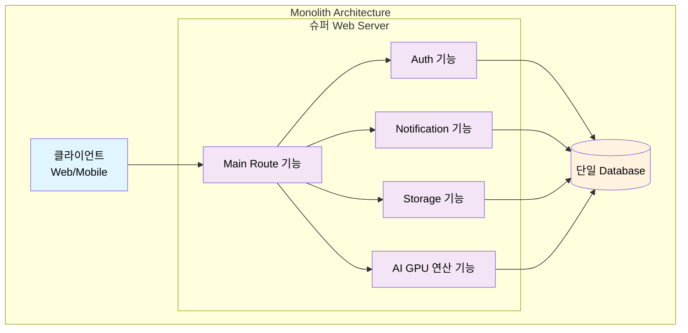
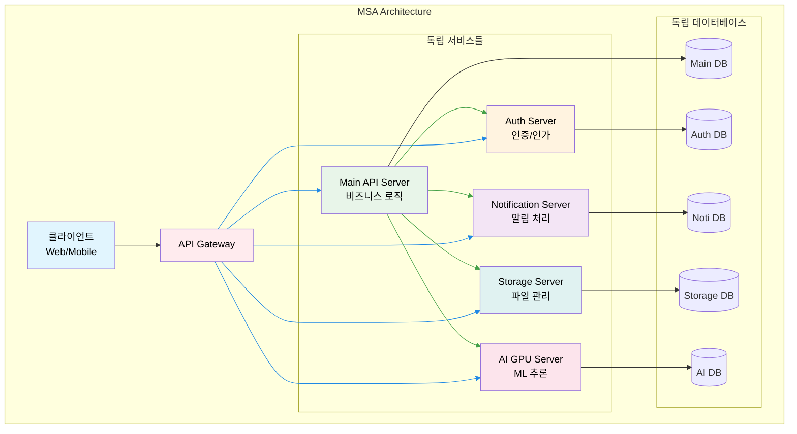
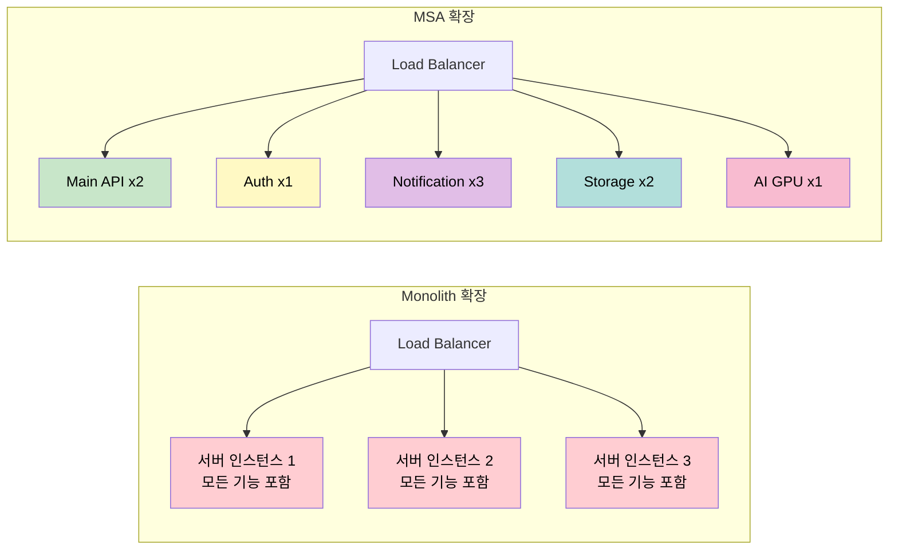

# 내가 경험한 MSA

## msa를 선택하는 기본 개념

### 1. Monolith 아키텍처

슈퍼 web 서버: main route 기능, auth 기능, noti 기능, storage 기능, ai gpu 연산 기능

#### 1. 단점
- scale up은 쉬울 수 있지만 scale out에서 비용이 많이 든다.
- 만약, 알림 기능이 망가졌을때, 웹 서비스 전체가 먹통이 될 수 있다.
- 서비스 오류 발생시 원인을 찾기가 어렵다.

#### 2. 장점
- 빠른 기능 구현: API 규칙, 인증 token 제어에서 고민 거리가 줄어든다.
- 빠른 페이지 구현: 백오피스 개발 용이, 직접적인 DB 데이터 접근
- 트랜잭션 처리: 단일 DB 내에서 ACID 보장이 쉬움
- 빠른 초기 개발: 프로토타입 및 MVP 구현에 유리
- 단순한 배포: 하나의 서버만 관리하면 됨

### 2. MSA 아키텍처

각 독립 api server: main api server, auth server, noti server, storage server ai gpu server

#### 1. 장점

- **독립적 확장**: 트래픽에 따라 서비스별 스케일링 가능
- **기술 스택 자유도**: 각 서비스마다 최적화된 기술 선택 가능
- **장애 격리**: 한 서비스 장애가 전체 시스템에 미치는 영향 최소화
- **팀별 개발**: 서비스 경계에 따른 독립적 개발/배포
- **데이터 격리**: 각 서비스가 독립적인 데이터베이스 소유

#### 2. 단점

- **네트워크 복잡성**: 서비스 간 통신으로 인한 레이턴시 증가
- **분산 시스템 복잡성**: 트랜잭션, 일관성 보장의 어려움
- **운영 오버헤드**: 다수의 서비스 모니터링, 로깅, 배포 관리
- **디버깅 어려움**: 여러 서비스에 걸친 요청 추적의 복잡성
- **초기 개발 비용**: API Gateway, 서비스 디스커버리 등 인프라 구축 필요

### 3. 배포 및 확장성 비교

**주요 차이점:**

- **Monolith**: 모든 기능이 하나의 서버에 통합, 수직 확장만 가능
- **MSA**: 각 서비스가 독립적으로 운영, 서비스별 수평 확장 가능
- **데이터 격리**: MSA는 각 서비스마다 독립적인 데이터베이스 소유
- **통신**: MSA는 서비스 간 직접 HTTP REST API 통신
- **게이트웨이**: Nginx를 통한 단일 진입점 및 로드밸런싱

## 내가 MSA를 선택해 구축한 이유

### 사례 1: tvcf.co.kr 리뉴얼 개발

- 기존 시스템이 이미 MSA 아키텍처로 구축되어 있어, 동일한 패턴으로 확장/연계를 진행하는 것이 합리적이라고 판단함
- 100TB+ 규모의 광고 영상 스토리지 서버 운영
- 미디어 서버 파이프라인 운영: 영상에서 키워드 추출, 자막 생성, 썸네일 생성
- 스토리지/미디어 처리/인증을 각각 독립적으로 확장해야 하는 특성상, 서비스별 스케일링이 가능한 MSA가 적합

### 사례 2: polygom (생성형 AI 서비스)

- 생성형 AI GPU 서버가 최소 10대 이상 상시 실행 중
- 모델 신규 버전/신규 기능 추가가 빈번하여, GPU 서버의 scale-out 및 롤아웃(카나리/블루-그린 등)에 유연하게 대응 필요
- 인증, 스토리지의 공통 규칙만 표준화하면, 서비스 도메인 서버를 상황에 맞게 손쉽게 추가/확장 가능
  - 예: AI Photobooth, AI Product Image, AI RMBG API 서버 등

### 핵심 판단

- 공통 자원 재사용: 인증 서버, AI GPU 추론 인프라, 스토리지 서버를 공용 컴포넌트로 재사용
- 빠른 서비스 출시: 각 서비스마다 프론트 클라이언트와 도메인 API 서버만 추가 구축하면 신규 기능을 빠르게 제공
- 유연한 확장성: 트래픽 및 연산 부하에 따라 서비스(또는 GPU 서버) 단위 수평 확장 가능
- 운영 리스크 분리: 서비스 장애 격리 및 독립 배포로 전체 시스템 영향 최소화
- 장기 유지보수성: 팀/기능 단위 소유권 분리와 독립 릴리스 사이클로 변경 부담 감소
