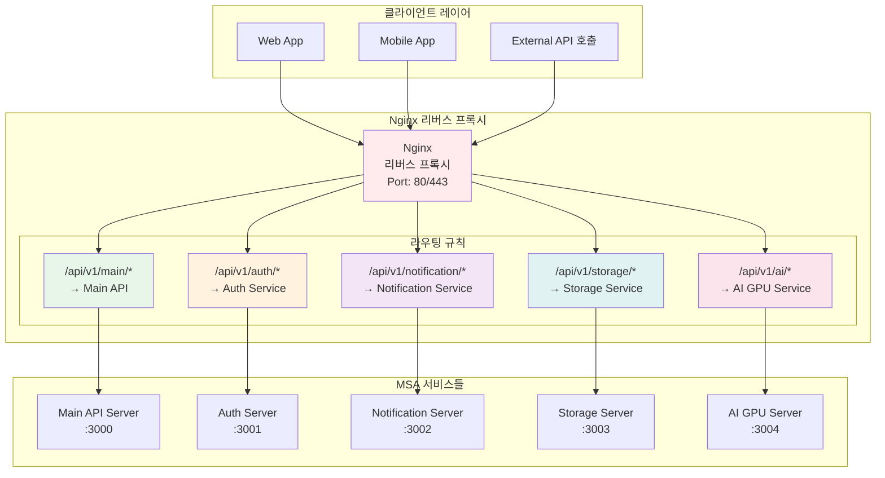
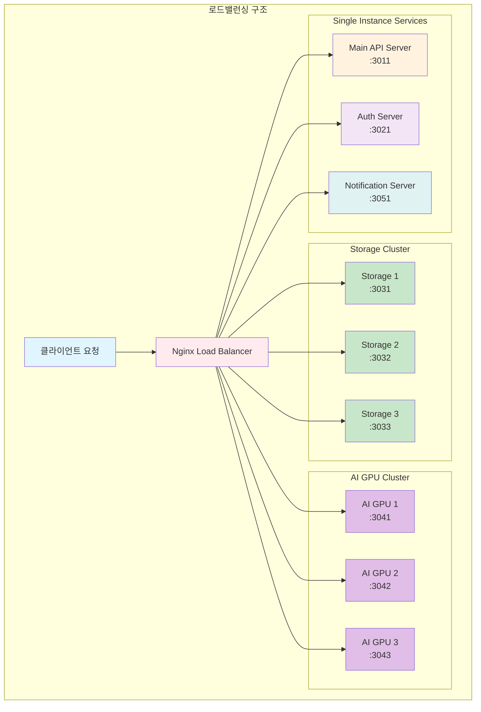

# MSA 환경에서 Nginx 리버스 프록시 API 라우팅 규칙

## 문제 정의

MSA 환경으로 전환하면서 가장 먼저 직면한 문제는 **클라이언트가 여러 개의 독립적인 서비스에 어떻게 접근할 것인가**였습니다.

### Monolith 환경의 단순함

- 클라이언트 → 단일 서버 (모든 API 통합)
- 하나의 도메인, 하나의 포트
- 내부 함수 호출로 서비스 간 통신

### MSA 환경의 복잡성

- 클라이언트 → 5개의 독립 서비스
- 각각 다른 포트와 주소
- 클라이언트가 모든 서비스 위치를 알아야 함

**결론**: Nginx 리버스 프록시가 필요하다!

## API 라우팅 아키텍처

### 1. 전체 라우팅 구조

## 라우팅 규칙 상세 설계

### 서비스별 URL 패턴

| 서비스 | URL 패턴 | 역할 | api url 예시 | back office page url  예시
|--------|----------|------|------|---|
| **Main API** | `/api/v1/main/*` | 핵심 비즈니스 로직 | `/api/v1/main/products`, `/api/v1/main/processing` | `/page/main/dashboard`, `/page/main/logs/` |
| **Auth** | `/api/v1/auth/*` | 인증/인가 | `/api/v1/auth/login`, `/api/v1/auth/users` | `/page/auth/users`, `/page/auth/roles` |
| **Notification** | `/api/v1/notification/*` | 알림 처리 | `/api/v1/notification/send`, `/api/v1/notification/history` | `/page/notification/templates`, `/page/notification/logs` |
| **Storage** | `/api/v1/storage/*` | 파일 관리 | `/api/v1/storage/upload`, `/api/v1/storage/download` | `/page/storage/files`, `/page/storage/quota` |
| **AI** | `/api/v1/ai/*` | AI 연산 | `/api/v1/ai/predict`, `/api/v1/ai/train` | `/page/ai/models`, `/page/ai/metrics` |

### 3. 로드밸런싱 전략

## 추천하는 라우팅 규칙 설계 원칙

### 1. 명확한 서비스 경계

- 각 서비스는 고유한 URL prefix 사용
- `/api/v1`은 핵심 비즈니스만, 인프라성 기능은 별도 경로

### 2. 버전 관리 전략

- API 버전은 URL에 명시적으로 포함
- 하위 호환성을 위한 점진적 마이그레이션

### 3. 확장성 고려

- 새로운 서비스 추가 시 기존 규칙에 영향 없도록
- 마이크로서비스의 독립성 보장

### 4. 보안 고려사항

- 민감한 API는 별도 인증 레이어 적용
- Rate limiting으로 서비스별 트래픽 제어

이러한 라우팅 규칙을 통해 클라이언트는 단일 진입점을 통해 모든 MSA 서비스에 접근할 수 있으며, 운영팀은 중앙집중식 트래픽 관리가 가능해집니다.