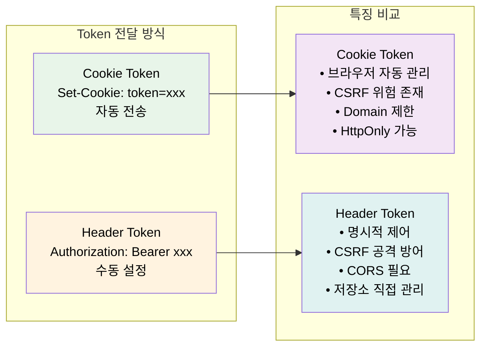
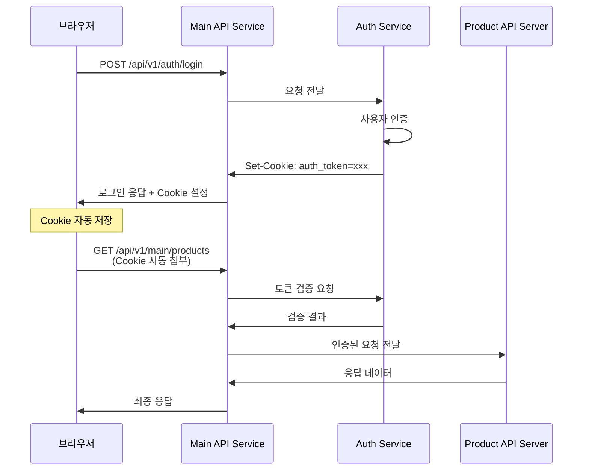
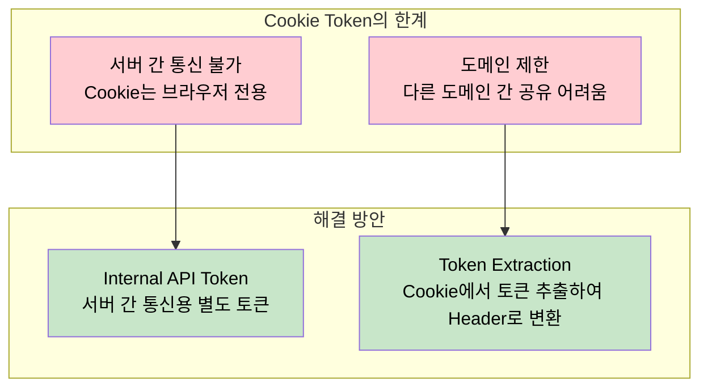
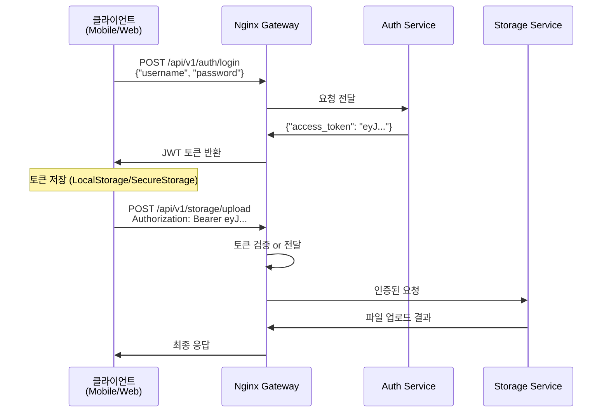
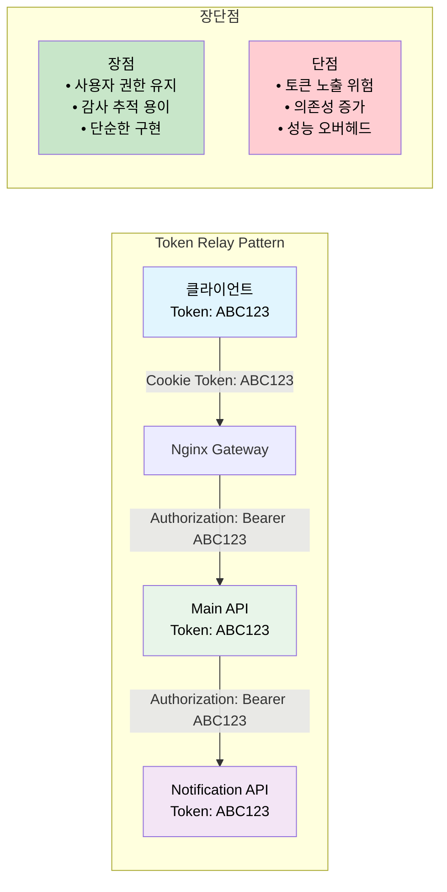
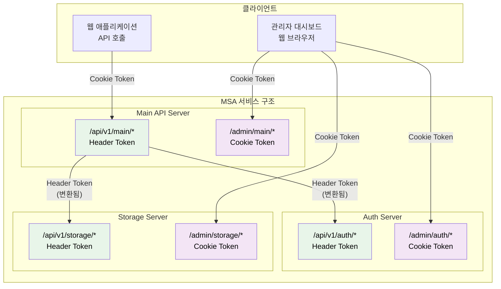
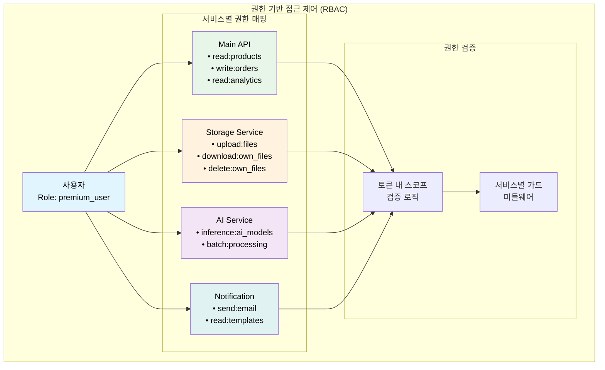

# MSA 환경에서 Cookie Token과 Header Token 활용법

## 개요

MSA(마이크로서비스) 아키텍처에서는 여러 독립적인 서비스들이 상호 작용하기 때문에, 인증 토큰 관리가 Monolith 환경보다 훨씬 복잡해집니다. 

### Cookie Token vs Header Token 기본 개념



### CSRF 보안 차이점 상세 예시

#### Cookie Token의 CSRF 위험 시나리오

```html
<!-- 악의적 사이트 (evil-site.com)에서 -->
<form id="maliciousForm" action="https://mybank.com/api/transfer" method="POST">
  <input type="hidden" name="to" value="attacker-account">
  <input type="hidden" name="amount" value="10000">
</form>

<script>
// 사용자가 mybank.com에 로그인되어 있다면
// Cookie가 자동으로 전송되어 송금이 실행됨
document.getElementById('maliciousForm').submit();
</script>
```

- **문제점**: 브라우저가 mybank.com의 인증 Cookie를 자동으로 전송하므로, 사용자 모르게 송금이 실행됨
- **보안**: Same-Origin-Policy에 의해 악의적 사이트에서는 다른 도메인의 토큰에 접근할 수 없음

### MSA 환경에서의 특별한 고려사항

- **서비스 간 통신**: 각 서비스가 독립적으로 토큰을 검증해야 함
- **도메인 분리**: 서로 다른 서브도메인이나 포트를 사용하는 서비스들
- **클라이언트 다양성**: 웹, 모바일, 서버 투 서버 등 다양한 클라이언트

## Cookie Token 활용법

### 웹 애플리케이션에서의 활용

Cookie Token은 웹 브라우저 환경에서 가장 자연스러운 인증 방식입니다.



### 서버간 통신 시 한계점



## Header Token (Bearer Token) 활용법

### API 통신에서의 활용

Header Token은 RESTful API와 서비스 간 통신에서 표준적인 방식입니다.



### 서비스간 통신 최적화

#### Token Relay 방식
- **토큰 전달**: 사용자 토큰을 그대로 다음 서비스로 전달
- **헤더 설정**: `Authorization: Bearer` + `X-Service-Name` 조합
- **사용 사례**: 사용자 권한이 중요한 체인형 서비스 호출

#### Token Exchange 방식  
- **토큰 변환**: 서비스별 전용 토큰으로 변환하여 사용
- **보안 강화**: 각 서비스마다 다른 토큰으로 권한 분리
- **사용 사례**: 높은 보안이 요구되는 민감한 서비스 호출

### Token Relay 패턴

사용자의 원본 토큰을 서비스 체인을 통해 전달하는 패턴입니다.



## 하이브리드 접근법

### 서비스별 라우터 토큰 전략



### API 라우터 인증 방식

#### Main API Server (진입점)
- **URL 패턴**: `/api/v1/main/*`
- **웹 앱**: Cookie Token으로 인증
- **외부 파트너**: Header Token으로 인증
- **역할**: 토큰 변환 및 다른 서비스 호출

#### 다른 API Server들
- **URL 패턴**: `/api/v1/{service}/*` (auth, storage 등)
- **인증 방식**: Header Token (Main API에서 변환된 토큰)
- **특징**: 서비스간 통신, 직접 클라이언트 접근 불가

### Admin 라우터: Cookie Token

- **URL 패턴**: `/admin/{service}/*`
- **인증 방식**: Cookie 기반 인증
- **클라이언트**: 관리자 웹 대시보드
- **특징**: 서버 사이드 렌더링, 세션 관리, CSRF 방어 필요

### 서비스간 통신: Internal Token

- **토큰 생성**: 서비스별 고유 Secret으로 JWT 생성
- **스코프 제한**: 필요한 권한만 포함 (`read:notifications`, `write:storage`)
- **서비스 식별**: `X-Service-Name` 헤더로 호출자 식별
- **보안**: 짧은 만료 시간 (1시간) 설정

## 실제 구현 예시

### 각 서비스별 토큰 검증 로직

아래 표는 각 서비스 유형별로 토큰 소스, 검증 방식, 적용 라우트를 요약한 것입니다.

| 구분 | 토큰 소스 | 검증 방식 | 적용 라우트 |
| --- | --- | --- | --- |
| 웹 | Cookie의 `auth_token` | JWT 서명 검증, 만료시간 확인 | 웹 대시보드, 관리자 페이지 |
| API | `Authorization: Bearer` 헤더 | JWT 서명 검증, 스코프 권한 확인 | 모바일 API, 외부 API |
| 내부 | `Authorization` + `X-Service-Name` 헤더 | 서비스별 Secret으로 서명 검증 | 서비스 간 내부 통신 |


## 보안 고려사항

### 서비스별 권한 분리



### 토큰 스코프 관리

#### 스코프 기반 권한 검증
- **토큰 스코프 확인**: 사용자 토큰에 포함된 권한 범위 검증
- **필수 권한 체크**: API 엔드포인트별 필수 스코프 정의
- **권한 부족 시 처리**: 403 Forbidden 응답 및 필요 권한 안내
