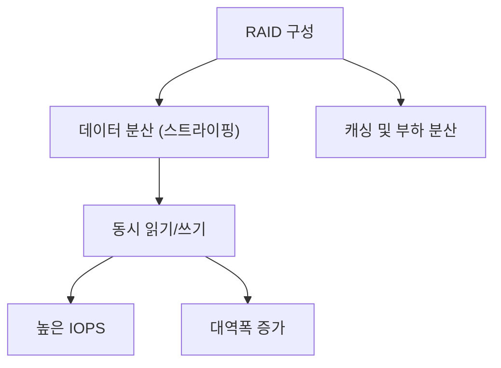

# RAID를 통한 성능 향상 영역

RAID 구성을 통해 성능을 향상시키고자 할 때, 주로 아래와 같은 영역에서 개선 효과를 기대할 수 있습니다.

1. **읽기 성능(Read Performance)**
   - **병렬 읽기**: 여러 디스크에 데이터를 분산 저장함으로써 동시에 읽어들일 수 있어, 읽기 속도가 향상됩니다.
   - **캐싱 효과**: RAID 1(미러링)의 경우, 여러 디스크에서 읽기 요청을 분산 처리할 수 있어 읽기 부하가 줄어듭니다.

2. **쓰기 성능(Write Performance)**
   - **병렬 쓰기**: RAID 0 또는 RAID 10과 같이 스트라이핑을 사용하는 구성은 데이터를 여러 디스크에 동시에 기록하여 쓰기 속도를 높입니다.
   - **쓰기 분산**: 일부 RAID 구성에서는 쓰기 작업을 여러 디스크에 분산하여 I/O 부하를 줄임으로써 성능 개선이 가능합니다.

3. **IOPS (Input/Output Operations Per Second) 향상**
   - 여러 디스크가 동시에 입출력 작업을 처리하므로, 단일 디스크 대비 IOPS가 향상되어 응용 프로그램의 응답성이 개선됩니다.

4. **대역폭(Bandwidth) 증대**
   - 대용량 데이터 전송 시, 여러 디스크가 동시에 데이터를 읽고 쓸 수 있어 전체 전송 대역폭이 증가합니다.

---

## 성능 향상 관련 RAID 구성의 예시

* IOPS는 Input/Output Operations Per Second의 약어로, 초당 수행되는 입출력 작업의 횟수를 나타냅니다.

## 병렬 처리에 대한 추가 설명

### 병렬 쓰기 (Parallel Writing)

- RAID 0, RAID 10과 같이 스트라이핑 기법을 사용하는 경우, 파일을 여러 조각으로 나누어 각 디스크에 동시에 기록합니다.
- 예를 들어, 한 번에 큰 파일을 여러 사람이 나눠서 각자 다른 부분을 동시에 받는다고 생각하면 이해가 쉽습니다. 이렇게 하면 전체 쓰기 속도가 증가합니다.

#### 하드웨어 레벨 성능 이슈:

- 디스크 동기화 문제:
여러 디스크가 동시에 데이터를 기록해야 하는데, 각 디스크의 속도가 조금씩 다르면 동기화 문제가 발생할 수 있습니다. 즉, 한 디스크가 늦어지면 전체 쓰기 완료 시간이 그 디스크에 맞춰지게 됩니다.

- RAID 컨트롤러 및 캐시 메모리:
동시에 여러 디스크에 데이터를 분산 기록할 때, RAID 컨트롤러가 데이터를 잘 분배하고 조율해야 합니다. 만약 컨트롤러의 처리 능력이나 캐시 메모리 용량이 부족하면, 쓰기 성능의 기대를 완전히 발휘하기 어렵습니다.

- 내구성 및 오류 관리:
RAID 0와 같이 단순히 성능 향상만을 목적으로 하는 구성은, 한 디스크에 장애가 발생하면 전체 데이터의 손실 위험이 있습니다. 이러한 위험을 줄이기 위해 추가적인 하드웨어적 오류 검출 및 복구 메커니즘이 요구될 수 있습니다.
---
