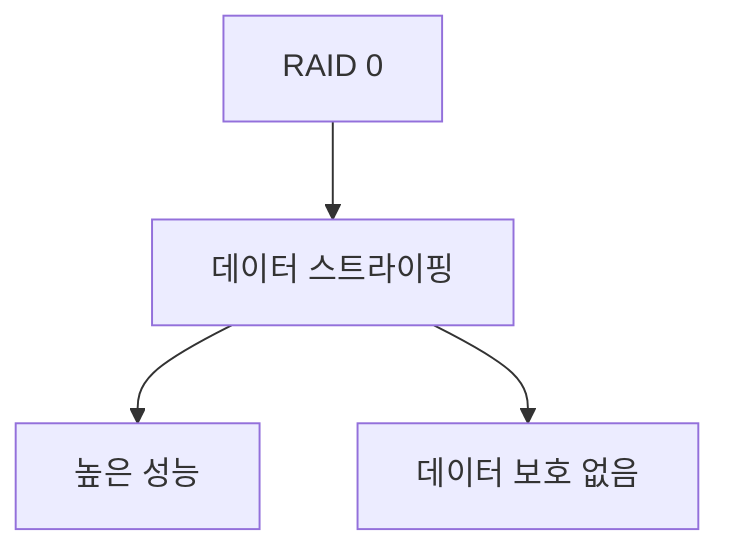
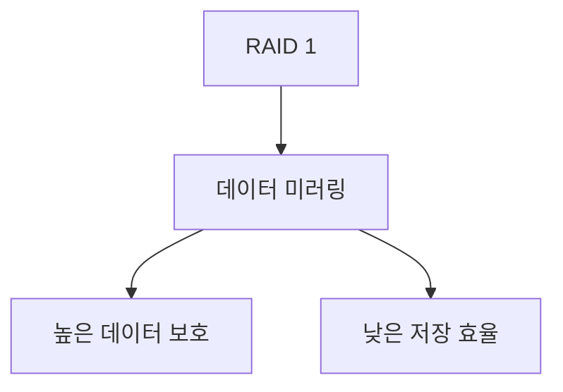
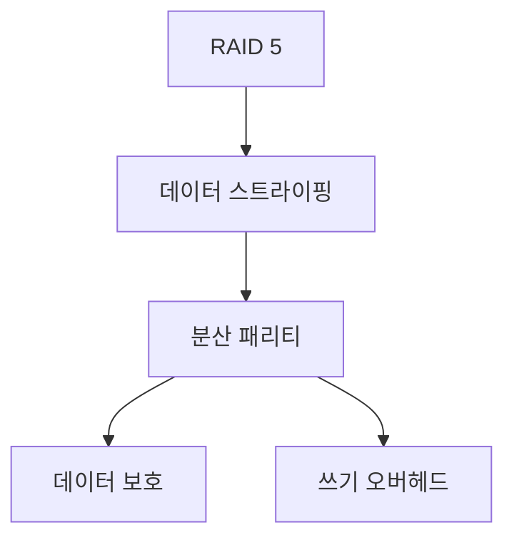
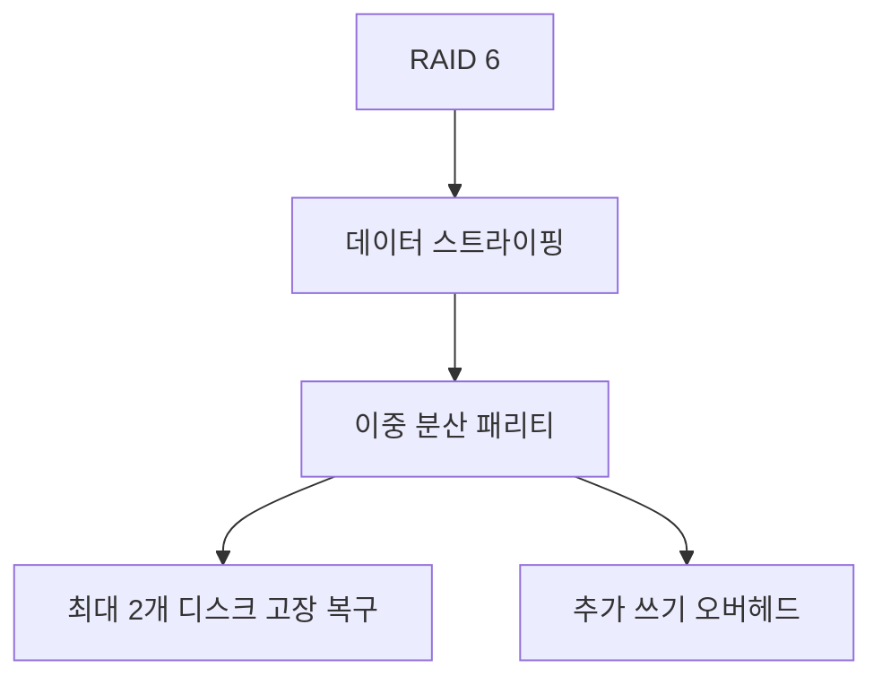
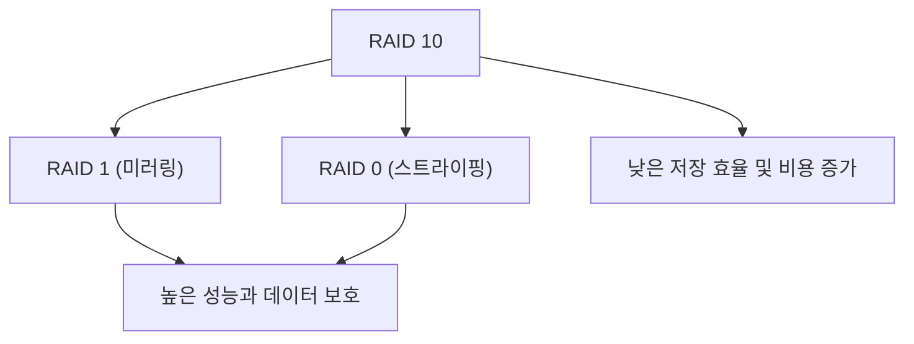

# 스토리지 RAID 구성 방식 종류와 각 방식에 따른 장단점

스토리지 RAID(Redundant Array of Independent Disks)는 여러 개의 디스크를 하나의 논리적 스토리지 풀로 구성하여 성능, 데이터 보호, 용량 효율 등을 개선하는 기술입니다. 상용 서비스에서는 데이터 무결성과 고가용성, 성능 요구 사항을 만족시키기 위해 각 RAID 방식의 장단점을 고려하여 적절한 구성이 채택됩니다.

아래는 대표적인 RAID 구성 방식과 각 방식의 특징, 장단점을 정리한 내용입니다.

---

## 1. RAID 0 (스트라이핑)

- **개념**: 데이터를 여러 디스크에 분산하여 동시에 읽기/쓰기를 수행, 성능 향상에 중점을 둠.
- **장점**:
  - **높은 성능**: 데이터 분산으로 빠른 읽기 및 쓰기 속도.
  - **저비용**: 최소 2개 디스크만으로 구성 가능.
- **단점**:
  - **데이터 보호 없음**: 단일 디스크 고장 시 전체 데이터 손실.



---

## 2. RAID 1 (미러링)

- **개념**: 동일한 데이터를 두 개 이상의 디스크에 복제하여 저장, 데이터 복구에 강점.
- **장점**:
  - **높은 데이터 보호**: 한 디스크 고장 시 다른 디스크에서 데이터 복구 가능.
  - **읽기 성능 향상**: 미러된 여러 디스크에서 읽기 요청을 분산할 수 있음.
- **단점**:
  - **낮은 저장 효율**: 저장 용량의 절반만 사용 가능.
  - **비용 증가**: 동일 데이터를 저장하기 위한 추가 디스크 필요.



---

## 3. RAID 5 (스트라이핑 + 분산 패리티)

- **개념**: 데이터를 여러 디스크에 스트라이핑하고, 패리티 정보를 분산 저장하여 한 디스크 고장 시 복구 가능.
- **장점**:
  - **효율적 저장**: N개의 디스크 중 1개 분량만 패리티 정보로 사용.
  - **데이터 보호**: 하나의 디스크 고장 시 복구 가능.
- **단점**:
  - **쓰기 성능 저하**: 패리티 계산으로 인한 오버헤드.
  - **복구 시간**: 디스크 복구 시 시간이 길어질 수 있음.



---

## 4. RAID 6 (스트라이핑 + 이중 분산 패리티)

- **개념**: RAID 5와 유사하지만, 두 개의 패리티 정보를 사용하여 최대 두 디스크까지 고장에 대비.
- **장점**:
  - **높은 안정성**: 최대 두 디스크 고장까지 데이터 복구 가능.
  - **상용 서비스 적합**: 미션 크리티컬 환경에서 안정성 강화.
- **단점**:
  - **쓰기 성능 저하**: 이중 패리티 계산으로 인한 추가 오버헤드.
  - **저장 효율 감소**: 두 개의 패리티 정보 저장으로 인한 용량 손실.



---

## 5. RAID 10 (RAID 1+0)

- **개념**: RAID 1(미러링)과 RAID 0(스트라이핑)을 결합하여, 데이터 보호와 성능을 동시에 달성.
- **장점**:
  - **높은 성능**: 스트라이핑으로 인한 빠른 읽기/쓰기.
  - **데이터 보호**: 미러링을 통한 안정성 제공.
- **단점**:
  - **낮은 저장 효율**: 저장 용량의 50%만 사용 가능.
  - **비용 증가**: 추가 디스크로 인한 비용 상승.



---

## 상용 서비스에서의 RAID 구성 선택 방향

상용 서비스에서는 **데이터 무결성**, **고가용성**, **성능** 및 **비용 효율성**을 종합적으로 고려합니다.

- **RAID 0**: 성능이 가장 중요한 경우, 캐시나 임시 데이터 저장 용도로 사용될 수 있으나, 데이터 보호는 별도의 백업 시스템으로 보완해야 합니다.
- **RAID 1**: 단순하고 빠른 복구가 필요한 경우에 적합하며, 중요 데이터의 실시간 복제에 많이 사용됩니다.
- **RAID 5/6**: 비용과 저장 효율, 데이터 보호 사이의 균형을 이뤄야 하는 환경에서 널리 채택됩니다. 특히 RAID 6는 이중 패리티로 안정성을 높여 미션 크리티컬 서비스에 적합합니다.
- **RAID 10**: 성능과 데이터 보호 모두 중요한 환경, 예를 들어 데이터베이스 서버나 고성능 파일 서버에서 많이 사용됩니다.

각 구성 방식은 서비스의 특성과 요구사항에 맞춰 선택되며, 상용 환경에서는 RAID 구성을 단일 솔루션으로 보지 않고, 백업, 복제, 클러스터링 등 다양한 기술과 함께 데이터 안정성을 확보하는 방향으로 설계됩니다.
```